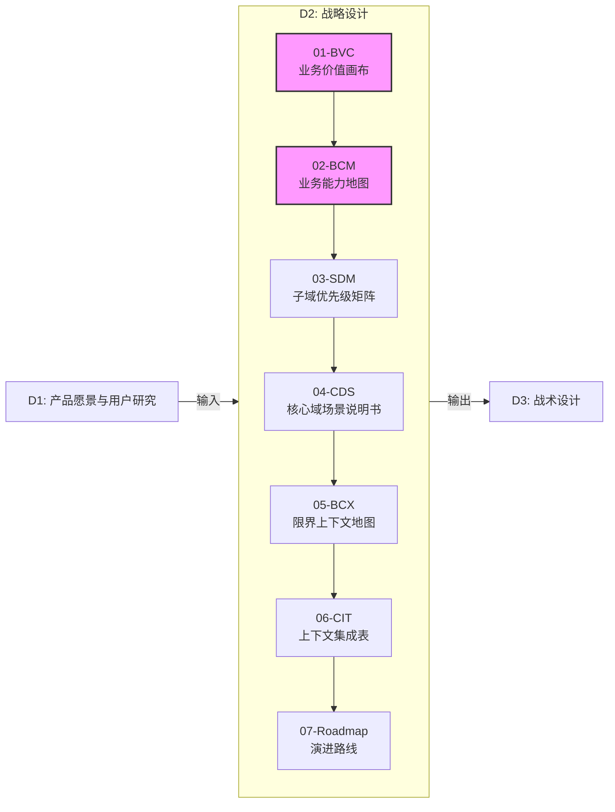
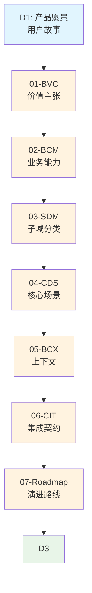
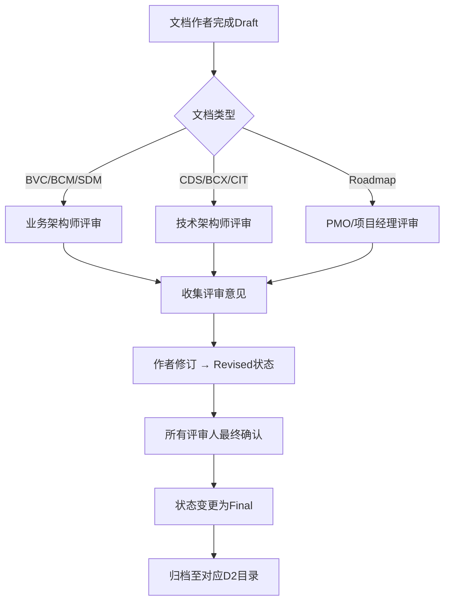

# DDD 战略设计标准规范

> **版本**: v2.0
> **制定依据**: 基于碳排优化MVP、防霉管控MVP的实践经验总结
> **适用范围**: 所有采用DDD战略设计方法的产品/项目
> **核心目标**: 统一战略设计输出物标准，明确文档间依赖关系，确保设计质量与可落地性

---

## 1. 整体框架与阶段划分

DDD战略设计遵循 **"愿景输入 → 战略设计 → 战术设计"** 的三阶段框架，将模糊的业务愿景转化为清晰的技术架构。



### 1.1 各阶段核心目标

| 阶段 | 核心目标 | 主要产出 | 关键决策者 |
| :--- | :--- | :--- | :--- |
| **D1** | **统一认知**<br>明确"为什么做"与"为谁做" | 产品愿景、用户故事、用户旅程 | 产品经理、业务方 |
| **D2** | **战略分解**<br>将愿景翻译为可执行的架构蓝图 | 7份标准战略设计文档 | 业务架构师、技术负责人 |
| **D3** | **战术落地**<br>将蓝图转化为具体的实现方案 | 事件风暴、技术架构、实现细节 | 技术架构师、开发团队 |

---

## 2. 文档清单与写作顺序

### 2.1 强制文档清单 (Mandatory)

所有项目必须产出以下 **7份核心文档**，严格按照编号顺序编写：

| 序号 | 文档缩写 | 文档全称 | 核心作用 | 主要受众 | 写作顺序 |
| :--- | :--- | :--- | :--- | :--- | :--- |
| **01** | **BVC** | 业务价值画布<br>(Business Value Canvas) | 统一"为什么做"与"怎么赚钱"的商业逻辑 | 高管、业务方、投资人 | 第1步 |
| **02** | **BCM** | 业务能力地图<br>(Business Capability Map) | 将战略翻译为"要长什么肌肉"的业务能力 | 业务架构师、产品经理 | 第2步 |
| **03** | **SDM** | 子域优先级矩阵<br>(Subdomain Priority Matrix) | 决定"先攻哪个山头"的投资策略 | 技术负责人、架构师 | 第3步 |
| **04** | **CDS** | 核心域场景说明书<br>(Core Domain Scenario) | 让"最值钱的场景"可验收、可测试 | 领域专家、PO、测试 | 第4步 |
| **05** | **BCX** | 限界上下文地图<br>(Bounded Context Map) | 绘制系统划分的"第一张蓝图" | 架构师、Tech Lead | 第5步 |
| **06** | **CIT** | 上下文集成表<br>(Context Integration Table) | 将"接口"提前定义为"协作契约" | 开发团队、集成工程师 | 第6步 |
| **07** | **Roadmap** | 演进路线图<br>(Evolution Roadmap) | 将战略拆解为可交付的"节拍" | PMO、项目经理、客户 | 第7步 |

### 2.2 可选补充文档 (Optional)

| 序号 | 文档缩写 | 文档全称 | 适用场景 |
| :--- | :--- | :--- | :--- |
| **08** | **CUJ** | 关键用户旅程<br>(Critical User Journey) | 用户体验要求高的C端产品或需要路演演示 |
| **09** | **ESP** | 事件风暴流程<br>(EventStorming Process) | D3阶段输入，复杂领域需要提前探索事件流 |

---

## 3. 文档间依赖关系与输入输出

### 3.1 依赖关系图



### 3.2 详细输入输出矩阵

| 文档 | 主要输入 | 核心输出 | 输出质量要求 |
| :--- | :--- | :--- | :--- |
| **01-BVC** | D1产品愿景、市场分析、竞品研究 | 1. 量化北极星指标（OMTM）<br>2. 商业模式要素矩阵<br>3. 风险应对策略 | 指标必须可量化、商业模式必须闭环 |
| **02-BCM** | BVC的价值主张、痛点分析 | 1. Level-0 价值流图（Mermaid）<br>2. Level-1/2 业务能力表<br>3. 能力热力图（战略/增值/基础） | 价值流必须端到端、能力需有明确输入输出 |
| **03-SDM** | BCM的业务能力清单 | 1. 子域评估表（差异化×复杂度）<br>2. 四象限矩阵图（Mermaid）<br>3. 建设策略（自研/外采/二次开发） | 每个子域必须有明确的建设策略和决策理由 |
| **04-CDS** | SDM确定的核心域、用户故事 | 1. 核心场景时序图（Mermaid）<br>2. 业务规则表（显性/隐性）<br>3. Given/When/Then验收标准 | 场景必须可验收、规则必须可配置 |
| **05-BCX** | SDM的子域分类、CDS的核心场景 | 1. 上下文拓扑图（Mermaid）<br>2. 上下文定义表（职责+聚合）<br>3. 集成模式说明（Partnership/ACL/OHS） | 每个上下文必须有明确的聚合和领域事件 |
| **06-CIT** | BCX的上下文映射关系 | 1. 集成契约清单（A→B，模式，协议）<br>2. 关键数据结构定义（JSON Schema）<br>3. SLA与失败策略定义 | 每个集成必须有明确的协议和失败处理 |
| **07-Roadmap** | 所有前述文档的输出 | 1. 分阶段演进策略<br>2. 详细路线图（OKR+交付物）<br>3. 资源与预算基线 | 每个阶段必须有明确的业务目标和技术交付物 |

---

## 4. 写作质量标准

### 4.1 通用质量要求（所有文档）

1. **图表优先原则**
   - 能用Mermaid图表达的不用文字描述
   - 核心流程必须包含时序图（`sequenceDiagram`）
   - 结构关系必须包含拓扑图（`graph TD/LR`）
   - 优先级分析必须包含四象限图（`quadrantChart`）

2. **量化表达原则**
   - 价值必须用具体数字（¥、%、分钟、次数）
   - 指标必须有计算公式或统计口径
   - 时间必须有具体周期（Q1、月度、周度）

3. **一致性原则**
   - 术语一致：同一概念在所有文档中使用相同名称
   - 结构一致：相同类型的文档使用相同章节结构
   - 编号一致：能力编号（BC-01）、子域名称等保持一致

4. **可落地性原则**
   - 每个设计决策必须有明确的"决策理由"
   - 每个业务规则必须有配置方式或参数范围
   - 每个技术选型必须有备选方案或降级策略

### 4.2 文档状态管理

| 状态 | 定义 | 允许操作 |
| :--- | :--- | :--- |
| **Draft** | 初稿，核心逻辑已覆盖但细节待完善 | 任意修改，可用于内部评审 |
| **Review** | 评审中，已发送给相关干系人审阅 | 只接受评审意见，不直接修改 |
| **Revised** | 已根据评审意见修订 | 可进入最终审批流程 |
| **Final** | 最终版，已获得所有关键干系人签字确认 | 只能通过变更流程修改 |

### 4.3 版本控制规范

**文件命名格式**：
```
DDD-STR-{ProductLine}-{YYYYMMDD}-v{Version}-{Type}.md
```

**版本号规则**：
- `v1.0`：初始版本，覆盖所有必填章节
- `v2.0`：深化版本，包含异常流程、详细规则、量化分析
- `vX.Y`：X为主版本（重大修订），Y为次版本（细节优化）

**版本升级条件**：
1. 主版本升级：业务模式变更、架构重大调整、核心指标重新定义
2. 次版本升级：细节优化、错误修正、补充分析内容

---

## 5. 工具与工作流建议

### 5.1 推荐工具栈

| 工具类型 | 推荐工具 | 主要用途 |
| :--- | :--- | :--- |
| **文档编写** | VS Code + Mermaid插件 | Markdown编辑与实时预览 |
| **图表绘制** | Mermaid Live Editor | 复杂图表调试与分享 |
| **协作评审** | 飞书文档/Confluence | 多人在线评审与评论 |
| **术语管理** | 飞书多维表格 | 统一术语表维护与导出 |
| **版本控制** | Git + GitHub/GitLab | 文档版本管理与协作历史 |

### 5.2 AI辅助工作流（基于Trae指南）

遵循 **"C-G-R"** 高效对话模式：

1. **C (Context Injection - 上下文注入)**
   ```
   我正在进行[项目名称]的DDD战略设计。
   请阅读：
   1. D1输入文档：[产品愿景.md]
   2. 参考范例：[金标准文档.md]
   3. 写作标准：[本规范文档]

   请重点分析参考范例的写作风格、图表类型和逻辑结构。
   ```

2. **G (First Draft Generation - 初稿生成)**
   ```
   请基于[D1文档]的业务愿景，为我草拟[目标文档名称，如：01-BVC]。
   要求：
   1. 覆盖[核心价值主张]、[商业模式要素]等必填章节
   2. 识别关键指标与风险假设
   3. 保持文件状态为Draft
   ```

3. **R (Style Alignment & Refinement - 风格对齐与精修)**
   ```
   请参考[金标准文档]的写作风格，优化刚才生成的初稿。
   重点加强：
   1. 图表质量：确保所有Mermaid图表语法正确
   2. 量化表达：补充具体数字和计算公式
   3. 结构完整性：检查是否所有必填章节都已覆盖
   ```

### 5.3 评审与验收流程



**评审要点**：
- **业务评审**（BVC/BCM/SDM）：商业模式是否闭环？能力是否覆盖价值流？投资优先级是否合理？
- **技术评审**（CDS/BCX/CIT）：场景是否可验收？上下文划分是否合理？集成契约是否明确？
- **管理评审**（Roadmap）：阶段划分是否可行？资源需求是否合理？里程碑是否可测量？

---

## 6. 附录：各文档详细模板

> 注：以下为各文档必须包含的最低章节要求，详细写作标准参见各专项指南。

### 6.1 01-BVC 业务价值画布
```
# 01-BVC 业务价值画布 (Business Value Canvas)

> **编号**: DDD-STR-{ProductLine}-{YYYYMMDD}-v{Version}-01-BVC
> **状态**: Draft/Review/Revised/Final
> **版本说明**: [简要说明本版主要变更]

---

## 1. 核心价值主张 (Core Value Proposition)

### 🎯 愿景与定位
**产品定位**: [一句话定位]
**一句话愿景**: [感性、隐喻的愿景描述]

### 🔴 痛点与机会 (Pain Points & Opportunities)
| 利益相关者 | 核心痛点 (Pains) | 我们的机会 (Gains) | 替代方案缺陷 |
| :--- | :--- | :--- | :--- |
| [角色A] | 1. [痛点1] | [解决方案1] | [现有方案缺陷] |
| [角色B] | 1. [痛点2] | [解决方案2] | [现有方案缺陷] |

### ⭐ 北极星指标体系 (North Star Metric System)
**一级指标 (OMTM):** [指标名称] (计算公式)
**二级指标 (拆解因子):**
1. [因子1]: [定义与测量方式]
2. [因子2]: [定义与测量方式]

---

## 2. 商业模式要素 (Business Model Elements)

### 🤝 关键合作伙伴 (Key Partners)
1. [合作伙伴1]: [合作内容与价值]
2. [合作伙伴2]: [合作内容与价值]

### 📊 收入来源与定价策略 (Revenue Streams)
| 套餐类型 | 价格 | 核心价值点 | 目标客户 |
| :--- | :--- | :--- | :--- |
| [套餐A] | [价格] | [价值点1] | [客户群体] |
| [套餐B] | [价格] | [价值点2] | [客户群体] |

### 💰 成本结构与财务模型
**主要成本项:**
1. [成本项1]: [占比/金额]
2. [成本项2]: [占比/金额]

**单用户生命周期价值 (LTV) 测算:**
| 项目 | 数值 | 说明 |
| :--- | :--- | :--- |
| 获客成本 (CAC) | [金额] | [计算方式] |
| 月度留存率 | [百分比] | [历史数据/假设] |
| 平均生命周期 | [月数] | [计算方式] |
| LTV | [金额] | LTV = ARPU × 生命周期 |

---

## 3. 关键假设与验证计划

| 阶段 | 关键假设 | 验证方法 | 成功标准 | 时间窗口 |
| :--- | :--- | :--- | :--- | :--- |
| MVP | [假设1] | [验证方法1] | [标准1] | [时间1] |
| Growth | [假设2] | [验证方法2] | [标准2] | [时间2] |

---

## 4. 风险全景图与护城河

**核心风险:**
1. [风险1]: [概率] - [影响] - [应对策略]
2. [风险2]: [概率] - [影响] - [应对策略]

**竞争护城河:**
1. [护城河1]: [具体描述]
2. [护城河2]: [具体描述]
```

### 6.2 02-BCM 业务能力地图
```
# 02-BCM 业务能力地图 (Business Capability Map)

> **编号**: DDD-STR-{ProductLine}-{YYYYMMDD}-v{Version}-02-BCM
> **状态**: Draft/Review/Revised/Final
> **版本说明**: [简要说明本版主要变更]

---

## 1. Level-0 价值流 (Value Stream)


**阶段说明:**
1. **[阶段1]**: [核心活动与产出]
2. **[阶段2]**: [核心活动与产出]

---

## 2. Level-1 & Level-2 业务能力列表

| 编号 | L1 能力 (Capability) | L2 子能力 (Sub-Capability) | 输入业务对象 | 输出业务对象 | 分类 |
| :--- | :--- | :--- | :--- | :--- | :--- |
| **BC-01** | **[能力名称]** | 1.1 [子能力1]<br>1.2 [子能力2] | [输入对象] | [输出对象] | 核心/支撑/通用 |
| **BC-02** | **[能力名称]** | 2.1 [子能力1]<br>2.2 [子能力2] | [输入对象] | [输出对象] | 核心/支撑/通用 |

---

## 3. 能力热力图与投资策略

| 能力分类 | 投资策略 | 资源分配比例 | 典型能力示例 |
| :--- | :--- | :--- | :--- |
| **战略级 (Strategic)** | 饱和投入，建立核心竞争力 | 40-50% | [示例能力] |
| **增值级 (Value-Added)** | 重点投入，提升用户体验 | 30-40% | [示例能力] |
| **基础级 (Basic)** | 适度投入，确保稳定运行 | 10-20% | [示例能力] |
```

> *注：其他文档模板因篇幅限制省略，详见各专项写作标准文档。*

---

## 7. 变更记录

| 版本 | 日期 | 变更说明 | 变更人 |
| :--- | :--- | :--- | :--- |
| v1.0 | 2025-12-10 | 初始版本，基于碳排优化MVP实践 | [姓名] |
| v2.0 | 2025-12-14 | 扩展为完整规范，增加防霉管控MVP经验 | Claude Code |

**文档维护责任**：
- **业务架构师**: 负责BVC、BCM、SDM章节的维护
- **技术架构师**: 负责CDS、BCX、CIT章节的维护
- **项目经理**: 负责Roadmap章节的维护
- **所有成员**: 负责术语一致性和文档间关联性检查