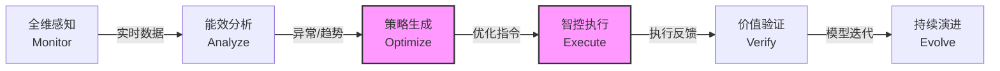

# 02-BCM 业务能力地图 (Business Capability Map)

> **编号**：DDD-STR-CarbonOpt-20251210-v2.0  
> **状态**：Final  
> **版本说明**：深化版，细化至 Level-2 能力粒度

---

## 1. Level-0 价值流 (Value Stream)

1.  **全维感知**: 采集水/电/气/热及环境数据，构建数据底座。
2.  **能效分析**: 实时计算 PUE、碳排放强度，识别能耗异常点。
3.  **策略生成**: (核心) 基于 AI 预测负荷，生成削峰填谷与设备调优策略。
4.  **智控执行**: (核心) 边缘端对策略进行安全校验与指令下发，闭环控制。
5.  **价值验证**: 生成节能报表与合规证书，量化 ROI。
6.  **持续演进**: 基于反馈优化 AI 参数，适配更多场景。

---

## 2. Level-1 & Level-2 业务能力列表

| 编号 | L1 能力 (Capability) | L2 子能力 (Sub-Capability) | 输入业务对象 | 输出业务对象 | 分类 |
| :--- | :--- | :--- | :--- | :--- | :--- |
| **BC-01** | **多源数据采集** | 1.1 **异构协议适配** 1.2 **数据清洗与补全** 1.3 **时序数据存储** | 原始报文 (Modbus/DLT645) | 标准化读数, 设备状态 | 基础支撑 |
| **BC-02** | **碳排核算分析** | 2.1 **碳因子库管理** 2.2 **实时碳足迹计算** 2.3 **合规报告生成** | 能耗数据, 因子库 | 碳排日报, 碳核查证书 | **核心差异** |
| **BC-03** | **负荷预测与调优** | 3.1 **短期负荷预测 (AI)** 3.2 **多目标寻优求解** 3.3 **光储充协同调度** | 历史负荷, 气象, 电价 | 预测曲线, 调度策略 | **战略核心** |
| **BC-04** | **边缘智控执行** | 4.1 **离线规则引擎** 4.2 **安全互锁校验** 4.3 **指令下发与反馈** | 调度策略, 控制规则 | 控制指令, 执行ACK | **战略核心** |
| **BC-05** | **全域数字孪生** | 5.1 **3D 场景渲染** 5.2 **能流可视化** 5.3 **告警空间定位** | 空间数据, 实时状态 | 孪生场景, 告警热图 | 增值服务 |
| **BC-06** | **资产全生命周期** | 6.1 **设备台账管理** 6.2 **维保计划管理** 6.3 **老化预警** | 设备信息, 维保记录 | 维修工单, 健康评分 | 通用支撑 |
| **BC-07** | **非法接入阻断** | 7.1 **设备指纹识别** 7.2 **异常流量分析** 7.3 **自动阻断控制** | 网络流量, 设备特征 | 阻断日志, 安全告警 | **核心差异** |
| **BC-08** | **租户与权限** | 8.1 **多租户隔离** 8.2 **RBAC 权限控制** 8.3 **操作审计** | 用户请求 | 访问令牌, 审计日志 | 通用支撑 |

---

## 3. 能力热力图 (Capability Heatmap)

| 战略等级 | 业务能力 | 投资策略 | 决策理由 |
| :--- | :--- | :--- | :--- |
| **战略级 (Strategic)** _决定竞争优势_ | **BC-03 负荷预测与调优** **BC-04 边缘智控执行** | **饱和投入 (自研)** | 这是产品的"大脑"与"手脚"，直接决定节能率与安全性。需组建顶尖算法与嵌入式团队，构建技术壁垒。 |
| **增值级 (Value-Add)** _提升客户体验_ | **BC-02 碳排核算分析** **BC-07 非法接入阻断** | **重点投入 (自研+合作)** | 解决客户"合规"与"安全"痛点。碳因子库可引入外部权威数据，但核算引擎与阻断逻辑需自研以保证敏捷。 |
| **基础级 (Commodity)** _维持业务运转_ | **BC-01 多源数据采集** **BC-05 全域数字孪生** | **适度投入 (外采/集成)** | 采集层利用开源 IoT 平台 (如 EdgeX)；孪生利用成熟 3D 引擎 (如 UE/Unity) 二次开发，避免重复造轮子。 |
| **通用级 (Generic)** _非核心业务_ | **BC-06 资产全生命周期** **BC-08 租户与权限** | **极简投入 (开源/SaaS)** | 属于标准 ERP/SaaS 功能，直接使用开源框架 (如 Spring Security) 或集成现有资产管理系统。 |
