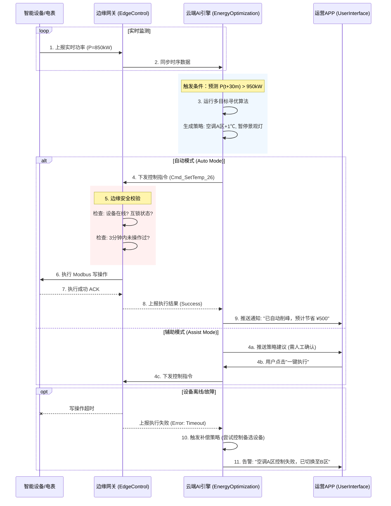

# 04-CDS 核心域场景说明书 (Core Domain Scenario)

> **编号**：DDD-STR-CarbonOpt-20251210-v2.0  
> **状态**：Final  
> **版本说明**：深化版，包含异常流程与详细规则

---

## 场景：AI 预测削峰填谷 (AI-Driven Peak Shaving)

**场景简述**：当 AI 预测到未来半小时内园区总负荷将突破"最大需量"阈值时，系统自动生成最优削峰策略，并在边缘端执行设备调控，避免产生高额罚款。

### 1. 业务流程时序 (Sequence Diagram)

### 2. 业务规则 (Business Rules)

| 规则ID | 规则名称 | 规则详情 | 约束强度 |
| :--- | :--- | :--- | :--- |
| **BR-01** | **需量预警阈值** | 只有当 `预测负荷 > 变压器容量 * 0.85` 且持续时间 `> 5分钟` 时，才触发削峰策略，避免误判波动。 | **强约束** (硬编码) |
| **BR-02** | **舒适度红线** | 办公区空调调节范围严格限制在 `24℃ - 27℃` 之间；每次调节步长不超过 `1℃`。 | **强约束** (配置项) |
| **BR-03** | **设备保护机制** | 同一设备在 `15分钟` 内禁止连续反向操作（如开-关-开），防止压缩机损坏。 | **强约束** (边缘端强制) |
| **BR-04** | **负荷优先级** | 削峰顺序：`景观照明 (P4)` > `走廊照明 (P3)` > `办公空调 (P2)` > `生产设备 (P1)`。严禁切断 P1 级设备。 | **弱约束** (策略权重) |
| **BR-05** | **断网自治** | 当边缘网关与云端断连超过 `10分钟`，网关应自动接管控制权，执行本地预置的"保底削峰策略"。 | **强约束** (边缘逻辑) |

### 3. 验收标准 (Acceptance Criteria)

*   **场景 1：自动削峰成功**
    *   **Given**: 当前负荷 850kW，变压器告警阈值 950kW，系统设置为"自动模式"。
    *   **When**: AI 预测 15 分钟后负荷将达到 960kW。
    *   **Then**: 
        1.  系统应在 **3秒内** 生成削峰策略。
        2.  边缘网关应成功下发指令关闭景观灯。
        3.  App 端收到"自动削峰执行成功"通知。
        4.  15分钟后的实际负荷未超过 950kW。

*   **场景 2：设备故障自动补偿**
    *   **Given**: 策略决定关闭"空调机组A"，但该设备 Modbus 通讯超时。
    *   **When**: 边缘网关上报"执行失败"错误。
    *   **Then**: 
        1.  云端应在 **5秒内** 生成新的补偿策略（如关闭"空调机组B"）。
        2.  系统记录一次"设备通讯故障"告警。

*   **场景 3：舒适度保护**
    *   **Given**: 当前室内温度 26.5℃，策略试图将空调设定为 28℃。
    *   **When**: 策略下发。
    *   **Then**: 
        1.  边缘网关应 **拒绝执行**，并返回"超出舒适度限制"错误码（因为 28℃ > 27℃ 上限）。
        2.  该策略被标记为"无效"。

### 4. 场景级北极星指标

*   **削峰响应时延**: `< 60秒` (从预测触发到指令落地)
*   **削峰成功率**: `100%` (指未产生实际需量罚款)
*   **用户投诉率**: `< 0.1%` (因削峰导致的舒适度投诉)
