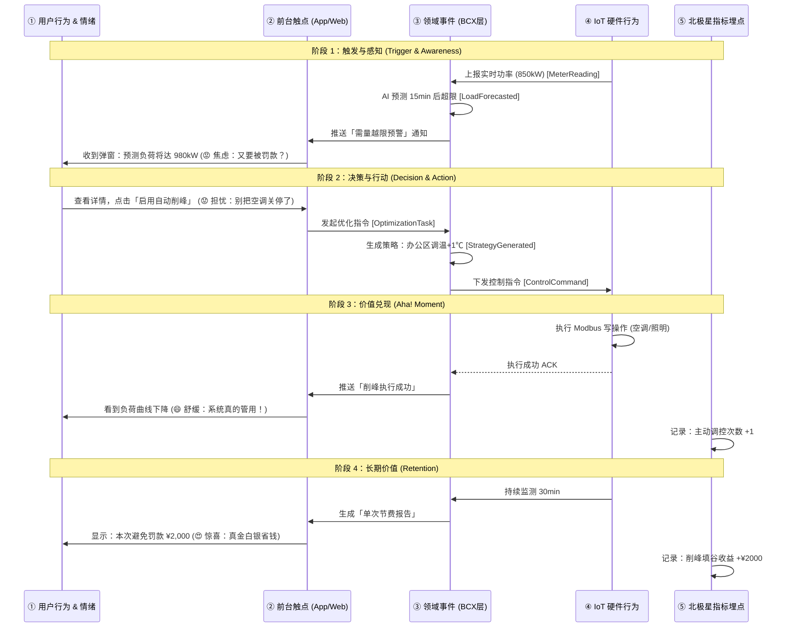
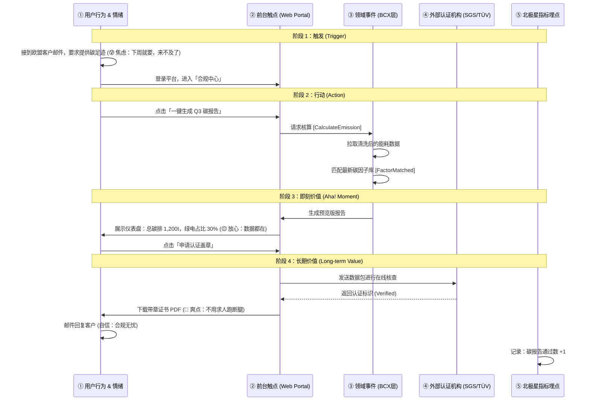
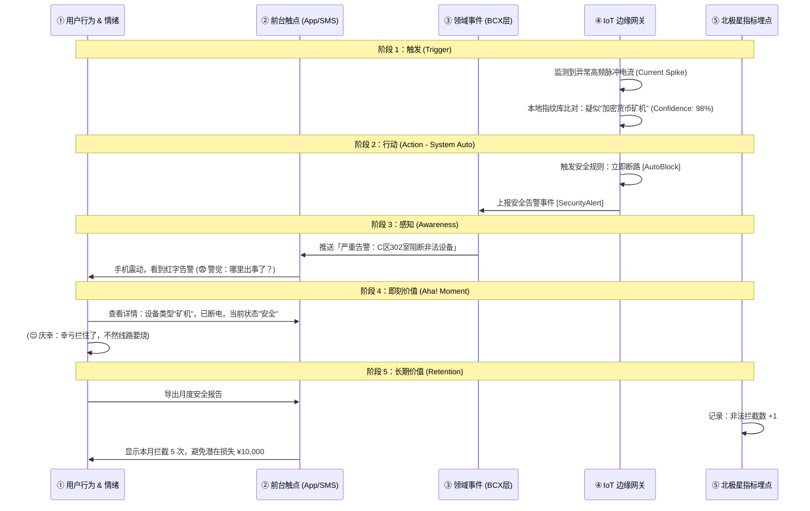
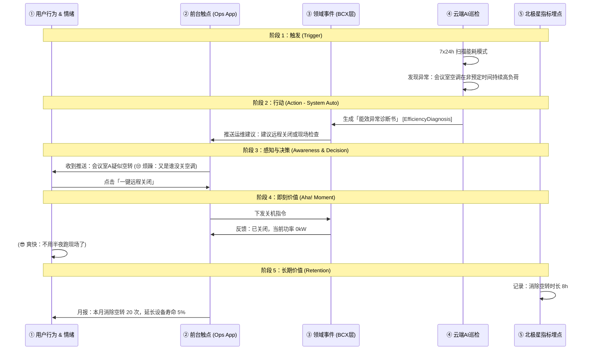
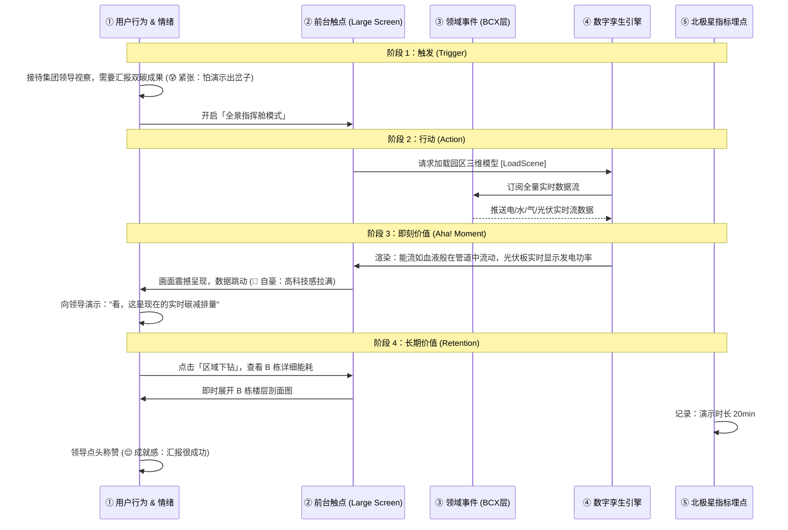
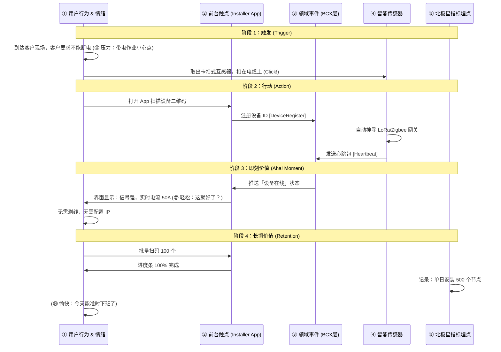

# 碳排优化MVP —— 「用户故事 & 用户旅程」

> **编号**：DDD-STR-CarbonOpt-20251210-v1.0-08-CUJ  
> **版本**：v1.1  
> **关联文档**：BVC, CDS, BCX  
> **状态**：Final

---

## 1. 核心旅程概览

本 MVP 阶段聚焦六条决定产品生死的核心价值路径：
1.  **运营方视角（降本）**：AI 智能削峰，避免巨额需量罚款。
2.  **企业方视角（增收）**：零摩擦生成合规碳报告，消除出口阻碍。
3.  **安防视角（安全）**：非法高能耗设备（如矿机）秒级拦截。
4.  **维保视角（提效）**：AI 预测性维护，消除“人走灯亮”与设备空转。
5.  **管理者视角（掌控）**：全景数字孪生监控，实现“所见即所得”的全局管理。
6.  **交付视角（体验）**：零侵入快速入网，保障客户生产“零中断”。

---

## 2. 旅程一：智能削峰免罚款 (Smart Peak Shaving)

### 2.1 用户故事卡 (User Story Card)

```text
作为【园区能源运营经理】，
我希望在【用电尖峰时段（如夏季午后）】自动完成【负荷削峰】，
从而【避免触发电网最大需量罚款 + 降低人力巡检成本】，
以支撑我【完成年度节能 KPI 并向集团汇报 ROI】。

验收标准：
1. 给定预测负荷 > 变压器容量 90%，当持续时间 > 5min 时，系统自动下发调控指令，且 30min 内负荷曲线回归安全值。
2. 北极星指标：削峰成功率 100%（无一次罚款发生）。

对应子域/上下文：EnergyOptimization (能源调优), EdgeControl (边缘控制)
对应北极星指标：园区月度综合节能率
```

### 2.2 用户旅程泳道图 (User Journey Map)



### 2.3 必填字段清单

| 字段 | 内容 | 备注 |
| :--- | :--- | :--- |
| **1. 用户角色** | 园区能源运营经理 | 背负降本增效 KPI，对罚款极其敏感 |
| **2. 关键痛点** | 需量罚款不可控，单月可能损失 ¥50,000+ | 传统人工拉闸由于滞后性，往往罚单已生成 |
| **3. 产品特征** | AI 负荷预测 + 边缘秒级调控 | 提前 30 分钟预测，3 秒内执行 |
| **4. 即刻价值** | 实时看到负荷曲线被“压”回安全线 | 消除当下的罚款焦虑 |
| **5. 长期价值** | 月度账单节省 20%，无需增加运维人力 | 续费理由：省下的钱远大于软件订阅费 |
| **6. 北极星指标** | 削峰成功率 100% | 必须零失误 |
| **7. 对应子域** | EnergyOptimization (核心域) | 依赖 AI 预测算法 |
| **8. 旅程版本号** | Journey-CarbonOpt-2025Q1-v1.0 | MVP 核心交付 |

---

## 3. 旅程二：一键合规碳报告 (Compliance Reporting)

### 3.1 用户故事卡 (User Story Card)

```text
作为【出口企业 EHS 负责人】，
我希望在【每季度出口报关前】自动生成【ISO 14064 合规碳足迹报告】，
从而【零摩擦通过欧盟碳关税审查 + 获得绿色供应链资质】，
以支撑我【确保订单按时交付并提升品牌溢价】。

验收标准：
1. 给定季度能耗数据，当点击“生成报告”时，3秒内产出包含源数据溯源链的 PDF/XML 报告。
2. 北极星指标：碳报告通过率 100%（认证机构无拒收）。

对应子域/上下文：CarbonCore (碳排核心), EnergyMonitoring (能源监测)
对应北极星指标：碳报告通过率
```

### 3.2 用户旅程泳道图 (User Journey Map)



### 3.3 必填字段清单

| 字段 | 内容 | 备注 |
| :--- | :--- | :--- |
| **1. 用户角色** | 出口企业 EHS 负责人 | 非能源专家，惧怕复杂的核算公式 |
| **2. 关键痛点** | 手工 Excel 核算易出错，第三方认证周期长达 2 周 | 时间紧迫，一旦数据存疑会被退回 |
| **3. 产品特征** | 物联网溯源 + 权威因子库 + 在线认证 | 数据源头防篡改，与认证机构互认 |
| **4. 即刻价值** | 3 秒生成草稿，数据可视化 | 瞬间掌握碳排家底 |
| **5. 长期价值** | 每年节省 ¥10万+ 咨询费，订单零延误 | 续费理由：合规护身符 |
| **6. 北极星指标** | 碳报告通过率 100% | 结果导向 |
| **7. 对应子域** | CarbonCore (核心域) | 依赖精准核算引擎 |
| **8. 旅程版本号** | Journey-CarbonOpt-2025Q1-v1.0 | 增值服务交付 |

---

## 4. 旅程三：非法设备智能拦截 (Illegal Device Interception)

### 4.1 用户故事卡 (User Story Card)

```text
作为【园区安防/IT 经理】，
我希望在【私接高能耗设备（如矿机/大功率电炉）时】系统能【3秒内自动识别并断电拦截】，
从而【消除线路过载火灾隐患 + 防止盗用公家电费】，
以支撑我【保障园区电网绝对安全与能耗合规】。

验收标准：
1. 给定未知设备接入，当功率特征匹配"挖矿/违规"指纹库时，网关在 3s 内切断该回路电源。
2. 北极星指标：非法设备拦截率 ≥ 95%。

对应子域/上下文：EdgeControl (边缘控制), EnergyMonitoring (能源监测)
对应北极星指标：非法设备拦截数
```

### 4.2 用户旅程泳道图 (User Journey Map)



### 4.3 必填字段清单

| 字段 | 内容 | 备注 |
| :--- | :--- | :--- |
| **1. 用户角色** | 园区安防/IT 经理 | 关注资产安全与用电合规 |
| **2. 关键痛点** | 私接设备隐蔽难查，往往引发火灾或跳闸后才发现 | 传统巡检无法发现隐蔽的违规电器 |
| **3. 产品特征** | 边缘指纹识别 + 毫秒级断路 | 无需云端介入，断网也能拦截 |
| **4. 即刻价值** | 3秒内消除隐患，收到"已处理"通知 | 安全感拉满 |
| **5. 长期价值** | 杜绝电费跑冒滴漏，火灾风险降低 90% | 续费理由：买保险 |
| **6. 北极星指标** | 非法设备拦截率 ≥ 95% | 核心安全指标 |
| **7. 对应子域** | EdgeControl (核心域) | 依赖边缘计算能力 |
| **8. 旅程版本号** | Journey-CarbonOpt-2025Q1-v1.1 | 差异化安全卖点 |

---

## 5. 旅程四：AI 预测性维护 (Predictive Maintenance)

### 5.1 用户故事卡 (User Story Card)

```text
作为【设施维保工程师】，
我希望在【设备发生实质性故障前（如人走灯亮/电机异响）】收到【精准的异常诊断建议】，
从而【变"救火式维修"为"计划性保养" + 消除无效能耗】，
以支撑我【降低设备停机率并延长资产寿命】。

验收标准：
1. 给定非工作时间（如凌晨 2 点），当监测到照明回路仍有 20kW 负荷时，系统自动标记为"异常空转"并生成工单。
2. 北极星指标：运维响应时延从"小时级"降至"3秒"。

对应子域/上下文：EnergyMonitoring (能源监测), DeviceAsset (设备资产)
对应北极星指标：月度自动优化控制次数
```

### 5.2 用户旅程泳道图 (User Journey Map)



### 5.3 必填字段清单

| 字段 | 内容 | 备注 |
| :--- | :--- | :--- |
| **1. 用户角色** | 设施维保工程师 | 厌恶低价值的重复跑腿工作 |
| **2. 关键痛点** | 故障发现滞后，"人走灯亮"造成巨大浪费 | 经常半夜被叫起来处理紧急跳闸 |
| **3. 产品特征** | 7x24h AI 巡检 + 远程智控 | 数字能源管家替代人工 |
| **4. 即刻价值** | 手机一点即可解决问题，无需跑现场 | 极大提升运维幸福感 |
| **5. 长期价值** | 运维效率提升 50%，设备寿命延长 | 续费理由：省人省力 |
| **6. 北极星指标** | 运维响应时延 < 3秒 | 效率指标 |
| **7. 对应子域** | EnergyMonitoring (支撑域) | 依赖数据模式识别 |
| **8. 旅程版本号** | Journey-CarbonOpt-2025Q1-v1.1 | 运营提效卖点 |

---

## 6. 旅程五：全景数字孪生监控 (Digital Twin Monitoring)

### 6.1 用户故事卡 (User Story Card)

```text
作为【园区综合管理者】，
我希望在【每日晨会或接待重要客户参观时】能够【通过三维大屏直观展示园区能源流向】，
从而【全局掌控园区运行状态 + 提升企业绿色品牌形象】，
以支撑我【快速做出宏观调度决策并获得利益相关者认可】。

验收标准：
1. 3D 园区模型加载时间 < 5秒，数据刷新频率 < 1秒。
2. 北极星指标：关键决策支持次数 / 参观演示满意度评分 > 4.8分。

对应子域/上下文：DigitalTwin (数字孪生), EnergyMonitoring (能源监测)
对应北极星指标：用户活跃度 (DAU)
```

### 6.2 用户旅程泳道图 (User Journey Map)



### 6.3 必填字段清单

| 字段 | 内容 | 备注 |
| :--- | :--- | :--- |
| **1. 用户角色** | 园区综合管理者 | 关注宏观数据与对外形象 |
| **2. 关键痛点** | 传统报表枯燥乏味，无法直观展示复杂的能源关系 | 向非技术人员汇报时解释成本高 |
| **3. 产品特征** | WebGL 三维可视化 + 实时数据驱动 | 游戏级渲染画质，低延迟 |
| **4. 即刻价值** | 一眼看懂全园状态，视觉冲击力强 | 极佳的演示工具 |
| **5. 长期价值** | 提升决策效率，成为园区对外宣传的名片 | 续费理由：面子工程+里子工程 |
| **6. 北极星指标** | 演示满意度 > 4.8 | 体验指标 |
| **7. 对应子域** | DigitalTwin (通用域/支撑域) | 依赖可视化引擎 |
| **8. 旅程版本号** | Journey-CarbonOpt-2025Q1-v1.0 | 差异化旗舰功能 |

---

## 7. 旅程六：零侵入快速入网 (Non-intrusive Onboarding)

### 7.1 用户故事卡 (User Story Card)

```text
作为【现场部署工程师】，
我希望在【不切断客户电源且不破坏原有装修的情况下】完成【传感器的安装与联网】，
从而【保障客户工厂生产"零中断"】，
以支撑我【在 1 天内完成千点规模的交付任务】。

验收标准：
1. 单个设备安装耗时 < 5分钟（卡扣式）。
2. 扫码配对成功率 100%，上电即上云。
3. 北极星指标：单园区交付周期（天）。

对应子域/上下文：DeviceAsset (设备资产), EdgeControl (边缘控制)
对应北极星指标：交付效率
```

### 7.2 用户旅程泳道图 (User Journey Map)



### 7.3 必填字段清单

| 字段 | 内容 | 备注 |
| :--- | :--- | :--- |
| **1. 用户角色** | 现场部署工程师 / 强电工 | 关注施工难度与安全性 |
| **2. 关键痛点** | 传统方案需停电穿线，协调难度大，工期长 | 客户往往拒绝停产配合 |
| **3. 产品特征** | 无线 LoRa/Zigbee + CT 取电/卡扣设计 | 真正的“即插即用” |
| **4. 即刻价值** | 咔嗒一声安装完毕，扫码即用 | 极致的交付效率 |
| **5. 长期价值** | 交付成本降低 80%，快速复制到更多园区 | 续费理由：不仅是软件，更是服务体验 |
| **6. 北极星指标** | 单园区交付周期 < 3天 | 成本指标 |
| **7. 对应子域** | DeviceAsset (支撑域) | 依赖自动化注册流程 |
| **8. 旅程版本号** | Journey-CarbonOpt-2025Q1-v1.0 | 核心非功能竞争力 |

---

## 8. 情绪曲线分析 (Emotion Curve)

```mermaid
xychart-beta
    title "核心旅程"情绪峰值对比
    x-axis [触发, 感知, 决策, 行动, 即刻价值, 长期价值]
    y-axis "情绪分值" -2 --> +2
    line [ -1.5, -0.5, 0.5, 0.0, 1.8, 2.0]
    line [ -1.0, -0.8, 0.2, 1.0, 1.5, 1.8]
    line [ -0.5, 0.0, 1.5, 1.8, 2.0, 2.0]
    line [ -0.2, 0.5, 1.0, 1.5, 2.0, 1.5]
    line [ -0.5, 0.0, 0.5, 1.0, 1.8, 2.0]
```

*   **曲线 1 (智能削峰)**: 解决强焦虑（罚款），高潮在于“实时止损”。
*   **曲线 2 (非法拦截)**: 解决惊恐（火灾/盗电），高潮在于“自动防御”带来的安全感。
*   **曲线 3 (预测维护)**: 解决烦躁（跑腿/低效），高潮在于“远程掌控”带来的掌控感。
*   **曲线 4 (数字孪生)**: 解决紧张（汇报压力），高潮在于“震撼视觉”带来的成就感。
*   **曲线 5 (快速入网)**: 解决压力（施工难度），高潮在于“秒级上云”带来的轻松感。

---

## 9. 总结

六条旅程共同构建了产品的完整价值闭环：
*   **旅程一 & 二**：解决 B 端客户最关注的 **ROI (降本)** 与 **合规 (增收)** 问题。
*   **旅程三 & 四**：解决运维与安防人员最关注的 **安全** 与 **效率** 问题。
*   **旅程五 & 六**：解决管理者与交付团队最关注的 **掌控感** 与 **交付体验** 问题。

这构成了“安装即服务”与“数字能源管家”愿景的坚实落地基石，覆盖了从部署、使用、管理到汇报的全生命周期。
