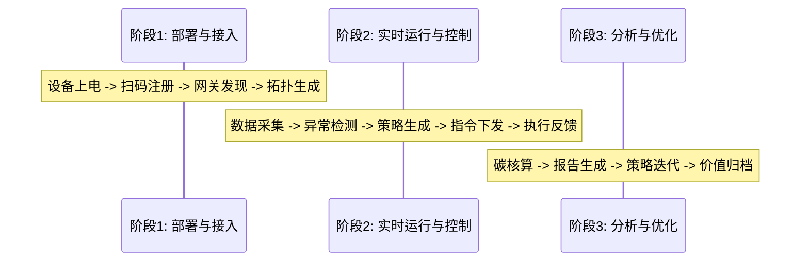
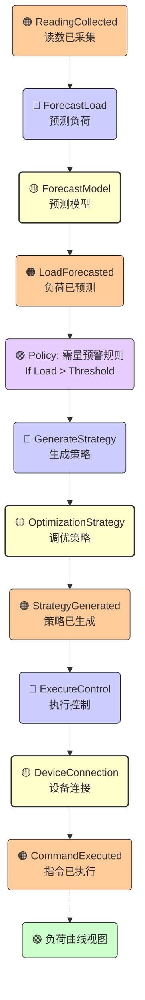
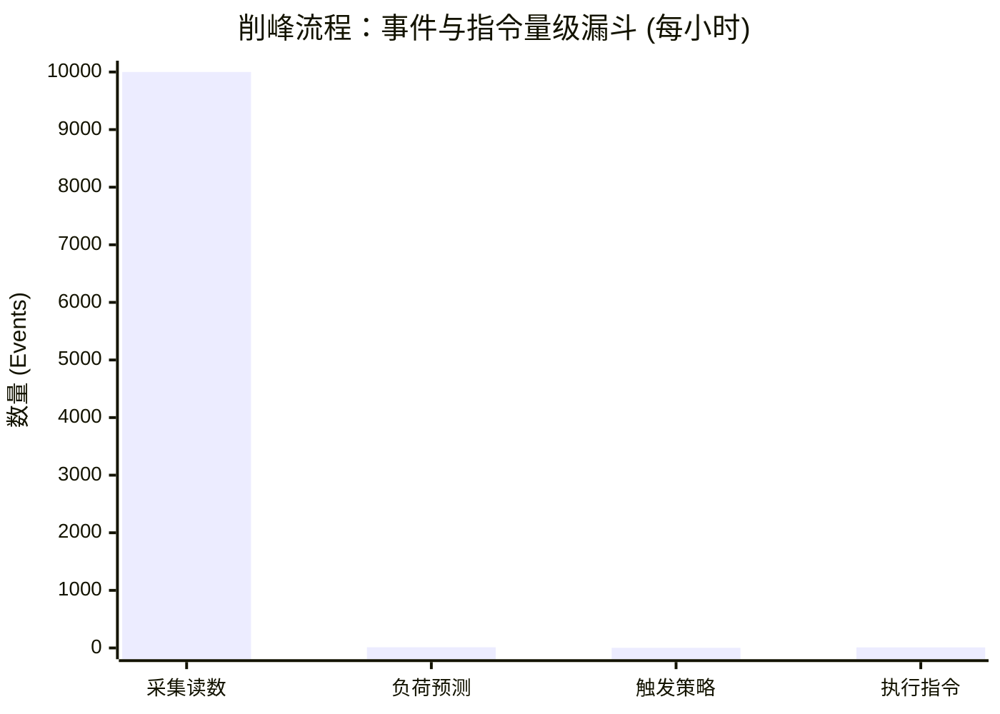
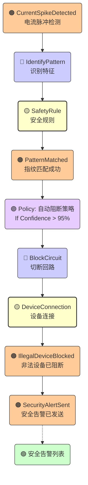
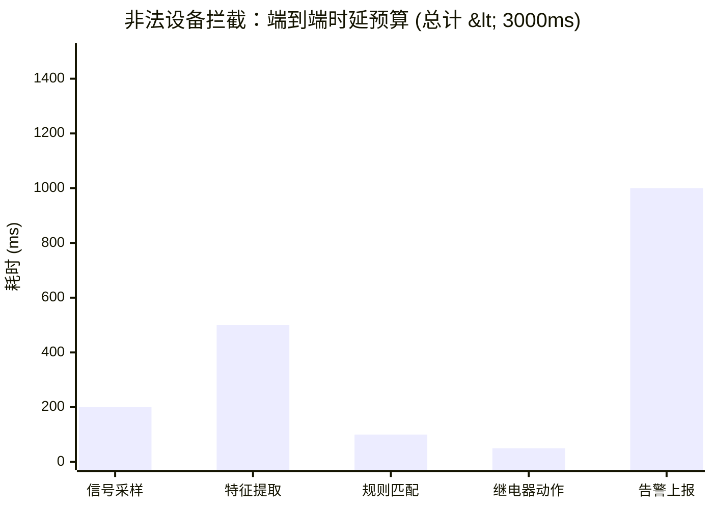
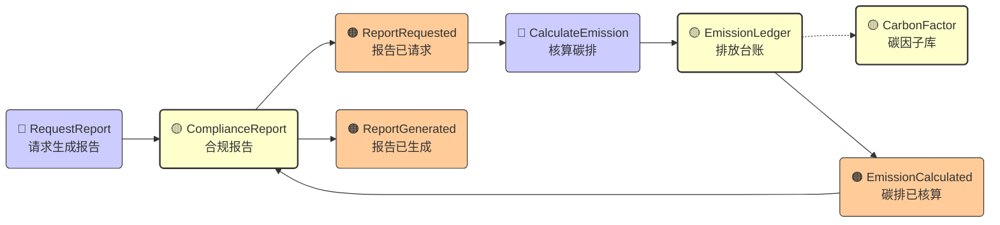
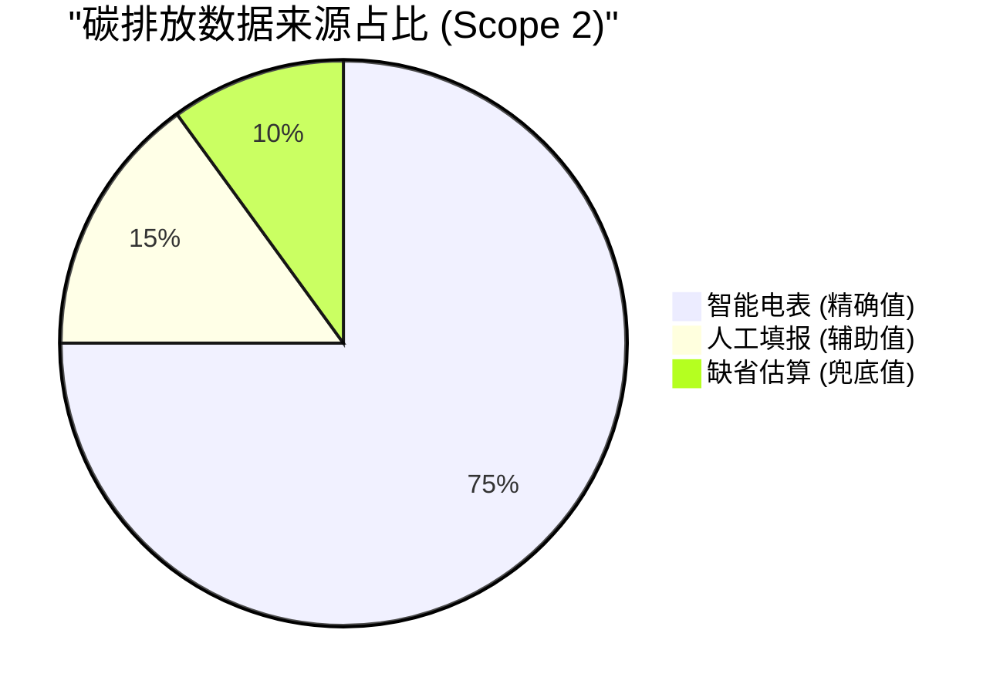
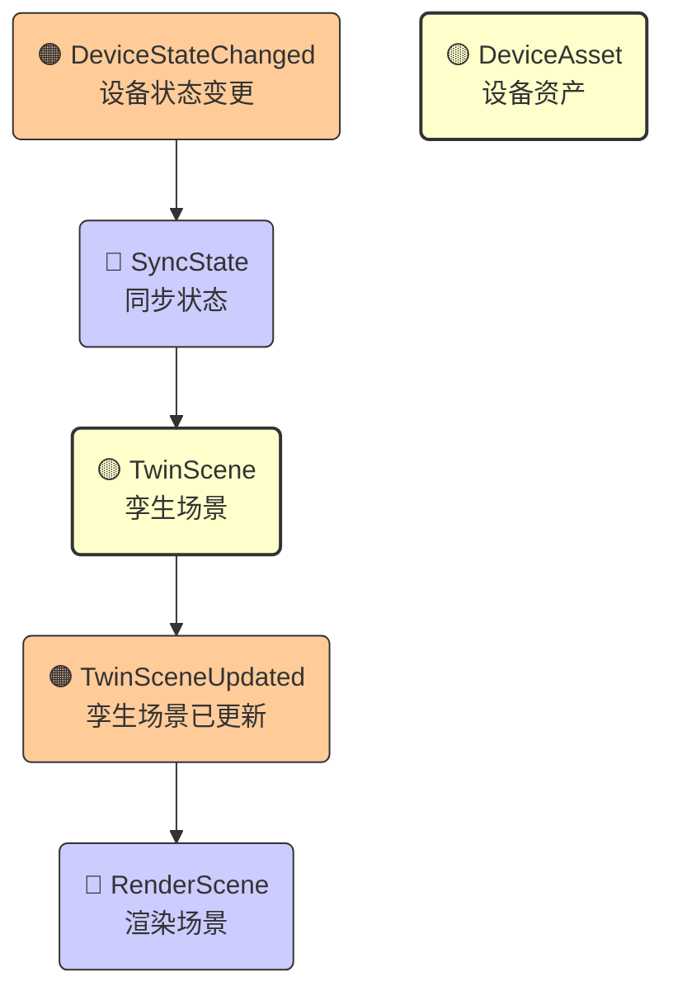

# 09-ES 事件风暴规划设计 (Event Storming)

> **编号**：DDD-STR-CarbonOpt-20251210-v1.0-09-EventStorming  
> **状态**：Final  
> **版本说明**：基于 D1/D2 阶段文档的事件风暴产出，深度解析核心流程的命令与事件流转。

---

## 1. 全局事件流 (Big Picture)

本节展示了碳排优化系统核心业务流程中的关键领域事件（Domain Events），按时间轴分为三个主要阶段：**部署与接入**、**实时运行与控制**、**分析与优化**。

### 1.1 时间轴概览

### 1.2 关键领域事件清单

| 阶段 | 领域事件 (Event) | 触发源 (Trigger) | 关键数据 (Payload) | 归属上下文 |
| :--- | :--- | :--- | :--- | :--- |
| **接入** | `DevicePowerOn` (设备上电) | 物理动作 | MAC地址 | DeviceAsset |
| | `DeviceRegistered` (设备已注册) | 用户扫码 | DeviceID, TenantID, Location | DeviceAsset |
| | `DeviceOnline` (设备上线) | 边缘网关 | Heartbeat, SignalStrength | EdgeControl |
| **运行** | `ReadingCollected` (读数已采集) | 定时任务 | Voltage, Current, Power | EnergyMonitoring |
| | `LoadForecasted` (负荷已预测) | 定时/事件 | ForecastCurve (t+30m) | EnergyOptimization |
| | `StrategyGenerated` (策略已生成) | 预测超限 | TargetDevice, Action, Priority | EnergyOptimization |
| | `CommandExecuted` (指令已执行) | 边缘执行 | ExecutionResult, Timestamp | EdgeControl |
| | `SecurityAlertTriggered` (安全告警) | 模式识别 | AlertType, Confidence | EdgeControl |
| | `IllegalDeviceBlocked` (非法设备被阻断) | 自动规则 | BlockDuration, DeviceType | EdgeControl |
| **分析** | `EmissionCalculated` (碳排已核算) | 周期任务 | CO2e, Scope1/2/3 | CarbonCore |
| | `ReportGenerated` (报告已生成) | 用户请求 | ReportURL, Period | CarbonCore |
| | `OptimizationModelUpdated` (模型已更新) | 算法迭代 | ModelVersion, Accuracy | EnergyOptimization |

---

## 2. 核心流程建模 (Process Modeling)

本节选取最核心的三个业务场景，通过 **Command (命令) -> Aggregate (聚合) -> Event (事件)** 的流转模式进行详细建模，并附带详细的逻辑说明表。

### 图例说明
*   🔵 **Command (蓝色)**: 用户或系统发起的动作。
*   🟡 **Aggregate (黄色)**: 接收命令、维护状态、发布事件的实体。
*   🟠 **Event (橙色)**: 聚合状态变更后发生的客观事实。
*   🟣 **Policy (紫色)**: 监听事件并触发新命令的业务规则（自动化）。
*   🟢 **Read Model (绿色)**: 供用户查询的视图。

### 2.1 流程一：智能削峰填谷 (Smart Peak Shaving)

此流程展示了系统如何从“预测”到“执行”的闭环控制，涉及跨上下文协作（Monitoring -> Optimization -> Edge）。

#### 2.1.1 流程图 (Process Graph)

#### 2.1.2 领域逻辑详述 (Logic Specification)

| 步骤 | 触发源 (Trigger) | 核心聚合 (Aggregate) | 业务逻辑/不变量 (Policy/Invariant) | 产出事件 (Event) | 备注 |
| :--- | :--- | :--- | :--- | :--- | :--- |
| **1. 预测** | `ReadingCollected` | `ForecastModel` | 基于历史数据和当前负荷，预测未来 30min 曲线。 | `LoadForecasted` | AI 模型调用 |
| **2. 决策** | `LoadForecasted` | `OptimizationStrategy` | **需量预警规则**：若 P(t+30) > 变压器容量 * 90%，触发削峰。优先切断 P4 (景观) > P3 (走廊)。 | `StrategyGenerated` | 策略包含具体设备列表 |
| **3. 下发** | `StrategyGenerated` | `DeviceConnection` | **连接检查**：仅向 `Status=Online` 的设备下发指令。 | N/A (RPC Call) | 跨上下文 Partnership |
| **4. 执行** | `ExecuteControl` | `DeviceConnection` | **设备保护**：同一设备 15min 内禁止连续反向操作。 | `CommandExecuted` | 边缘端执行 Modbus 写操作 |
| **5. 反馈** | `CommandExecuted` | `OptimizationStrategy` | 更新策略执行状态，计算实际削峰量。 | `OptimizationCompleted` | 用于修正 AI 模型 |

#### 2.1.3 数据量级漏斗分析 (Data Volume Funnel)

> **分析**: 从海量的采集数据 (10k+) 到少量的控制指令 (10+)，体现了系统“过滤噪音、提炼价值”的核心能力。

---

### 2.2 流程二：非法设备智能拦截 (Illegal Device Interception)

此流程强调边缘端的快速响应（3秒内），不依赖云端即可完成闭环。

#### 2.2.1 流程图 (Process Graph)

#### 2.2.2 领域逻辑详述 (Logic Specification)

| 步骤 | 触发源 (Trigger) | 核心聚合 (Aggregate) | 业务逻辑/不变量 (Policy/Invariant) | 产出事件 (Event) | 备注 |
| :--- | :--- | :--- | :--- | :--- | :--- |
| **1. 识别** | `CurrentSpikeDetected` | `SafetyRule` | 对比本地指纹库，计算相似度 (Confidence)。 | `PatternMatched` | 边缘计算 |
| **2. 判定** | `PatternMatched` | `SafetyRule` | **自动阻断策略**：若 `Confidence > 95%` 且 `DeviceType` 在黑名单中，立即触发阻断。 | N/A (Internal) | 毫秒级决策 |
| **3. 阻断** | `BlockCircuit` | `DeviceConnection` | **安全优先**：强制切断继电器，忽略云端其他指令。 | `IllegalDeviceBlocked` | 物理断电 |
| **4. 告警** | `IllegalDeviceBlocked` | `SecurityService` | 生成高危告警，推送到运维端。 | `SecurityAlertSent` | 异步上报 |

#### 2.2.3 响应时延分布分析 (Latency Breakdown)

> **分析**: 核心阻断动作 (前4步) 耗时 < 1秒，确保了电气安全；告警上报 (最后1步) 允许异步延迟，不阻塞保护逻辑。

---

### 2.3 流程三：合规碳报告生成 (Compliance Reporting)

此流程展示了核心域 CarbonCore 如何整合数据生成价值交付物。

#### 2.3.1 流程图 (Process Graph)

#### 2.3.2 领域逻辑详述 (Logic Specification)

| 步骤 | 触发源 (Trigger) | 核心聚合 (Aggregate) | 业务逻辑/不变量 (Policy/Invariant) | 产出事件 (Event) | 备注 |
| :--- | :--- | :--- | :--- | :--- | :--- |
| **1. 请求** | 用户点击 | `ComplianceReport` | 校验用户权限与套餐等级。 | `ReportRequested` | - |
| **2. 核算** | `ReportRequested` | `EmissionLedger` | **因子快照**：必须使用核算周期内生效的碳因子版本（如 2024版）。 **不可篡改**：台账一旦生成，仅可通过冲红修正，不可删除。 | `EmissionCalculated` | 核心合规逻辑 |
| **3. 生成** | `EmissionCalculated` | `ComplianceReport` | 按照 ISO 14064 模板渲染 PDF。 | `ReportGenerated` | 交付物 |

#### 2.3.3 碳核算数据来源构成 (Emission Data Composition)

> **分析**: 系统高度依赖自动化采集 (75%) 以确保数据的客观性与审计通过率；人工与估算仅作为补充。

---

### 2.4 流程四：数字孪生实时映射 (Digital Twin Mapping)

此流程展示了物理世界状态如何实时同步至 3D 虚拟场景，支持可视化监控。

#### 2.4.1 流程图 (Process Graph)

#### 2.4.2 领域逻辑详述 (Logic Specification)

| 步骤 | 触发源 (Trigger) | 核心聚合 (Aggregate) | 业务逻辑/不变量 (Policy/Invariant) | 产出事件 (Event) | 备注 |
| :--- | :--- | :--- | :--- | :--- | :--- |
| **1. 变更** | `DeviceOnline` / `ReadingCollected` | `DeviceAsset` | 设备物理状态发生变化。 | `DeviceStateChanged` | 来源：Edge |
| **2. 映射** | `DeviceStateChanged` | `TwinScene` | **ID 映射规则**：根据 `DeviceID` 查找对应的 3D Mesh (网格对象)。 **状态插值**：若数据频率 < 渲染帧率，进行线性插值平滑动画。 | `TwinSceneUpdated` | 包含位置、颜色、动画状态 |
| **3. 渲染** | `TwinSceneUpdated` | `TwinScene` | 前端引擎 (Three.js/UE) 接收事件并刷新画面。 | N/A (View Update) | WebSocket 推送 |

---

## 3. 聚合识别与职责 (Aggregate Identification)

基于上述事件流，我们识别出以下核心聚合及其职责边界：

| 聚合名称 (Aggregate) | 归属上下文 | 核心职责 | 包含实体/值对象 | 关键不变量 (Invariant) |
| :--- | :--- | :--- | :--- | :--- |
| **OptimizationStrategy** (调优策略) | EnergyOptimization | 维护一次调优任务的全生命周期（生成->下发->反馈）。 | TaskID, DeviceList, ActionType, Status | 策略必须包含至少一个有效控制指令；同一设备不能在同一时间段内有冲突策略。 |
| **DeviceConnection** (设备连接) | EdgeControl | 管理物理设备的连接状态与协议适配。 | ConnectionState, ProtocolConfig, LastHeartbeat | 设备断连后，必须拒绝下发非离线指令。 |
| **SafetyRule** (安全规则) | EdgeControl | 定义边缘端的安全保护逻辑（如过载保护、非法识别）。 | RuleType, Threshold, Action, Whitelist | 安全规则优先级高于云端控制指令。 |
| **EmissionLedger** (排放台账) | CarbonCore | 记录每一笔碳排放流水，不可篡改。 | LedgerID, EmissionValue, FactorSnapshot, SourceDataID | 核算结果必须关联当时版本的碳因子快照。 |
| **TwinScene** (数字孪生场景) | DigitalTwin | 管理 3D 场景中的对象映射关系。 | SceneID, MeshID, DataBinding | 每一个 3D 对象必须绑定唯一的 DeviceID 或 VirtualID。 |

---

## 4. 热点与机会 (Hotspots & Opportunities)

在事件风暴过程中，团队识别出的关键挑战（Hotspots）与潜在价值点（Opportunities）：

### 4.1 🔴 热点 (Hotspots) - 需重点关注的风险
1.  **H1 (边缘一致性)**: 当云端下发策略时，边缘设备可能刚刚离线。
    *   *对策*: 引入 `CommandExpired` 事件，策略下发带 TTL（生存时间），超时未执行自动失效。
2.  **H2 (因子版本)**: 碳核算因子每年更新，历史数据的重算问题。
    *   *对策*: `EmissionLedger` 聚合必须快照存储计算时的因子值，支持“重算”命令生成新的 Ledger 版本，保留旧版本用于审计。
3.  **H3 (多租户隔离)**: 物理网关可能被多个租户共享（如园区公共设施）。
    *   *对策*: 在 `DeviceAsset` 层面严格定义所有权，`EdgeControl` 执行指令时校验 `TenantID`。

### 4.2 🟢 机会 (Opportunities) - 潜在业务价值
1.  **O1 (虚拟电厂预留)**: `OptimizationStrategy` 聚合的设计应预留“外部电网指令”接口，便于未来接入 VPP（虚拟电厂）市场。
2.  **O2 (设备指纹库变现)**: 非法设备识别的指纹库（`SafetyRule`）具有独立商业价值，可作为数据产品单独订阅。
3.  **O3 (碳信用流转)**: `EmissionLedger` 的不可篡改特性天然适合上链，未来可直接对接碳交易平台。

---

## 5. 结论

通过事件风暴，我们确认了系统的核心驱动力是 **“数据驱动的闭环控制”**。
*   **输入端**: 依赖 `EnergyMonitoring` 的高频数据和 `DeviceAsset` 的精准元数据。
*   **决策端**: `EnergyOptimization` 和 `EdgeControl` 共同构成了系统的“大脑”和“小脑”。
*   **输出端**: 通过 `CarbonCore` 和 `DigitalTwin` 将技术价值转化为业务价值（合规与体验）。

后续战术设计（D3）应重点关注 **OptimizationStrategy** 和 **DeviceConnection** 这两个核心聚合的详细设计与测试。
