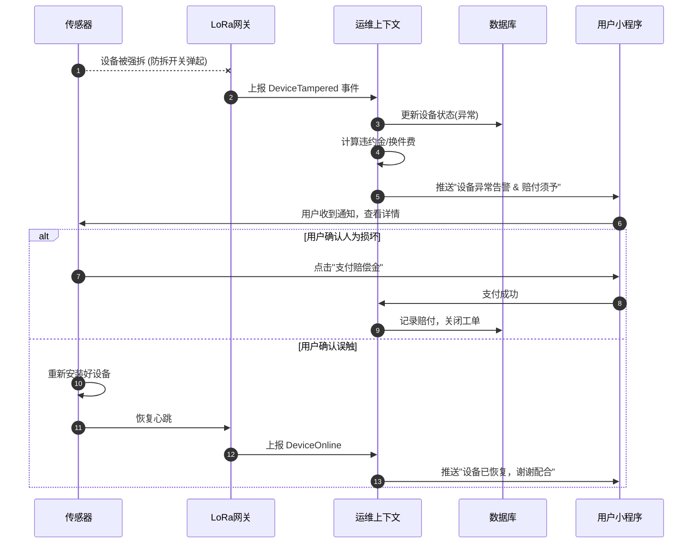
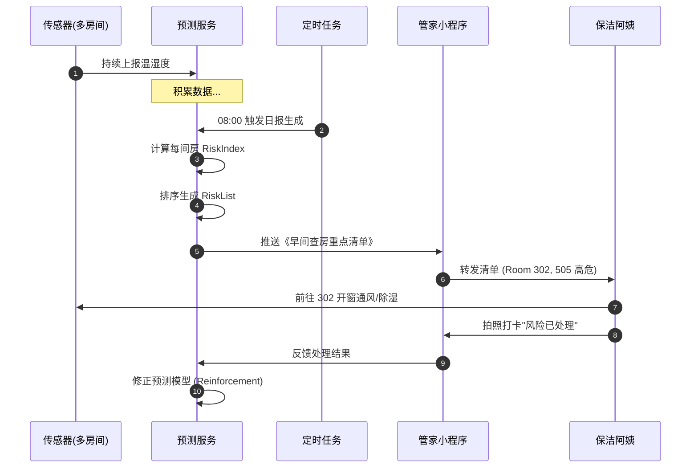
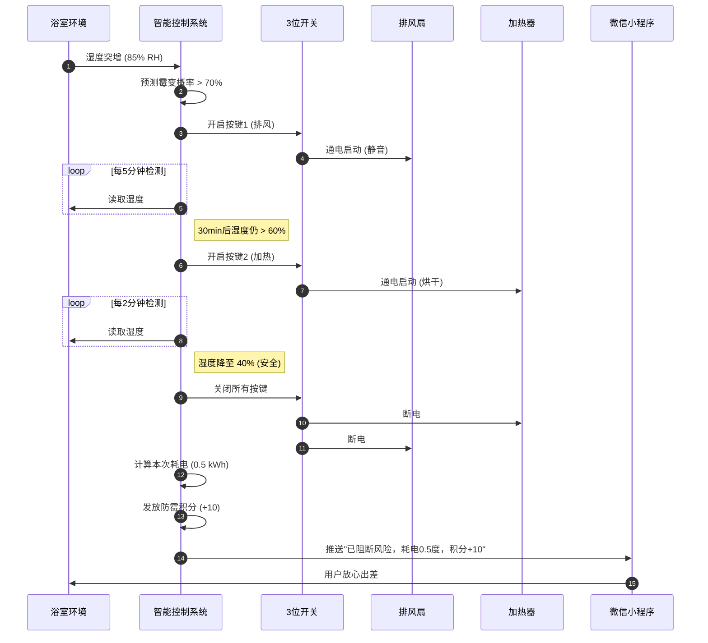
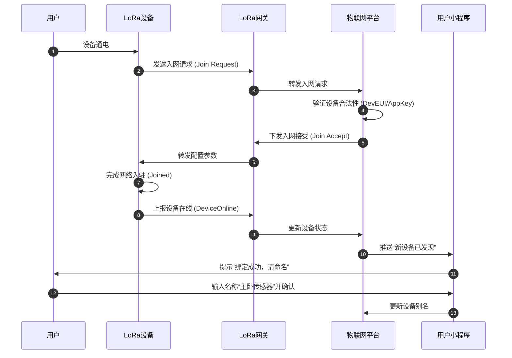

# 防霉管控MVP —— 「用户故事 & 用户旅程」

> **编号**: USER-STORIES-SmartMoldGuard-20251212-v2.0
> **状态**: Final
> **版本说明**: 基于产品愿景v2.0深化，包含完整用户旅程时序图
> **依据**: PROD-VISION-SmartMoldGuard-20251212-v2.0
> **术语引用**: 本文档使用《SmartMoldGuard-统一术语表》（v1.0）定义的标准术语

## 一、核心用户故事 (Core User Stories)

### Story 1: 资产保全与零运维 (运维核心)
```markdown
作为【设备提供方的运维工程师】，
当【系统检测到“金南家园三期 3502 房温湿度传感器”被非法拆除或长期离线时】，
我希望【系统能通过微信小程序同步将告警推送给设备使用方，并自动生成包含传感器SN、剩余租期、换件费用告知内容也同步展现】，
从而【让 99.99 % 的异常在 10 分钟内由用户自助确认或邮寄返修，无需派单上门】，
以支撑我【实现零最终用户侧上门运维，无上门安装和调测服务，所有使用问题在云端解决】。

验收标准：
1. Given 设备心跳丢失 > 3次 或 防拆开关触发
   When 判定为异常离线
   Then 推送告警至用户小程序，文案包含：“您的设备[SN:123]已离线，若为人为损坏需赔付¥50”
2. 北极星指标：异常自助处理率 > 99%

对应子域：交付运维上下文 (Support), 设备连接上下文 (Support)
```

### Story 2: 轻量化风险监测 (B端核心)
```markdown
作为【经营 30 间民宿的法人用户（设备使用方）】，
当【房内仅配置了温湿度传感器、未装 LoRa 开关面板时】，
我希望【每天8:00与20:00在微信小程序收到每间房的‘霉变风险指数’准实时推送（如18%安全/65%预警）并支持按风险排序一键导出】，
从而【把高风险房提前插入我的保洁与通风计划，降低人工巡检频次50%，单房每月节省0.8次应急保洁（约￥120），同时确保零霉变投诉】，
以支撑我【合理安排房间保洁工作，为客人提供舒适的居住空间，并体验到人工智能带来的管理效率提升与友好体验感】。

验收标准：
1. Given 每日 08:00 / 20:00 定时触发
   When 获取所有房间过去12小时湿度数据并计算风险
   Then 生成《今日高风险房间清单》推送至管家微信
2. 北极星指标：人工巡检成本降低 ≥ 50%

对应子域：防霉预测上下文 (Core), 防霉报告上下文 (Support)
```

### Story 3: 智能联动与能耗感知 (C端核心)
```markdown
作为【年轻白领（设备使用方）】，
当【黄梅季夜间湿度突增至 85 %RH 且模型预测 3 h 后霉变概率＞70 % 时】，
我希望【系统先自动控制3位开关开启排风扇，30 min后若风险仍未降至30 %以下则联动加热器，并把单次能耗≤0.8 kWh的明细实时推送到微信小程序】，
从而【在零打扰的情况下保住衣柜内价值2万元的西装与包包免受霉菌侵袭，同时每月电费增幅＜5元，比传统防潮剂节省￥150/季】，
以支撑我【放心出差7天无需找人看房，时刻保持居住空间舒适，并享受人工智能带来的友好体验感，主动续订3年尊享云订阅+为同层邻居转介绍获取1个月免费服务】。

验收标准：
1. Given 预测霉变概率 > 70%
   When 触发智能干预策略
   Then 开启排风扇(静音) -> 30min后检测 -> 开启加热器(烘干)
   And 推送消息：“本次为您阻断霉菌风险，耗电 0.5 度，获得 10 防霉积分”
2. 北极星指标：霉变阻断成功率 100% & 用户NPS > 50%

对应子域：智能控制上下文 (Core), 防霉预测上下文 (Core), 订阅上下文 (Support)
```

### Story 4: 首次配置自动配网 (用户体验)
```markdown
作为【首次使用防霉系统的家庭住户（最终用户）】，
当【我把 LoRa 开关盒或温湿度传感器通电时】，
我希望【LoRa开关盒或温湿度传感器自动配置云端通讯连接】，
从而【在 5 分钟内自己完成配网与绑定，无需等待运维工程师上门或电话指导，首次配置成功率 ≥ 99.99 %】，
以支撑我【实现零最终用户侧上门运维，无上门安装和调测服务，所有使用问题在云端解决】。

验收标准：
1. Given 设备上电初始化
   When 自动发起入网请求 (Join Request)
   Then 云端自动下发配置，设备上线成功
   And 小程序自动弹出“新设备已连接，请命名”
2. 北极星指标：首次配置成功率 ≥ 99.99% & 配网耗时 < 5min

对应子域：设备连接上下文 (Core), 交付运维上下文 (Support)
```

## 二、用户旅程泳道图 (User Journey Map)

### 旅程 A: 资产保全闭环 (Asset Protection Loop)
*适用场景：设备被拆除/离线，运维侧*



### 旅程 B: 轻量化风险监测 (Lightweight Monitoring)
*适用场景：民宿/酒店，仅传感器，人工干预*



### 旅程 C: 智能联动与能耗感知 (Smart Intervention & Energy Insight)
*适用场景：家庭用户，全套设备，自动闭环*



### 旅程 D: 首次配置自动配网 (Auto Provisioning)
*适用场景：新设备上电，首次使用*


