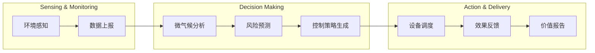

# 02-BCM 业务能力地图 (Business Capability Map)

> 编号：DDD-STR-SmartMoldGuard-20251209-v2.0
> 状态：Final
> 版本说明：深化版，包含L2能力拆解与KPI指标

## 1. Level-0 核心价值流 (Core Value Stream)

## 2. 业务能力清单 (Business Capabilities)

### 2.1 战略级能力 (Strategic) - *Build In-House*

| L1 能力 | L2 子能力 (Sub-Capability) | 描述 | 衡量指标 (KPI) | 资源策略 |
| :--- | :--- | :--- | :--- | :--- |
| **BC-02** **防霉预测** | **BC-02-01 特征工程** | 对温湿度时序数据进行清洗、降噪、特征提取（如露点计算）。 | 数据质量评分 > 98% | **自研** |
| | **BC-02-02 风险模型推理** | 运行霉菌生长模型 (Mold Growth Model)，输出风险概率。 | 推理延迟 < 500ms | **自研** |
| | **BC-02-03 气候带自适应** | 根据设备地理位置，自动加载对应气候带的参数配置。 | 区域模型覆盖率 100% | **自研** |
| | **BC-02-04 预测反馈闭环** | 收集实际干预效果，用于模型再训练 (Reinforcement Learning)。 | 样本有效率 > 90% | **自研** |
| **BC-03** **智能控制** | **BC-03-01 策略编排** | 基于规则引擎 + AI建议，生成最优控制指令 (风速/时长)。 | 策略冲突率 < 0.1% | **自研** |
| | **BC-03-02 场景联动** | 处理多设备协同（如开启加热器同时开启排风扇低速）。 | 联动成功率 > 99.9% | **自研** |
| | **BC-03-03 节能优化** | 实时计算能耗，在满足防霉前提下寻找最低能耗路径。 | 平均节能率 > 30% | **自研** |
| | **BC-03-04 能耗统计** | 设备运行能耗估算、电费节省计算引擎。 | 统计误差 < 5% | **自研** |

### 2.2 优化级能力 (Optimization) - *Partner / Hybrid*

| L1 能力 | L2 子能力 (Sub-Capability) | 描述 | 衡量指标 (KPI) | 资源策略 |
| :--- | :--- | :--- | :--- | :--- |
| **BC-01** **环境监测** | **BC-01-01 传感器校准** | 处理传感器漂移，利用多源数据进行逻辑校准。 | 漂移识别准确率 > 95% | **自研算法+外采硬件** |
| | **BC-01-02 边缘计算** | 在网关侧进行简单数据过滤，减少无效上报。 | 流量节省率 > 20% | **合作开发** |
| **BC-06** **交付与运维** | **BC-06-01 物流与返修** | 管理设备发货、退换货物流信息及状态追踪。 | 物流签收率 > 99% | **SaaS (物流API)** |
| | **BC-06-02 远程诊断** | 支持运维查看传感器状态、信号强度。 | 诊断覆盖率 > 90% | **自研** |
| | **BC-06-03 自助配网** | 支持 C 端用户通过小程序扫码一键组网，无需上门。 | 配网成功率 > 98% | **自研小程序SDK** |
| | **BC-06-04 资产保全** | 监测设备拆除、计算资产损失与赔付费用。 | 资产回收率 > 99% | **自研** |
| | **BC-06-05 自动配网** | 设备上电即连网，零接触配置 (Zero Touch Provisioning)。 | 首次配置成功率 > 99.99% | **自研+LoRa Server** |

### 2.3 支撑级/通用级能力 (Supporting/Generic) - *Buy / SaaS*

| L1 能力 | L2 子能力 (Sub-Capability) | 描述 | 衡量指标 (KPI) | 资源策略 |
| :--- | :--- | :--- | :--- | :--- |
| **BC-04** **设备连接** | **BC-04-01 设备注册鉴权** | 管理设备证书，确保合法接入。 | 认证耗时 < 200ms | **IoT PaaS** |
| | **BC-04-02 指令下发** | 可靠的双向通信通道 (RPC)。 | 指令到达率 > 99.5% | **IoT PaaS** |
| | **BC-04-03 OTA升级** | 固件版本管理与差分升级。 | 升级成功率 > 98% | **IoT PaaS** |
| **BC-05** **订阅管理** | **BC-05-01 计费引擎** | 处理周期性扣款、试用期管理，支持微信/支付宝。 | 计费差错率 0% | **Stripe / 微信支付 / 支付宝** |
| | **BC-05-02 权益管理** | 映射套餐到具体功能权限 (Feature Flags)。 | 权限同步延迟 < 1s | **自研适配层** |
| | **BC-05-03 多租户管理** | 支持 B 端账户层级（集团-门店-房间）。 | 租户隔离度 100% | **自研** |
| | **BC-05-04 积分与忠诚度** | 管理"防霉积分"发放与抵扣，激励用户活跃。 | 积分核销率 > 30% | **自研** |

## 3. 能力热力图分析 (Heatmap Analysis)

### 🔥 投资重点 (Investment Focus)
*   **防霉预测 (BC-02)** 是核心竞争壁垒。目前行业内多为简单的阈值控制（湿度>80%即开），我们的价值在于**趋势预测**（湿度60%但在快速上升时即开）。
*   **智能控制 (BC-03)** 是用户体验的关键。必须做到"无感"，即不仅要防霉，还要静音、节能，这需要复杂的策略编排。
*   **远程诊断 (BC-06-02) & 自动配网 (BC-06-05)** 是"零运维"愿景的关键支撑，需投入资源确保设备上电即用，且运维人员能远程定位 90% 以上的问题，彻底消除上门成本。

### 📉 成本控制 (Cost Control)
*   **设备连接 (BC-04)** 虽然技术复杂（涉及高并发、MQTT协议），但市面已有成熟PaaS（阿里云IoT、ThingsBoard），**严禁自造轮子**，应通过适配层集成。
*   **订阅管理 (BC-05)** 业务逻辑标准，直接使用支付渠道的订阅接口或成熟的Subscription SaaS。

## 4. 信息流依赖 (Information Flow)

*   **BC-01 (监测)** -> 提供原始数据 -> **BC-02 (预测)**
*   **BC-02 (预测)** -> 提供风险事件 -> **BC-03 (控制)**
*   **BC-05 (订阅)** -> 提供权益约束 -> **BC-03 (控制)** (例如：未付费用户仅预警不干预)
*   **BC-03 (控制)** -> 提供执行结果 -> **BC-02 (预测)** (用于强化学习反馈)
