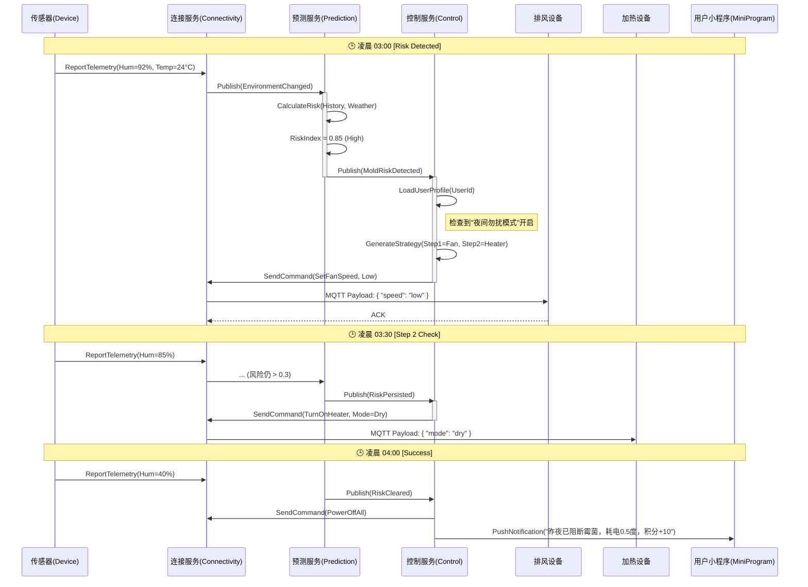
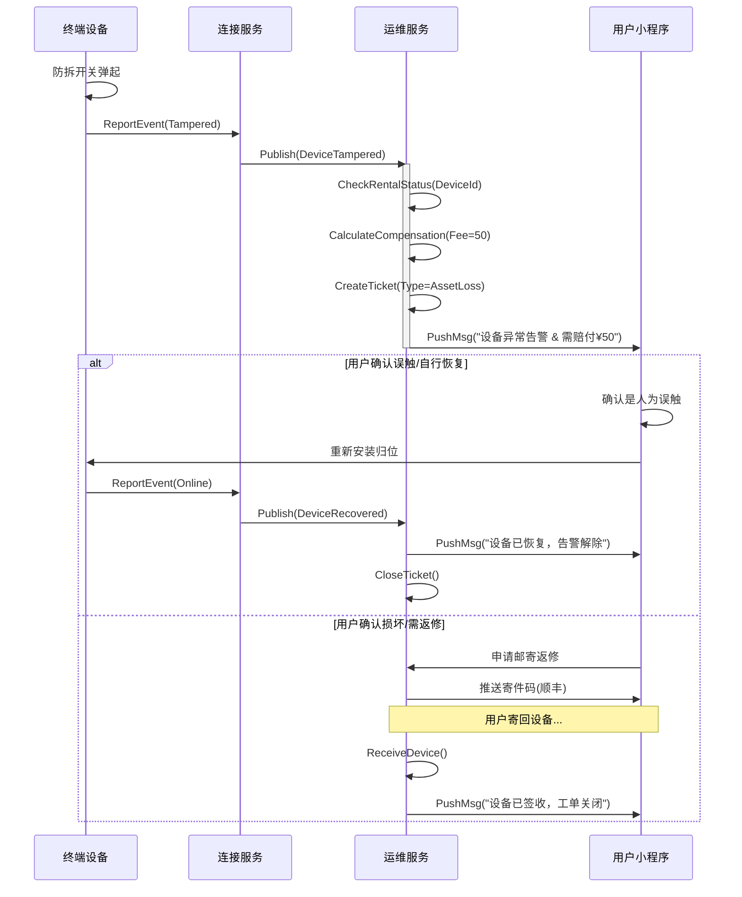
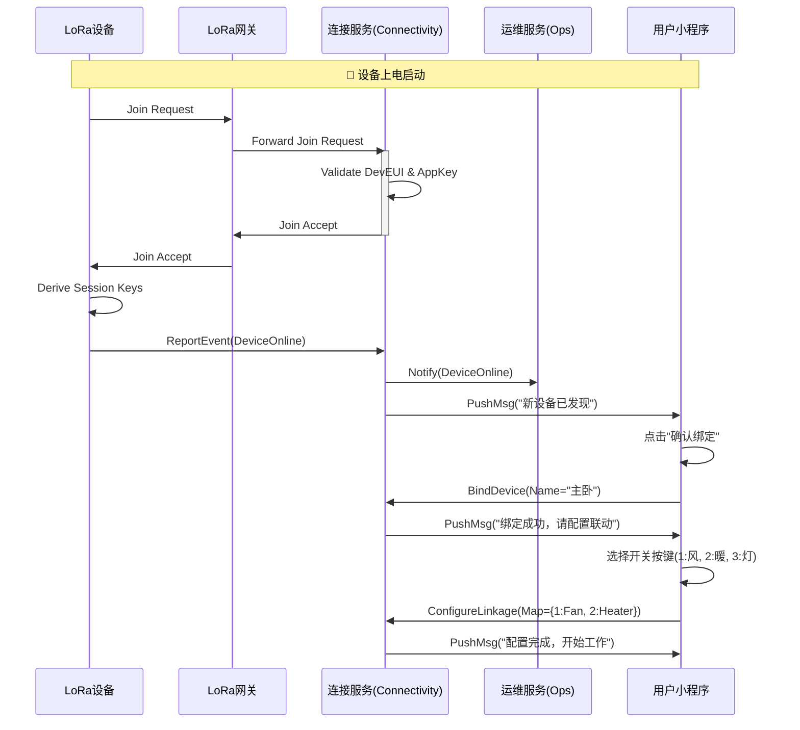

# 04-CDS 核心域场景说明书 (Core Domain Scenario)

> 编号：DDD-STR-SmartMoldGuard-20251209-v2.0
> 状态：Final
> 版本说明：深化版，包含异常流程、统一语言与Given-When-Then验收标准

## 1. 统一语言 (Ubiquitous Language)

| 术语 (Term) | 定义 (Definition) | 示例/备注 |
| :--- | :--- | :--- |
| **微气候 (Microclimate)** | 浴室内的局部温湿度环境，包含湿度变化率(Humidity Rate)。 | "当前微气候显示露点正在接近墙面温度" |
| **霉菌风险指数 (Mold Risk Index)** | 0.0-1.0 的浮点数，表示未来6小时内霉菌孢子萌发的概率。 | >0.8 为高风险，需立即干预 |
| **干预策略 (Intervention Strategy)** | 针对特定风险等级生成的一组设备控制指令集合。 | "夜间静音排风策略", "强力除湿策略" |
| **远程诊断 (Remote Diagnosis)** | 运维人员通过云端查看设备信号强度(RSSI)、电池电压、丢包率等底层数据的过程。 | "进行一次远程诊断，确认是否为信号死角" |
| **健康指纹 (Health Fingerprint)** | 设备正常运行时的数据特征基线（如平均信号强度、心跳间隔）。 | "设备指纹偏离基线，疑似故障" |

## 2. 核心场景 (Core Scenarios)

### 场景 1：夜间自动霉菌阻断 (Nighttime Auto-Intervention) [C端]

#### 2.1 业务背景
用户在睡前洗澡后忘记开窗/排风，浴室湿度维持在90%+。系统需在用户熟睡时自动检测风险并进行"静音干预"：**通过3位开关面板先开启排风扇，30分钟后若风险未解除则联动加热器烘干**，确保次日清晨浴室干爽，能耗控制在0.8度以内。

#### 2.2 流程交互 (Sequence Diagram)

### 场景 2：设备防拆与资产保全闭环 (Device Tamper & Asset Protection Loop) [运维端]

#### 2.3 业务背景
当设备被非法拆除（防拆开关触发）或异常离线时，系统需自动识别为"资产流失风险"，并立即推送告警至用户与运维端。用户可选择**自助确认赔付**或**邮寄返修**，实现资产保全零人工上门。

#### 2.4 流程交互

### 场景 3：酒店轻量化风险监测 (Hotel Lightweight Monitoring) [B端]

#### 2.5 业务背景
针对仅安装传感器的酒店/民宿场景（无控制面板），系统**每日早晚两次 (8:00 & 20:00)** 自动生成按风险排序的房间清单，指导保洁人员进行针对性通风或除湿，替代人工逐个巡检。

#### 2.6 核心流程
*   **When**: 每日 08:00 & 20:00
*   **Then**: 
    1.  系统扫描该酒店下所有房间的过去12小时湿度数据。
    2.  生成《风险房间清单》(Risk List)，按风险值排序。
    3.  推送到经理的**微信小程序管理端**。
    4.  经理一键转发任务给保洁员小程序。

### 场景 4：首次配置与自动配网 (Auto Provisioning) [用户端]

#### 2.7 业务背景
首次使用防霉系统的家庭用户，将设备通电后，系统应在 **5分钟内** 自动完成入网、鉴权、配置下发与绑定流程，无需用户进行复杂操作，实现"零上门"安装。

#### 2.8 流程交互

## 3. 验收标准 (Acceptance Criteria)

### AC1: 风险识别准确性
*   **Given**: 连续30分钟湿度 > 85%，且温度 > 20°C。
*   **When**: 数据传入预测模型。
*   **Then**: `MoldRiskDetected` 事件必须在 5分钟内 被发出，RiskIndex 应 > 0.8。

### AC2: 勿扰模式执行
*   **Given**: 当前时间为 23:00 - 07:00，用户开启"勿扰"。
*   **When**: 触发干预策略。
*   **Then**: 下发的指令必须是 `LowSpeed` 或 `SilentMode`，严禁下发 `HighSpeed` 指令。

### AC3: 运维自动闭环
*   **Given**: 设备因电池耗尽离线。
*   **When**: 用户更换电池重新上线。
*   **Then**: 系统应在 1分钟内 自动将关联的故障工单状态更新为 `Closed`，无需人工销号。

### AC4: 自动配网时效
*   **Given**: 设备首次通电，且 LoRaWAN 信号覆盖良好 (RSSI > -110dBm)。
*   **When**: 发起入网请求。
*   **Then**: 从通电到小程序收到"新设备已发现"通知，耗时应 < 5分钟。
*   **And**: 入网成功率应 ≥ 99.99%。
