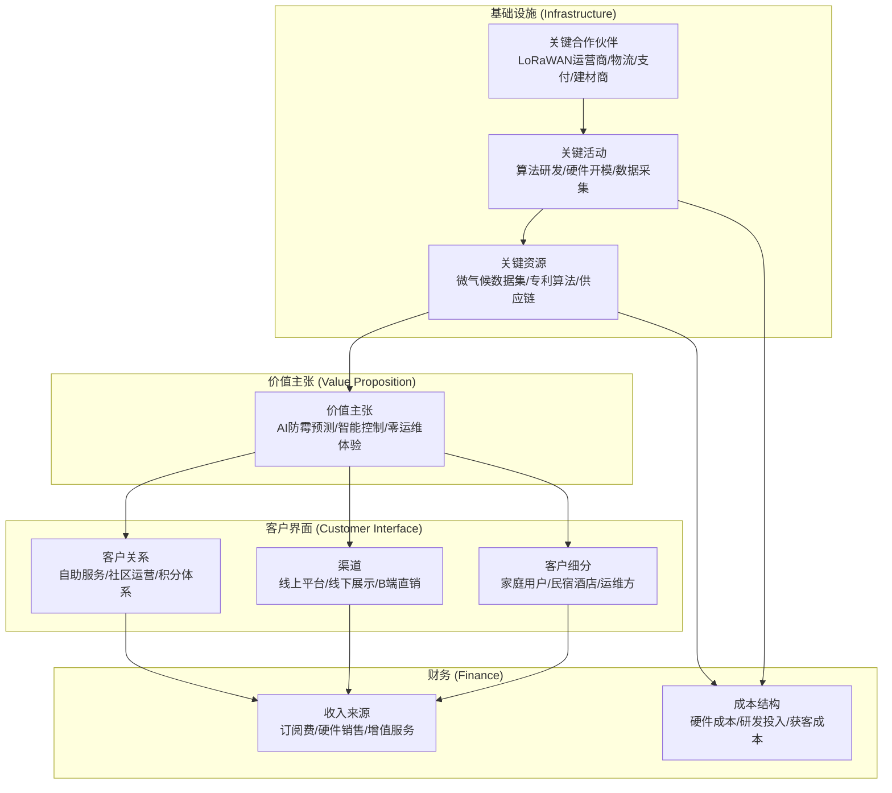

# 01-BVC 业务价值画布 (Business Value Canvas)

> 编号：DDD-STR-SmartMoldGuard-20251209-v2.0
> 状态：Final
> 版本说明：深化版，包含详细指标体系与生态分析
> **术语引用**: 本文档使用《SmartMoldGuard-统一术语表》（v1.0）定义的标准术语

## 1. 核心价值主张 (Core Value Proposition)

### 🎯 愿景与定位
**产品定位**：**防霉管控系统 (Mold Prevention Control System)**
**一句话愿景**：**用AI守护空间健康，让霉菌无处滋生，让建筑拥有智能免疫系统。**

### 🔴 痛点与机会 (Pain Points & Opportunities)

| 客户群体 | 核心痛点 (Pains) | 我们的机会 (Gains) | 替代方案缺陷 |
| :--- | :--- | :--- | :--- |
| **家庭用户** | 1. 霉菌反复滋生，除霉剂刺鼻伤手<br>2. 忘记开排风扇，洗澡后浴室如"蒸笼"<br>3. 担心老人小孩地滑摔倒 | **主动防御**：AI 提前6小时预警并干预<br>**无感托管**：3位开关面板自动控制，无需人工操作<br>**健康可视**：小程序实时查看健康指数 | 手动排风：滞后、易忘<br>定时器：无法适应天气变化，浪费电 |
| **长租公寓/酒店** | 1. 租客退房后墙面发霉，翻新成本高(¥500+/次)<br>2. 难以监控租客是否保持通风<br>3. 缺乏溢价亮点 | **资产保值**：降低墙面/设备损耗<br>**风险预判**：批量监控房源健康度<br>**合规报告**：提供空气质量合规报告 | 定期保洁：人力成本高，无法实时预防 |
| **运维工程师** | 1. 运维成本高，频繁上门排查<br>2. 被动响应，用户投诉后才知故障 | **远程诊断**：远程查看设备状态与信号<br>**零上门**：无需派单上门，问题云端解决 | 人工巡检：效率低，覆盖面窄 |

### ⭐ 北极星指标体系 (North Star Metric System)

**一级指标 (OMTM): 有效霉菌阻断数 (Successful Mold Interventions)**
> **定义公式**：
> ```
> 有效阻断数 = Σ_{i=1}^{N} [
>   (预测风险_i > 0.8) ∧
>   (设备干预成功_i) ∧
>   (干预后2小时湿度_i < 60%)
> ]
> ```
> **测量方法**：
> 1. **预测风险**：模型每10分钟计算一次霉菌风险指数 (0.0-1.0)
> 2. **设备干预**：控制服务接收风险事件，生成并执行干预策略
> 3. **效果验证**：干预后每30分钟采集湿度数据，计算2小时后的湿度值
> 4. **数据来源**：预测服务日志 + 控制服务日志 + 传感器遥测数据
> **目标值**：月均 ≥10次/户，年度累计 ≥120次/户

**二级指标 (拆解因子)**:
1.  **覆盖广度**: `活跃设备数 × 平均日运行时长`，目标：设备在线率 ≥99%
2.  **预测精度**: `准确率 = (TP+TN)/(TP+TN+FP+FN)`，目标：AUC ≥0.92，精确率 ≥0.85，召回率 ≥0.90
3.  **干预效果**: `降湿效率 = (初始湿度 - 2小时后湿度) / 干预时间`，目标：≥5%RH/小时
4.  **B端运维**: `运维成本降低率 = (传统成本 - 实际成本)/传统成本`，目标：≥40%

---

## 2. 商业模式要素 (Business Model Elements)

### 🎨 商业模式画布概览 (Business Model Canvas Overview)

```mermaid
quadrantChart
    title SmartMoldGuard 商业模式画布
    x-axis "内部 → 外部" "组织焦点"
    y-axis "执行 → 价值" "价值创造"
    quadrant-1 "关键活动"
    quadrant-2 "价值主张"
    quadrant-3 "成本结构"
    quadrant-4 "收入来源"
    "算法研发": [0.15, 0.85]
    "硬件开模": [0.25, 0.75]
    "数据采集": [0.35, 0.65]
    "AI防霉预测": [0.65, 0.85]
    "智能控制": [0.75, 0.75]
    "零运维体验": [0.85, 0.65]
    "硬件成本": [0.15, 0.25]
    "研发投入": [0.25, 0.35]
    "获客成本": [0.35, 0.15]
    "订阅收入": [0.75, 0.25]
    "硬件收入": [0.85, 0.35]
    "增值服务": [0.65, 0.15]
```

**商业模式九要素可视化**：


*图例：展示了SmartMoldGuard商业模式的九大要素及其关联关系*

### 🤝 关键合作伙伴 (Key Partners)
1.  **LoRaWAN 网络运营商**: 提供广域网覆盖，确保穿墙信号稳定 (如阿里云Link WAN, 腾讯云IoT)。
2.  **物流合作伙伴**: 合作"顺丰"、"京东物流"，实现设备快速配送与返修寄回。
3.  **支付与金融**: **微信支付/支付宝**提供订阅扣款能力；保险公司提供"防霉险"。
4.  **装修/建材商**: 前装市场植入，作为精装房标配销售。

### 📣 渠道与客户关系 (Channels & Relationships)
*   **触达渠道**: 
    *   线上：小红书/抖音 ("发霉浴室改造"话题营销)、租房平台 (自如/贝壳) 合作。
    *   线下：建材市场样板间、连锁酒店前台展示。
    *   **B端渠道**：B端直销团队、系统集成商合作伙伴。
*   **客户关系**:
    *   **自助服务**: 小程序端防霉报告、电费节省账单、自助配网。
    *   **社区运营**: "防霉积分"兑换、霉菌知识科普。

### 💰 收入来源 (Revenue Streams) - *详细测算*
1.  **订阅服务费 (ARR)**:
    *   基础版: ¥240/年/户
    *   加热版: ¥420/年/户
2.  **硬件销售/租赁 (One-off/Recurring)**:
    *   硬件买断/租赁: ¥147/套 (3位开关面板+温湿度传感器)
    *   (零安装费，用户自助安装)
3.  **B端增值服务**:
    *   API数据对接费: 项目制
    *   (移除独立的SaaS后台费，统一并在硬件或订阅中)

### 📦 订阅套餐结构与升级路径 (Plans & Upgrade Path)

| 套餐层级 | 目标客群 | 核心权益 | 与硬件关系 | 升级路径 |
| :--- | :--- | :--- | :--- | :--- |
| 基础防霉版 | 家庭用户 | 实时监测、风险预警、基础自动联动、防霉报告月报 | 需搭配标准套件，支持买断或租赁 | 体验期结束后可直接续费或升级加热版 |
| 加热增强版 | 高湿地区家庭、民宿 | 基础版全部权益，叠加智能加热烘干、节能优化算法、周报 | 需支持加热回路接入，硬件价格略高 | 可从基础版按差价升级，保留原有剩余订阅时长 |
| 物业/酒店版 | 长租公寓、酒店 | 批量房源看板、风险房间清单、批量告警、导出合规报告 | 基于相同硬件，但强调批量部署与运维工具 | 可按房间数或楼栋数扩容，支持多租户配置 |

在后续阶段，可在上述套餐基础上叠加防霉积分、保险联动等增值权益，形成面向 C 端和 B 端的升级阶梯。

### 📉 成本结构 (Cost Structure)
1.  **研发成本 (R&D)**: 算法团队(高薪)、云资源(GPU训练)、硬件开模。
2.  **履约成本 (COGS)**: 硬件BOM成本(约¥80)、物流快递费、物联网卡资费(¥10/年)。
3.  **获客成本 (CAC)**: 流量投放、首月免费试用损耗。

### 📊 详细财务测算表 (Financial Projections)

**1. LTV/CAC 测算 (用户生命周期价值/获客成本)**

| 项目 | 测算公式 | 基础版(¥240/年) | 加热版(¥420/年) | 单位 |
| :--- | :--- | :---: | :---: | :--- |
| **硬件收入** | 硬件售价 - BOM成本 | ¥147 - ¥80 = ¥67 | ¥147 - ¥80 = ¥67 | 元/套 |
| **年度订阅收入** | 订阅价格 × 订阅率 | ¥240 × 80% = ¥192 | ¥420 × 80% = ¥336 | 元/户/年 |
| **用户平均寿命** | 1/流失率 | 1/0.2 = 5年 | 1/0.15 = 6.7年 | 年 |
| **LTV (生命周期价值)** | 硬件利润 + ∑(年度订阅×寿命) | ¥67 + ¥192×5 = ¥1,027 | ¥67 + ¥336×6.7 = ¥2,318 | 元 |
| **CAC (获客成本)** | 营销费用 / 新增用户数 | ¥300 | ¥350 | 元 |
| **LTV/CAC 比率** | LTV ÷ CAC | 3.4× | 6.6× | - |
| **回收期** | CAC ÷ (硬件利润+首年订阅) | ¥300 ÷ (¥67+¥192) = 1.2年 | ¥350 ÷ (¥67+¥336) = 0.9年 | 年 |

**2. ROI 投资回报率测算**

| 投资阶段 | 投资金额 | 目标用户数 | 年度收入 | 年度成本 | 年度利润 | ROI |
| :--- | :---: | :---: | :---: | :---: | :---: | :---: |
| **种子期 (6个月)** | ¥500,000 | 2,000户 | ¥480,000 | ¥300,000 | ¥180,000 | 36% |
| **A轮 (12个月)** | ¥5,000,000 | 20,000户 | ¥4,800,000 | ¥2,500,000 | ¥2,300,000 | 46% |
| **B轮 (24个月)** | ¥20,000,000 | 100,000户 | ¥24,000,000 | ¥10,000,000 | ¥14,000,000 | 70% |

**3. 盈亏平衡分析**

| 变量 | 数值 | 说明 |
| :--- | :--- | :--- |
| **固定成本** | ¥2,000,000/年 | 团队薪资、办公室租金、云服务费 |
| **变动成本** | ¥90/户 | 硬件BOM ¥80 + 物流 ¥5 + 物联网卡 ¥5 |
| **单位收入** | ¥387/户 | 硬件利润 ¥67 + 年订阅 ¥192(第一年) |
| **盈亏平衡点** | **~6,500户** | 固定成本 ÷ (单位收入 - 变动成本) |
| **月度新增目标** | **~540户/月** | 达到盈亏平衡需要的月均新增用户数 |

**4. 敏感性分析 (关键变量影响)**

| 变量变动 | 对LTV影响 | 对CAC影响 | 对ROI影响 | 风险等级 |
| :--- | :--- | :--- | :--- | :--- |
| **订阅转化率 -10%** | -12% | 不变 | -15% | 中 |
| **用户流失率 +5%** | -8% | 不变 | -10% | 低 |
| **硬件成本 +¥10** | -3% | 不变 | -5% | 低 |
| **获客成本 +¥50** | 不变 | +17% | -12% | 中 |
| **订阅价格 -¥50** | -13% | 不变 | -18% | 高 |

---

## 3. 关键假设与验证 (Key Assumptions & Kill Points)

| 阶段 | 假设 (Hypothesis) | 验证方法 (Test) | 成功标准 (Success Criteria) |
| :--- | :--- | :--- | :--- |
| **MVP** | 浴室温湿度数据足以预测霉菌，无需图像识别 | 采集1000份样本，对比温湿度曲线与实际发霉记录 | 模型AUC ≥ 0.92 |
| **MVP** | LoRaWAN在封闭无窗浴室能稳定传输 | 选取20个极端户型(地下室、老破小)测试 | 丢包率 < 1%，RSSI > -110dBm |
| **Growth** | 用户愿意为"预防"付费，而非"治疗" | A/B测试：强调"防霉" vs 强调"节能" | 付费订阅转化率 > 80% |
| **Scale** | 算法能适应不同气候带 (如梅雨季 vs 暖气房) | 跨区域灰度发布 (广东 vs 北京) | 误报率差异 < 5% |

---

## 4. 风险全景图 (Risk Landscape)

### 🛡️ 护城河构建
1.  **数据壁垒**: 积累独有的"中国家庭浴室微气候数据集"，不仅是温湿度，还包含建筑结构、通风效率等标注数据。
2.  **算法闭环**: 随着用户增加，模型越来越准，误报越来越少，形成网络效应。
3.  **先发优势**: 在"浴室防霉"细分心智中占据第一。

### ⚠️ 潜在风险与缓解
*   **技术风险**: 复杂环境(如地下室)信号盲区。
    *   *对策*: 提供信号测试工具；网关多级级联。
*   **业务风险**: 用户对"订阅制"接受度低。
    *   *对策*: 推出"首月免费"体验。
*   **数据风险**: 用户担心隐私泄露。
    *   *对策*: 仅采集环境数据，不录音录像；数据加密传输，符合GDPR/个人信息保护法。
*   **责任界定**: 系统承诺防霉但还是发霉了。
    *   *对策*: 推出"防霉险"，由保险公司承保赔付深度清洁费用；明确免责条款（如用户人为关闭电源）。
*   **平台依赖**: 严重依赖第三方IoT平台。
    *   *对策*: 保持架构中立，设计防腐层，保留切换云厂商的能力。
