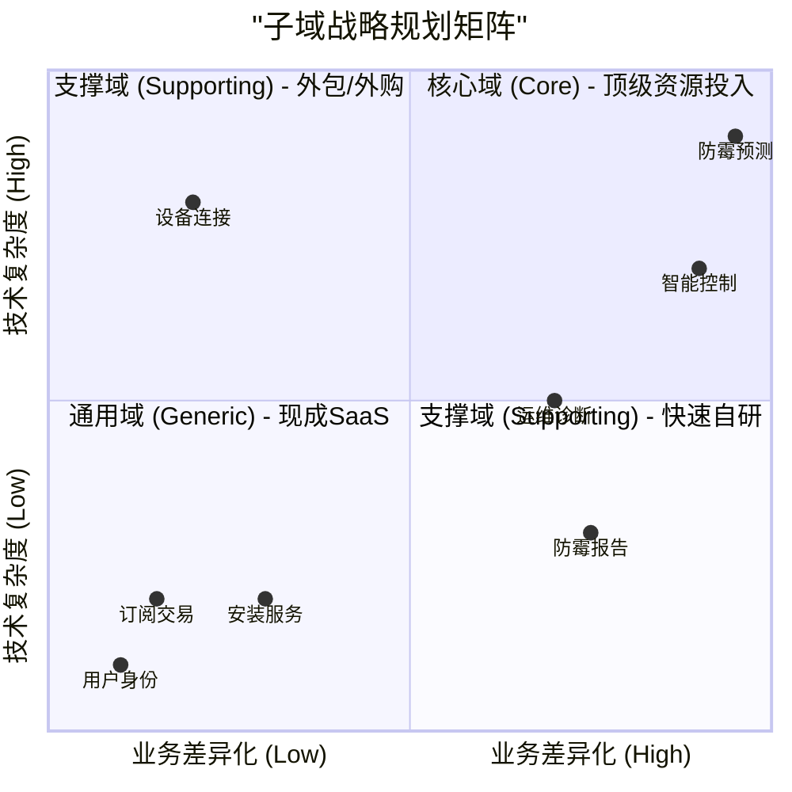

# 03-SDM 子域优先级矩阵 (Subdomain Priority Matrix)

> 编号：DDD-STR-SmartMoldGuard-20251209-v2.0
> 状态：Final
> 版本说明：深化版，包含详细选型建议与竞争优势分析
> **术语引用**: 本文档使用《SmartMoldGuard-统一术语表》（v1.0）定义的标准术语

## 1. 子域详细评估 (Subdomain Assessment)

| 子域名称 | 类型 | 业务差异化 (1-5) | 技术复杂度 (1-5) | 评分理由 (Rationale) | 竞争优势 (Competitive Advantage) |
| :--- | :--- | :---: | :---: | :--- | :--- |
| **防霉预测** (Mold Prediction) | **Core** | **5** | **5** | **极高差异化**：市场上无竞品能做到"基于微气候的预测"。**高复杂度**：涉及时序数据挖掘、机器学习模型训练。 | 拥有独家"中国家庭浴室微气候模型"，准确率比通用模型高20%。 |
| **智能控制** (Smart Control) | **Core** | **5** | **4** | **高差异化**：需解决"节能"与"干预"的平衡，策略极其复杂（如夜间静音模式、回南天模式）。 | "零人工干预"体验，比传统定时器节能40%。 |
| **运维诊断** (Ops Diagnosis) | Support | 4 | 3 | **中差异化**：支撑"零运维"愿景的核心。**中复杂度**：涉及信号指纹分析、设备自检逻辑。 | 远程一键故障定位，减少90%无效上门。 |
| **设备连接** (Connectivity) | Support | 2 | 4 | **低差异化**：标准IoT接入能力。**高复杂度**：海量并发、MQTT协议栈、LoRaWAN组网及3位开关状态同步。 | **LoRaWAN穿墙与低功耗优化**，适应复杂户型。 |
| **防霉报告** (Reporting) | Support | 4 | 2 | **中差异化**：用户感知的显性价值，决定续费率。**低复杂度**：数据聚合与图表展示。 | 清晰直观的"健康账单"，增强用户信任。 |
| **安装服务** (Installation) | Support | 2 | 2 | **低差异化**：标准化流程，重在自助引导。**低复杂度**：线下流程管理。 | "自助配网+无损换装"指引，降低人工依赖。 |
| **订阅交易** (Subscription) | Generic | 2 | 2 | **技术通用但业务关键**：计费和权益模型可复用标准SaaS，但需要与防霉预测、智能控制、防霉报告紧密耦合，为续费与升级提供支撑。 | 通过深度绑定"防霉效果+零运维"价值，将通用订阅能力沉淀为本产品线的长期现金流引擎。 |
| **用户身份** (Identity) | Generic | 1 | 1 | **无差异化**：标准OAuth2/JWT逻辑。 | 无。 |

## 2. 优先级矩阵 (Priority Matrix)

1. **第一象限（右上）**：**核心域**
   - 高业务差异化 + 高技术复杂度
   - 需要顶级资源投入，是公司的核心竞争力
   - 示例：智能控制、防霉预测
2. **第二象限（左上）**：**支撑域（外包/外购）**
   - 低业务差异化 + 高技术复杂度
   - 技术复杂但对业务差异化贡献不大，适合外包
   - 示例：设备连接
3. **第三象限（左下）**：**通用域**
   - 低业务差异化 + 低技术复杂度
   - 标准化的功能，适合使用现成SaaS服务
   - 示例：用户身份、订阅交易
4. **第四象限（右下）**：**支撑域（快速自研）**
   - 高业务差异化 + 低技术复杂度
   - 对业务有价值但技术实现简单，适合快速自研
   - 示例：运维诊断、防霉报告

## 3. 建设策略与选型建议 (Build vs Buy Strategy)

### 👑 核心域 (Core Domains) - *In-House Development*

*   **防霉预测子域**:
    *   **策略**: 组建由数据科学家带队的攻坚小组。
    *   **技术栈**: Python (Pandas, Scikit-learn), TensorFlow Lite (端侧推理), TimescaleDB (时序数据库)。
    *   **关键动作**: 针对 **LoRaWAN** 上报的低频数据进行特征工程优化。

*   **智能控制子域**:
    *   **策略**: 资深后端架构师负责，确保高可靠性。
    *   **技术栈**: Java (Spring Boot), DDD架构, 响应式编程 (Reactor) 处理并发指令。
    *   **关键动作**: 设计灵活的策略模式(Strategy Pattern)，支持动态加载新规则。

### 🚧 支撑域 (Supporting Domains) - *Outsource / Platform*

*   **设备连接子域**:
    *   **策略**: **严禁自研 LoRaWAN Network Server**。直接使用成熟IoT平台或运营商服务。
    *   **选型**: 阿里云 IoT Platform (支持 LoRaWAN 接入)。
    *   **决策**: 重点在于应用层协议解析与双向指令透传。

*   **运维诊断子域**:
    *   **策略**: 后端逻辑自研 + 前端集成于管理小程序。
    *   **技术栈**: Drools (诊断规则), WebSocket (实时日志)。
    *   **关键动作**: 构建设备"健康指纹"库。

*   **前端应用 (Front-end)**:
    *   **策略**: **All-in 微信小程序**。放弃原生 App 开发。
    *   **技术栈**: Taro / Uni-app (多端适配能力保留，但首发微信)。
    *   **关键动作**: 实现 C 端用户自助控制与 B 端运维管理在同一套代码库中通过权限分离。

### 📦 通用域 (Generic Domains) - *SaaS / Components*

*   **订阅交易 & 用户身份**:
    *   **策略**: "拿来主义"。
    *   **选型**: 
        *   *身份*: Spring Authorization Server + **微信一键登录**。
        *   *支付*: 微信支付 SDK。
    *   **决策**: 必须支持多租户账户体系（B端场景）。

## 4. 团队资源分配建议

| 团队角色 | 人数 | 专注领域 |
| :--- | :--- | :--- |
| **架构师** | 1 | 总体设计，核心域建模 (Control/Prediction) |
| **算法/数据** | 2 | 防霉预测模型训练，数据清洗 |
| **后端开发** | 3 | 智能控制(1.5), 运维诊断(1), 通用支撑(0.5) |
| **前端开发** | 2 | **微信小程序** (C端/B端/运维端) |
| **嵌入式** | 1 | LoRaWAN 模组适配，固件开发 |
| **测试/QA** | 1 | 自动化测试，现场环境模拟 |
