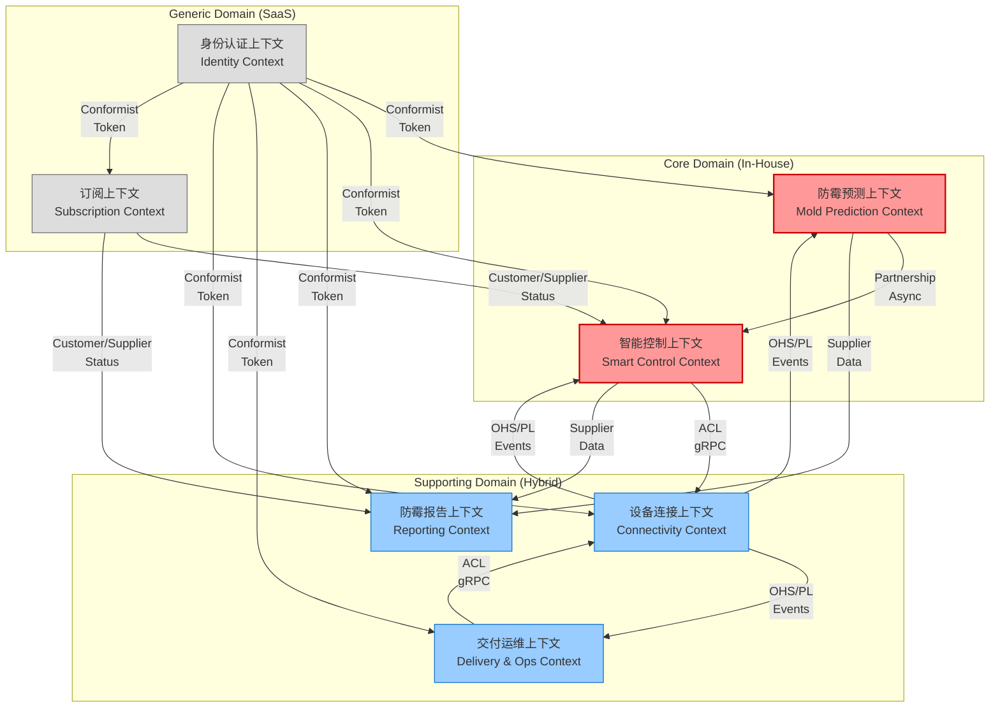

# 05-BCX 限界上下文地图 (Bounded Context Map)

> 编号：DDD-STR-SmartMoldGuard-20251209-v2.0
> 状态：Final
> 版本说明：深化版，包含核心聚合定义与上下文映射模式详解
> **术语引用**: 本文档使用《SmartMoldGuard-统一术语表》（v1.0）定义的标准术语

## 1. 限界上下文拓扑 (Context Topology)



## 2. 核心上下文详解 (Context Details)

### 2.1 防霉预测上下文 (Mold Prediction)
*   **职责**: 接收环境数据，计算霉菌生长风险，维护微气候模型。
*   **核心聚合 (Aggregates)**:
    *   `RiskAssessment` (风险评估): 聚合根。包含风险等级、预测因子、置信度。
    *   `MicroclimateProfile` (微气候档案): 实体。记录浴室的长期温湿度特征（如保温性、通风效率）。
*   **领域服务**: `MoldGrowthModelService` (计算核心)。

### 2.2 智能控制上下文 (Smart Control)
*   **职责**: 基于风险和用户偏好，生成设备控制策略。
*   **核心聚合 (Aggregates)**:
    *   `InterventionPlan` (干预计划): 聚合根。包含触发源、目标设备、执行步骤。
    *   `UserPreference` (用户偏好): 实体。勿扰时间段、舒适度阈值。
    *   `DeviceShadow` (设备影子): 值对象。设备当前的运行状态缓存。
*   **领域事件**: `InterventionStarted`, `InterventionCompleted`, `EnergySaved`.

### 2.3 交付运维上下文 (Delivery & Ops)
*   **职责**: 处理设备发货、配网支持、远程故障诊断与工单流转、资产保全。
*   **核心聚合 (Aggregates)**:
    *   `WorkOrder` (工单): 聚合根。追踪故障处理进度 (Open, Investigating, Resolved)。
    *   `DiagnosticReport` (诊断报告): 实体。包含信号强度历史、电池电压曲线。
    *   `AssetCompensate` (资产赔付): 聚合根。管理设备丢失/损坏的赔付流程。

### 2.4 订阅上下文 (Subscription)
*   **职责**: 管理商业化订阅关系，支持 B2C (家庭) 和 B2B2C (酒店/公寓) 模式，以及积分激励体系。
*   **核心聚合 (Aggregates)**:
    *   `Subscription` (订阅): 聚合根。包含有效期、套餐类型。
    *   `Tenant` (租户): 实体。支持层级结构 (集团 -> 门店 -> 房间)，实现 B 端批量授权。
    *   `LoyaltyPoints` (积分账户): 聚合根。管理用户防霉积分的发放与核销。
*   **关键领域事件**: `SubscriptionActivated`, `SubscriptionExpired`, `SubscriptionUpgraded`, `PointsEarned`。这些事件会驱动智能控制上下文调整权限边界，并为防霉报告上下文提供续费与升级的价值证明依据。

### 2.5 设备连接上下文 (Connectivity) [Supporting]
*   **职责**: 屏蔽底层硬件差异，负责 LoRaWAN + 4G 网关接入与指令下发。
*   **核心聚合**: `Gateway`, `Device`, `SwitchPanel` (3位开关).

## 3. 集成模式说明 (Integration Patterns)

### 3.1 OHS/PL (Open Host Service / Published Language)
*   **应用场景**: **设备连接 -> 预测/控制/运维**
*   **理由**: 连接层作为上游，服务于多个下游上下文。它必须定义一套标准的、通用的数据格式（如 `CloudEvents` 标准的 JSON），而不是为每个下游定制接口。下游必须遵守这套语言。

### 3.2 Partnership (合作伙伴)
*   **应用场景**: **防霉预测 <-> 智能控制**
*   **理由**: 预测模型升级可能导致风险指数含义变化（如从0-1变为0-100），控制策略必须同步调整。两个团队需要紧密配合，共同制定发布计划。

### 3.3 ACL (Anti-Corruption Layer)
*   **应用场景**: **智能控制/运维 -> 设备连接**
*   **理由**: 控制层和运维层的核心逻辑不应受限于底层设备的具体指令格式。它们定义自己的意图接口，通过 ACL 翻译成具体的设备指令。

## 4. 模块结构建议 (Package Structure)

以 `Delivery & Ops` 上下文为例 (Spring Boot / Java):

```text
com.smartmoldguard.ops
├── application          // 应用层
│   ├── command          // CreateTicket, AutoDiagnose...
│   └── query            // GetTicketStatus...
├── domain               // 领域层
│   ├── model            // WorkOrder, DiagnosticReport
│   └── service          // DiagnosisService (Drools Rule Engine)
├── infrastructure       // 基础设施层
│   ├── persistence      // JPA Repository
│   └── acl              // 调用 Connectivity 获取信号数据
└── interfaces           // 接口层
    └── api              // Admin API (供运维小程序调用)
```
