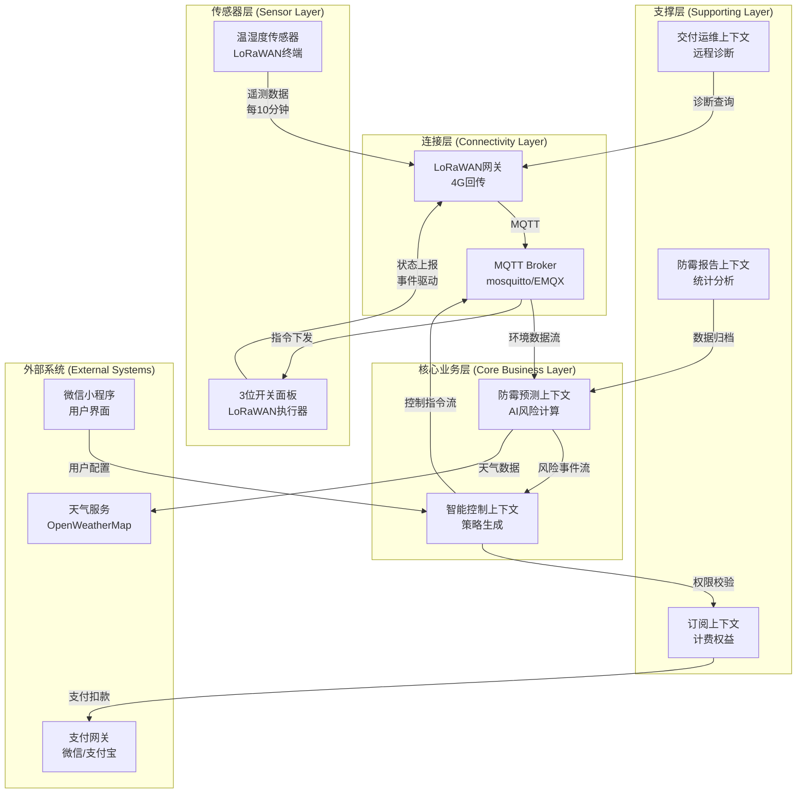

# 06-CIT 上下文集成表 (Context Integration Table)

> 编号：DDD-STR-SmartMoldGuard-20251209-v2.0
> 状态：Final
> 版本说明：深化版，包含详细API契约、SLA及一致性策略
> **术语引用**: 本文档使用《SmartMoldGuard-统一术语表》（v1.0）定义的标准术语

## 1. 核心集成全景 (Integration Landscape)

| 消费者 (Consumer) | 提供者 (Provider) | 集成内容 | 模式 | 通信协议 | 一致性 | SLA (延迟/可靠性/测量方法) | 失败策略 (Failure Strategy) |
| :--- | :--- | :--- | :--- | :--- | :--- | :--- | :--- |
| **Prediction** | **Connectivity** | 实时温湿度遥测数据 | Event | MQTT/Kafka | 最终一致 | **延迟**: P50<200ms, P95<500ms, P99<1s<br>**可靠性**: 99.9% (30天滚动)<br>**测量**: 端到端(MQTT pub到consumer确认) | 丢弃过期数据，断点续传 |
| **Control** | **Prediction** | 霉菌风险预警事件 | Event | Kafka (Avro) | 最终一致 | **延迟**: P50<100ms, P95<300ms, P99<500ms<br>**可靠性**: 99.99% (至少一次投递)<br>**测量**: Kafka consumer lag监控 | 滑动窗口限流，优先处理高风险事件，丢弃低风险事件 |
| **Control** | **Connectivity** | 设备控制指令 | Command | gRPC/HTTP | 强一致 | **延迟**: P50<50ms, P95<100ms, P99<200ms<br>**可靠性**: 99.5% (TCP ACK确认)<br>**测量**: gRPC interceptor记录 | 指数退避重试3次，失败入DLQ人工审计 |
| **Control** | **Subscription** | 权益校验 | Query | REST (Cache) | 弱一致(TTL 5m) | **延迟**: P50<10ms, P95<30ms, P99<50ms<br>**可靠性**: 99.9% (本地缓存兜底)<br>**测量**: Redis响应时间+缓存命中率 | 降级为默认权限，异步修复一致性 |
| **Ops** | **Connectivity** | 实时信号诊断 (RSSI/SNR) | Query | gRPC/HTTP | 强一致 | **延迟**: P50<100ms, P95<300ms, P99<500ms<br>**可靠性**: 99.5% (实时性要求高)<br>**测量**: gRPC客户端超时统计 | 超时返回缓存数据，记录失败日志 |
| **Ops** | **Connectivity** | 历史心跳/状态快照 | Query | REST | 弱一致 | **延迟**: P50<50ms, P95<150ms, P99<200ms<br>**可靠性**: 99.9% (可容忍延迟)<br>**测量**: API网关日志分析 | 返回部分数据，标记不完整状态 |
| **Subscription** | **PaymentGateway** | 订阅扣款(微信/支付宝) | Command | REST | 强一致 | **延迟**: P50<1s, P95<2s, P99<3s<br>**可靠性**: 99.99% (金融级)<br>**测量**: 第三方支付回调+本地DB事务 | 重试机制(1m/5m/15m)，最终失败人工介入 |
| **WeChatApp** | **Control** | 用户配置联动 | Command | REST | 强一致 | **延迟**: P50<100ms, P95<300ms, P99<500ms<br>**可靠性**: 99.9% (用户交互敏感)<br>**测量**: 前端埋点+后端日志关联 | 客户端重试(3次)，显示操作状态，本地缓存 |
| **Reporting** | **Prediction** | 历史风险数据归档 | Batch | S3 + Spark | 每日一致 | **延迟**: T+1 / 99.9%<br>**可靠性**: 99.9% (数据完整性)<br>**测量**: ETL任务监控+数据校验 | 重试直到成功，失败告警人工监控 |

### 1.1 数据流架构图 (Data Flow Architecture)



*图例：展示了SmartMoldGuard系统中各上下文之间的数据流向和集成关系*

### 1.2 SLA指标定义与测量方法 (SLA Definitions & Measurement)

**延迟指标定义**：
- **P50 (中位数)**: 50%的请求在此时间内完成，代表典型用户体验
- **P95 (95百分位)**: 95%的请求在此时间内完成，代表绝大多数用户体验
- **P99 (99百分位)**: 99%的请求在此时间内完成，代表极端情况下的性能边界

**可靠性指标定义**：
- **99.9% (三个九)**: 每月不可用时间 ≤ 43.2分钟
- **99.99% (四个九)**: 每月不可用时间 ≤ 4.32分钟
- **99.999% (五个九)**: 每月不可用时间 ≤ 26秒

**测量方法规范**：
1. **端到端测量**: 从请求发起（客户端/生产者）到响应完成（服务端/消费者确认）
2. **滚动窗口**: 使用30天滚动窗口计算可靠性，排除计划内维护时间
3. **监控工具**: Prometheus + Grafana 收集指标，设置SLO告警（如错误预算消耗率）
4. **数据采样**: 100%采样关键路径（如设备控制指令），1%采样非关键路径（如历史查询）

**SLO错误预算计算**：
```
月度错误预算 = (1 - 可靠性目标) × 月度总时间
示例：99.9%可靠性，每月错误预算 = 0.1% × 30天 × 24小时 × 60分钟 = 43.2分钟
```

## 2. 详细接口契约 (Interface Contracts)

### 2.1 霉菌风险检测事件 (Event: MoldRiskDetected)
*   **Topic**: `smartmoldguard.prediction.risk`
*   **Schema Registry**: `schema-registry:8081/subjects/risk-value/versions/latest`
*   **JSON Example**:
    ```json
    {
      "eventId": "evt_99887766",
      "eventType": "MoldRiskDetected",
      "timestamp": "2025-12-09T03:00:00Z",
      "data": {
        "deviceId": "dev_001",
        "riskScore": 0.85,          // 0.0 - 1.0
        "confidence": 0.92,         // 模型置信度
        "predictedGrowthTime": 360, // 预计发霉倒计时(分钟)
        "triggerFactors": [
          {"factor": "humidity", "value": 92.0, "weight": 0.7},
          {"factor": "temp_stable", "value": 24.0, "weight": 0.3}
        ]
      }
    }
    ```

### 2.2 设备控制指令 (Command: SendDeviceCommand)
*   **Service Definition**:
    ```protobuf
    service DeviceControlService {
      // 幂等接口：需携带 idempotency_key
      rpc SendCommand (CommandRequest) returns (CommandResponse);
    }

    message CommandRequest {
      string device_id = 1;
      string command_type = 2; // e.g., "SET_FAN_SPEED"
      map<string, string> params = 3; // {"speed": "low", "duration": "120m"}
      string idempotency_key = 4;
      int32 priority = 5; // 0=User, 1=AutoRule, 2=OpsDiagnosis
    }
    ```

## 3. 非功能性保障 (Non-Functional Requirements)

### 3.1 容错与重试 (Fault Tolerance)
*   **Control -> Connectivity**: 
    *   采用 **指数退避重试 (Exponential Backoff)** 策略：初始间隔 1s，最大重试 3 次。
    *   若最终失败，发送 `InterventionFailed` 事件到死信队列 (DLQ) 进行人工/后台审计。

### 3.2 流量削峰 (Throttling)
*   **Prediction -> Control**: 
    *   预测服务可能在短时间（如暴雨突袭）产生海量风险事件。
    *   控制服务需实现 **滑动窗口限流**，优先处理高风险（Risk > 0.9）事件，丢弃或延迟处理低风险事件。

### 3.3 契约测试策略 (Contract Testing)
*   工具：**Pact** (Consumer-Driven Contract)
*   流程：
    1.  `Control` (Consumer) 定义期望收到的 `RiskDetected` 事件格式 (Pact file)。
    2.  `Prediction` (Provider) 在 CI 流水线中运行 Pact Verifier，确保发出的事件符合 Consumer 期望。
    3.  任何破坏 Schema 兼容性的变更（如删除字段）将导致构建失败。
