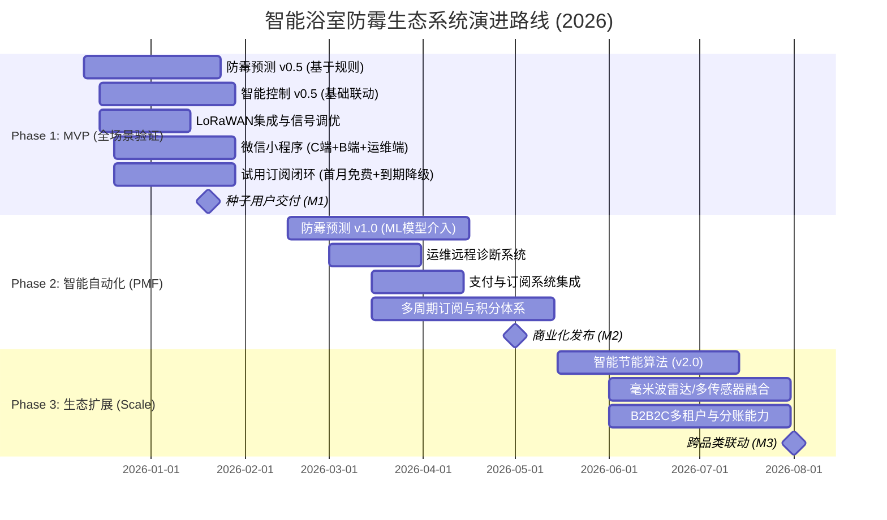

# 07-Roadmap 演进路线 & 里程碑

> 编号：DDD-STR-SmartMoldGuard-20251209-v2.0
> 状态：Final
> 版本说明：深化版，包含详细特性清单、技术债管理与DoD标准
> **术语引用**: 本文档使用《SmartMoldGuard-统一术语表》（v1.0）定义的标准术语

## 1. 战略演进路线 (Strategic Roadmap)

## 2. 详细里程碑定义 (Milestone Definitions)

### 🚩 M1: 种子用户交付 (MVP) - 2026 Q1
*   **目标**: 跑通 "感知-决策-执行" 最小闭环，验证 **家庭 + 酒店/公寓** 双场景。
*   **特性清单 (Feature Set)**:
    *   [P0] LoRaWAN 温湿度数据上报 (10分钟/次)。
    *   [P0] 基于阈值的简单规则 (湿度>85%且持续30min -> 3位开关开启风扇)。
    *   [P0] AI模型离线训练与验证 (基于采集数据，验证 BVC 假设)。
    *   [P0] **微信小程序**：支持 C 端用户输入 SN 码自助绑定设备、在线配置按键与设备联动关系、激活试用订阅。
    *   [P1] **首次体验闭环**：绑定后 5 分钟内可见实时数据，24 小时内生成首份风险评估报告。
    *   [P1] 设备离线报警。
*   **定义完成 (DoD)**:
    *   100台设备连续运行7天无断连。
    *   **运维响应时间 < 10min** (通过远程诊断工具)。
    *   规则触发延迟 < 5秒。

### 🚩 M2: 商业化发布 (PMF) - 2026 Q2
*   **目标**: 验证付费意愿，模型开始具备预测能力，实现 **"零运维"** 基础。
*   **特性清单 (Feature Set)**:
    *   [P0] AI 预测模型上线 (准确率 ≥ 92%)。
    *   [P0] 防霉日报推送到小程序。
    *   [P0] 微信支付订阅流程 (1年/2年/3年卡)。
    *   [P1] **运维远程诊断中心**：信号指纹分析、电池健康度监测。
*   **定义完成 (DoD)**:
*   预测误报率 < 10%。
*   订阅转化率 (试用->付费) > 15%。
*   首年续费率 ≥ 70%，月度订阅流失率 ≤ 3%。
*   **无效上门率降低 50%**。

## 3. 订阅服务演进与指标 (Subscription Evolution & Metrics)

### 3.1 分阶段订阅目标

| 阶段 | 关键订阅能力 | 订阅相关核心指标 | 目标值 |
| :--- | :--- | :--- | :--- |
| MVP | 首月免费试用闭环、基础订阅激活 | 试用激活率、试用期内留存率 | 试用激活率 ≥ 60%，试用期留存 ≥ 70% |
| PMF | 正式套餐上线、多周期计费、基础积分奖励 | 订阅转化率、首年续费率、LTV/CAC | 订阅转化率 ≥ 15%，首年续费率 ≥ 70%，LTV/CAC ≥ 3 |
| Scale | 多租户与分账、积分生态 | ARPU、企业客户占比、生态分成收入占比 | ARPU 年增长 ≥ 20%，企业客户数占比 ≥ 30% |

### 3.2 与技术债和团队规划的关联

在引入多周期计费和多租户分账能力时，需要同步规划：
*   计费引擎的可观测性和回滚能力。
*   订阅状态与控制权限之间的一致性测试自动化。
*   团队内专门负责商业化与订阅系统的子小组，与防霉预测和智能控制团队形成稳定协作节奏。

## 4. 技术债管理 (Technical Debt Management)

| 阶段 | 引入的技术债 | 理由 | 偿还计划 |
| :--- | :--- | :--- | :--- |
| **MVP** | **硬编码规则引擎**: 直接在代码中写 `if-else` 逻辑，未引入 Drools/LiteFlow。 | 快速上线，规则尚不复杂。 | **Phase 2**: 引入轻量级规则引擎，支持动态下发配置。 |
| **MVP** | **单体架构**: 所有 Context 部署在一个 Spring Boot 进程中。 | 减少部署运维成本，方便调试。 | **Phase 3**: 当并发超过 10k TPS 或 团队超过 10人 时，拆分微服务。 |
| **MVP** | **小程序代码耦合**: C端与B端逻辑混在同一个工程中。 | 快速迭代，复用组件。 | **Phase 2**: 采用分包加载 (Subpackages) 或 拆分为两个独立小程序。 |

## 5. 团队技能要求 (Team Competency)

*   **后端 (Java)**: 熟练掌握 DDD 战术模式 (Aggregate, Value Object, Domain Service)，熟悉 Event Sourcing 思想。
*   **AI/Data**: 熟悉时序数据处理 (Time Series Analysis)，掌握 TensorFlow/PyTorch，了解边缘计算模型压缩 (TFLite)。
*   **IoT**: 熟悉 MQTT 协议细节，**精通 LoRaWAN 协议 (Class A/C, ADR)**，有实际组网调优经验。
*   **前端 (Mini Program)**: 精通微信小程序开发生态，熟悉 ECharts 移动端适配。
