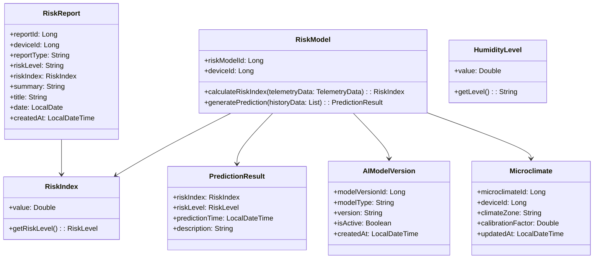
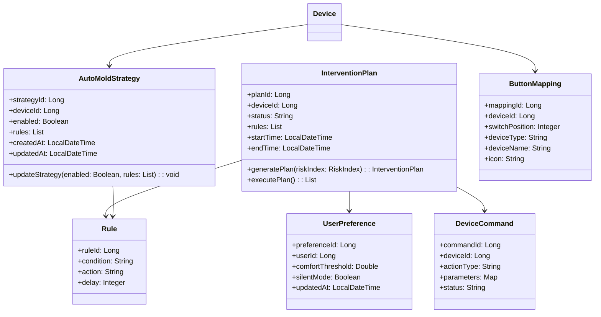
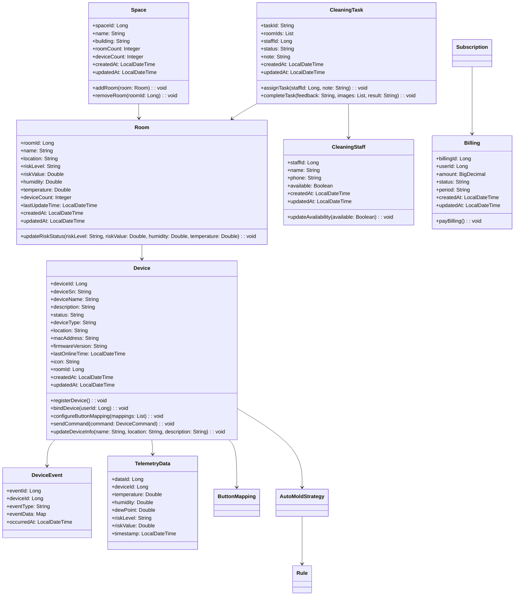
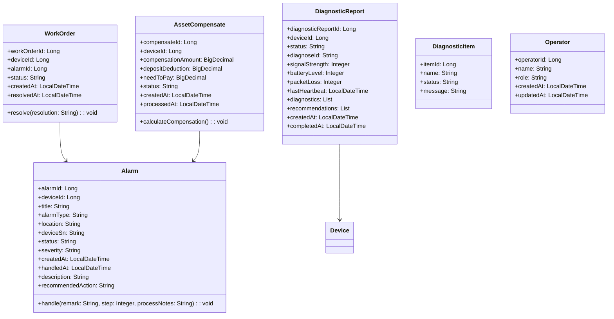
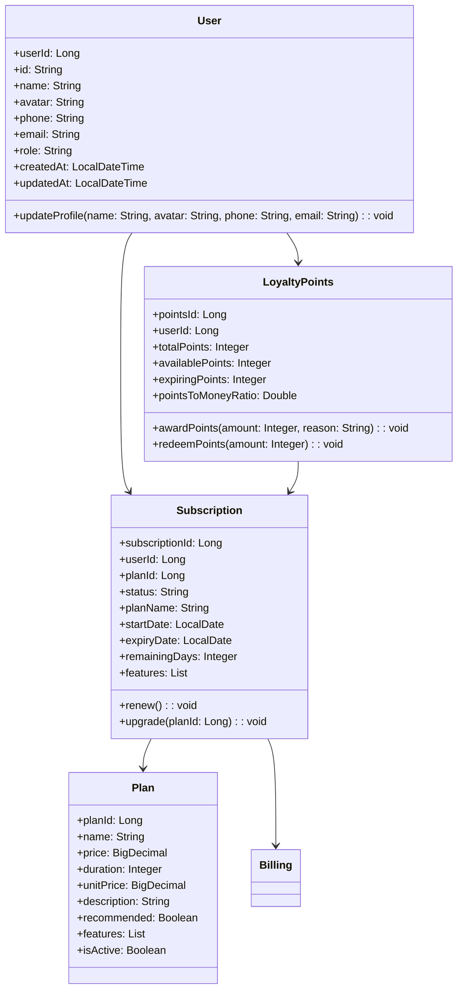
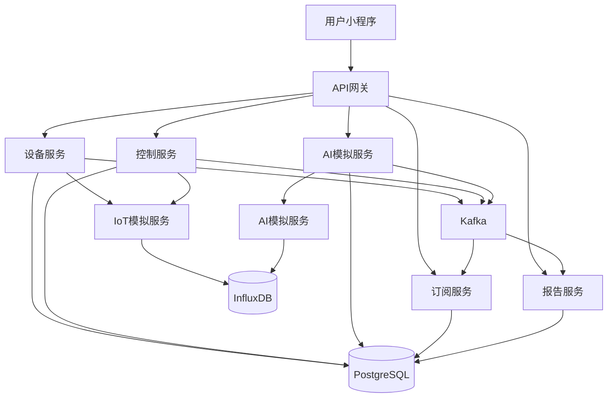

# 防霉管控MVP —— DDD战术设计文档

> **编号**: DDD-TAC-SmartMoldGuard-20251216-v1.0
> **状态**: Final
> **版本说明**: 基于战略设计v2.0的战术设计，AI模型和IoT平台采用模拟仿真方式
> **版本**: v1.0 (2025-12-16)
> **依据**: D1/产品设计和用户故事 & D2/实现战略设计 & D3/事件风暴规划
> **目标**: 将战略意图转化为可执行的战术设计，指导代码实现
> **术语引用**: 本文档使用《SmartMoldGuard-统一术语表》（v1.0）定义的标准术语

## 1. 文档概述

### 1.1 目的
本文档基于DDD（领域驱动设计）方法，详细描述SmartMoldGuard防霉管控系统的战术设计，包括领域模型、限界上下文、聚合根、领域服务等，为系统实现提供指导。

### 1.2 范围
覆盖系统所有核心域、支撑域和通用域，包括设备管理、环境监测、智能控制、订阅管理等功能模块。

### 1.3 外部系统集成策略
- **AI能力平台**: 采用模拟仿真方式，预留REST API接口
- **物联网平台**: 采用模拟仿真方式，预留MQTT/CoAP接口
- **天气服务**: 采用模拟仿真方式，预留REST API接口

## 2. 限界上下文

| 限界上下文 | 类型 | 核心职责 | 核心聚合根 |
| :--- | :--- | :--- | :--- |
| 防霉预测上下文 | 核心域 | 霉菌风险评估与预测 | RiskModel, RiskReport |
| 智能控制上下文 | 核心域 | 智能干预计划生成与执行 | InterventionPlan, UserPreference |
| 设备连接上下文 | 支撑域 | 设备管理与数据传输 | Device |
| 交付运维上下文 | 支撑域 | 告警处理与工单管理 | WorkOrder, AssetCompensate |
| 防霉报告上下文 | 支撑域 | 风险报告生成与管理 | RiskReport |
| 客户与订阅上下文 | 通用域 | 用户管理与订阅服务 | Subscription, LoyaltyPoints |

## 3. 领域模型设计

### 3.1 核心域模型

#### 3.1.1 防霉预测上下文



#### 3.1.2 智能控制上下文



### 3.2 支撑域模型

#### 3.2.1 设备连接上下文



#### 3.2.2 交付运维上下文



### 3.3 通用域模型

#### 3.3.1 客户与订阅上下文



## 4. 聚合根设计

### 4.1 核心域聚合根

#### 4.1.1 RiskModel（风险模型）

| 属性 | 类型 | 描述 |
| :--- | :--- | :--- |
| riskModelId | UUID | 风险模型ID |
| deviceId | UUID | 关联设备ID |
| createdAt | LocalDateTime | 创建时间 |
| updatedAt | LocalDateTime | 更新时间 |

| 命令 | 参数 | 事件 | 业务规则 |
| :--- | :--- | :--- | :--- |
| AssessMoldRisk | telemetryData: TelemetryData | MoldRiskDetected/EnvironmentSafe | 结合历史数据和外部天气计算风险 |
| GeneratePrediction | historyData: List<TelemetryData> | PredictionGenerated | 使用模拟AI模型生成预测 |

#### 4.1.2 InterventionPlan（干预计划）

| 属性 | 类型 | 描述 |
| :--- | :--- | :--- |
| planId | UUID | 干预计划ID |
| deviceId | UUID | 关联设备ID |
| status | PlanStatus | 计划状态 |
| startTime | LocalDateTime | 开始时间 |
| endTime | LocalDateTime | 结束时间 |
| rules | List<Rule> | 规则列表 |

| 命令 | 参数 | 事件 | 业务规则 |
| :--- | :--- | :--- | :--- |
| GenerateInterventionPlan | riskIndex: RiskIndex | InterventionGenerated | 基于风险指数生成干预计划 |
| ExecutePlan |  | InterventionStarted | 执行干预计划，下发控制指令 |
| CompletePlan | result: String | InterventionCompleted | 完成干预计划，记录结果 |

### 4.2 支撑域聚合根

#### 4.2.1 Device（设备）

| 属性 | 类型 | 描述 |
| :--- | :--- | :--- |
| deviceId | Long | 设备ID |
| deviceSn | String | 设备SN码 |
| deviceName | String | 设备名称 |
| description | String | 设备描述 |
| deviceType | String | 设备类型 |
| status | String | 设备状态 |
| location | String | 设备位置 |
| roomId | Long | 关联房间ID |
| macAddress | String | MAC地址 |
| firmwareVersion | String | 固件版本 |
| lastOnlineTime | LocalDateTime | 最后在线时间 |
| icon | String | 设备图标 |
| createdAt | LocalDateTime | 创建时间 |
| updatedAt | LocalDateTime | 更新时间 |

| 命令 | 参数 | 事件 | 业务规则 |
| :--- | :--- | :--- | :--- |
| RegisterDevice | deviceSn: String, name: String, location: String, description: String | DeviceRegistered | 验证设备SN码唯一性 |
| BindDevice | userId: Long | DeviceBound | 设备只能绑定一个用户 |
| UpdateDeviceInfo | name: String, location: String, description: String | DeviceUpdated | 允许更新设备基本信息 |
| DeleteDevice | deviceId: Long | DeviceDeleted | 验证设备存在性 |
| ConfigureButtonMapping | mappings: List<ButtonMapping> | ButtonMappingConfigured | 配置3个按键的功能映射 |
| SendCommand | command: DeviceCommand | CommandSent | 记录命令日志，模拟下发 |

#### 4.2.2 AutoMoldStrategy（自动防霉策略）

| 属性 | 类型 | 描述 |
| :--- | :--- | :--- |
| strategyId | Long | 策略ID |
| deviceId | Long | 关联设备ID |
| enabled | Boolean | 是否启用 |
| rules | List<Rule> | 策略规则 |
| createdAt | LocalDateTime | 创建时间 |
| updatedAt | LocalDateTime | 更新时间 |

| 命令 | 参数 | 事件 | 业务规则 |
| :--- | :--- | :--- | :--- |
| GetAutoMoldStrategy | deviceId: Long | StrategyFetched | 验证设备存在性 |
| UpdateAutoMoldStrategy | deviceId: Long, enabled: Boolean, rules: List<Rule> | StrategyUpdated | 验证规则有效性 |

#### 4.2.3 ButtonMapping（设备联动映射）

| 属性 | 类型 | 描述 |
| :--- | :--- | :--- |
| mappingId | Long | 映射ID |
| deviceId | Long | 关联设备ID |
| switchPosition | Integer | 开关位置 |
| deviceType | String | 设备类型 |
| deviceName | String | 设备名称 |
| icon | String | 设备图标 |
| createdAt | LocalDateTime | 创建时间 |
| updatedAt | LocalDateTime | 更新时间 |

| 命令 | 参数 | 事件 | 业务规则 |
| :--- | :--- | :--- | :--- |
| GetLinkageMapping | deviceId: Long | MappingFetched | 验证设备存在性 |
| UpdateLinkageMapping | deviceId: Long, mappings: List<ButtonMapping> | MappingUpdated | 验证映射数量不超过3个 |

#### 4.2.4 Room（房间）

| 属性 | 类型 | 描述 |
| :--- | :--- | :--- |
| roomId | Long | 房间ID |
| name | String | 房间名称 |
| location | String | 房间位置 |
| building | String | 所属楼栋 |
| riskLevel | String | 风险等级 |
| riskValue | Double | 风险值 |
| humidity | Double | 湿度 |
| temperature | Double | 温度 |
| deviceCount | Integer | 设备数量 |
| lastUpdateTime | LocalDateTime | 最后更新时间 |
| createdAt | LocalDateTime | 创建时间 |
| updatedAt | LocalDateTime | 更新时间 |

| 命令 | 参数 | 事件 | 业务规则 |
| :--- | :--- | :--- | :--- |
| GetRoomDetail | roomId: Long | RoomDetailFetched | 验证房间存在性 |
| UpdateRiskStatus | roomId: Long, riskLevel: String, riskValue: Double, humidity: Double, temperature: Double | RiskStatusUpdated | 更新房间风险状态 |

#### 4.2.5 Space（空间）

| 属性 | 类型 | 描述 |
| :--- | :--- | :--- |
| spaceId | Long | 空间ID |
| name | String | 空间名称 |
| building | String | 所属楼栋 |
| roomCount | Integer | 房间数量 |
| deviceCount | Integer | 设备数量 |
| createdAt | LocalDateTime | 创建时间 |
| updatedAt | LocalDateTime | 更新时间 |

| 命令 | 参数 | 事件 | 业务规则 |
| :--- | :--- | :--- | :--- |
| CreateSpace | name: String, building: String | SpaceCreated | 创建新空间 |
| GetSpaceList | page: Integer, pageSize: Integer, building: String | SpaceListFetched | 获取空间列表 |

#### 4.2.6 CleaningTask（保洁任务）

| 属性 | 类型 | 描述 |
| :--- | :--- | :--- |
| taskId | String | 任务ID |
| roomIds | List<Long> | 房间ID列表 |
| staffId | Long | 保洁员ID |
| status | String | 任务状态 |
| note | String | 备注信息 |
| content | String | 反馈内容 |
| images | List<String> | 反馈图片 |
| result | String | 处理结果 |
| createdAt | LocalDateTime | 创建时间 |
| updatedAt | LocalDateTime | 更新时间 |

| 命令 | 参数 | 事件 | 业务规则 |
| :--- | :--- | :--- | :--- |
| AssignCleaning | roomIds: List<Long>, staffId: Long, note: String | TaskAssigned | 指派保洁任务 |
| CompleteTask | taskId: String, content: String, images: List<String>, result: String | TaskCompleted | 完成保洁任务 |

#### 4.2.7 WorkOrder（工单）

| 属性 | 类型 | 描述 |
| :--- | :--- | :--- |
| workOrderId | Long | 工单ID |
| deviceId | Long | 关联设备ID |
| alarmId | Long | 关联告警ID |
| status | String | 工单状态 |
| createdAt | LocalDateTime | 创建时间 |
| resolvedAt | LocalDateTime | 解决时间 |

| 命令 | 参数 | 事件 | 业务规则 |
| :--- | :--- | :--- | :--- |
| CreateWorkOrder | alarmId: Long | WorkOrderCreated | 关联有效的告警ID |
| ResolveWorkOrder | resolution: String | WorkOrderResolved | 只有进行中的工单才能解决 |

### 4.3 通用域聚合根

#### 4.3.1 Subscription（订阅）

| 属性 | 类型 | 描述 |
| :--- | :--- | :--- |
| subscriptionId | Long | 订阅ID |
| userId | Long | 用户ID |
| planId | Long | 方案ID |
| status | String | 订阅状态 |
| planName | String | 方案名称 |
| startDate | LocalDate | 开始日期 |
| expiryDate | LocalDate | 到期日期 |
| remainingDays | Integer | 剩余天数 |
| features | List<String> | 功能列表 |
| createdAt | LocalDateTime | 创建时间 |
| updatedAt | LocalDateTime | 更新时间 |

| 命令 | 参数 | 事件 | 业务规则 |
| :--- | :--- | :--- | :--- |
| CreateSubscription | userId: Long, planId: Long | SubscriptionCreated | 验证用户和方案有效性 |
| RenewSubscription |  | SubscriptionRenewed | 只能续费有效订阅 |
| UpgradeSubscription | planId: Long | SubscriptionUpgraded | 验证新方案有效性 |
| Subscribe | planId: Long, paymentMethod: String | SubscriptionOrderCreated | 创建订阅订单 |

#### 4.3.2 LoyaltyPoints（积分账户）

| 属性 | 类型 | 描述 |
| :--- | :--- | :--- |
| pointsId | Long | 积分ID |
| userId | Long | 用户ID |
| totalPoints | Integer | 总积分 |
| availablePoints | Integer | 可用积分 |
| expiringPoints | Integer | 即将过期积分 |
| pointsToMoneyRatio | Double | 积分兑钱比例 |
| createdAt | LocalDateTime | 创建时间 |
| updatedAt | LocalDateTime | 更新时间 |

| 命令 | 参数 | 事件 | 业务规则 |
| :--- | :--- | :--- | :--- |
| GetPointsInfo | userId: Long | PointsFetched | 获取积分信息 |
| AwardPoints | userId: Long, amount: Integer, reason: String | PointsAwarded | 发放积分 |
| RedeemPoints | userId: Long, amount: Integer | PointsRedeemed | 兑换积分 |

#### 4.3.3 Plan（订阅方案）

| 属性 | 类型 | 描述 |
| :--- | :--- | :--- |
| planId | Long | 方案ID |
| name | String | 方案名称 |
| price | BigDecimal | 价格 |
| duration | Integer | 时长（月） |
| unitPrice | BigDecimal | 月单价 |
| description | String | 描述 |
| recommended | Boolean | 是否推荐 |
| features | List<String> | 功能列表 |
| isActive | Boolean | 是否激活 |
| createdAt | LocalDateTime | 创建时间 |
| updatedAt | LocalDateTime | 更新时间 |

| 命令 | 参数 | 事件 | 业务规则 |
| :--- | :--- | :--- | :--- |
| GetPlanList |  | PlanListFetched | 获取方案列表 |
| GetPlanDetail | planId: Long | PlanDetailFetched | 获取方案详情 |

#### 4.3.4 User（用户）

| 属性 | 类型 | 描述 |
| :--- | :--- | :--- |
| userId | Long | 用户ID |
| id | String | 系统用户ID |
| name | String | 用户名 |
| avatar | String | 头像URL |
| phone | String | 手机号 |
| email | String | 邮箱 |
| role | String | 用户角色 |
| createdAt | LocalDateTime | 创建时间 |
| updatedAt | LocalDateTime | 更新时间 |

| 命令 | 参数 | 事件 | 业务规则 |
| :--- | :--- | :--- | :--- |
| GetUserProfile | userId: Long | UserProfileFetched | 获取用户信息 |
| UpdateUserProfile | userId: Long, name: String, avatar: String, phone: String, email: String | UserProfileUpdated | 更新用户信息 |

## 5. 领域服务

| 领域服务 | 所属限界上下文 | 核心职责 | 依赖 |
| :--- | :--- | :--- | :--- |
| RiskAssessmentService | 防霉预测上下文 | 风险评估与预测 | RiskModelRepository, AIMockService |
| InterventionService | 智能控制上下文 | 干预计划生成与执行 | InterventionPlanRepository, DeviceRepository, IoTMockService |
| AutoMoldStrategyService | 智能控制上下文 | 自动防霉策略管理 | AutoMoldStrategyRepository, DeviceRepository |
| StrategyManagementService | 智能控制上下文 | 策略管理 | AutoMoldStrategyRepository |
| LinkageMappingService | 设备连接上下文 | 设备联动映射管理 | ButtonMappingRepository, DeviceRepository |
| DeviceManagementService | 设备连接上下文 | 设备注册与管理 | DeviceRepository, IoTMockService |
| RoomManagementService | 设备连接上下文 | 房间管理 | RoomRepository, DeviceRepository |
| SpaceManagementService | 设备连接上下文 | 空间管理 | SpaceRepository, RoomRepository |
| CleaningTaskService | 设备连接上下文 | 保洁任务管理 | CleaningTaskRepository, RoomRepository, CleaningStaffRepository |
| WorkOrderService | 交付运维上下文 | 工单创建与处理 | WorkOrderRepository, AlarmRepository |
| DiagnosticService | 交付运维上下文 | 设备诊断 | DiagnosticReportRepository, DeviceRepository |
| DeviceFaultMonitoringService | 交付运维上下文 | 设备故障监控 | AlarmRepository, DeviceRepository |
| SubscriptionService | 客户与订阅上下文 | 订阅管理 | SubscriptionRepository, PlanRepository |
| ReportGenerationService | 防霉报告上下文 | 报告生成与导出 | RiskReportRepository, RiskModelRepository |
| PointsService | 客户与订阅上下文 | 积分管理 | LoyaltyPointsRepository, SubscriptionRepository |
| UserProfileService | 客户与订阅上下文 | 用户信息管理 | UserRepository |
| UserManagementService | 客户与订阅上下文 | 用户管理 | UserRepository |
| PredictionFeedbackService | 防霉预测上下文 | 预测反馈管理 | RiskModelRepository |
| BillingService | 客户与订阅上下文 | 账单管理 | BillingRepository, SubscriptionRepository |

## 6. 模拟服务设计

### 6.1 AI模拟服务

#### 6.1.1 功能说明
- 模拟AI模型的风险预测功能
- 生成模拟的风险指数和预测结果
- 支持模型版本管理

#### 6.1.2 接口定义
```
POST /api/v1/ai/mock/predict
参数：{
  "deviceId": "string",
  "historyData": [{"timestamp": "long", "temperature": "double", "humidity": "double"}],
  "externalData": {"outdoorHumidity": "double"}
}
返回：{
  "riskIndex": 68.0,
  "riskLevel": "medium",
  "predictionTime": "2025-12-16T15:30:00Z",
  "description": "3小时后霉菌风险为中等，建议开启排风扇"
}
```

### 6.2 IoT模拟服务

#### 6.2.1 功能说明
- 模拟设备数据上报
- 模拟设备控制指令执行
- 管理模拟设备状态

#### 6.2.2 接口定义
```
POST /api/v1/iot/mock/commands
参数：{
  "deviceId": "string",
  "commandType": "turn_on_fan",
  "parameters": {"duration": 30}
}
返回：{
  "commandId": "string",
  "status": "success",
  "executedAt": "2025-12-16T15:30:00Z"
}
```

```
GET /api/v1/iot/mock/telemetry/{deviceId}
返回：{
  "temperature": 23.5,
  "humidity": 72.0,
  "dewPoint": 18.2,
  "updateTime": "2025-12-16T15:30:00Z"
}
```

## 7. 预留接口设计

### 7.1 AI服务接口

#### 7.1.1 风险预测接口
```
POST /api/v1/ai/predict
参数：{
  "deviceId": "string",
  "historyData": [{"timestamp": "long", "temperature": "double", "humidity": "double"}],
  "externalData": {"outdoorHumidity": "double"}
}
返回：{
  "riskIndex": 68.0,
  "riskLevel": "medium",
  "predictionTime": "2025-12-16T15:30:00Z",
  "description": "3小时后霉菌风险为中等，建议开启排风扇"
}
```

#### 7.1.2 模型管理接口
```
POST /api/v1/ai/models
参数：{
  "modelType": "mold_risk",
  "version": "1.0.0",
  "modelPath": "string"
}
返回：{
  "modelId": "string",
  "status": "success"
}
```

### 7.2 IoT平台接口

#### 7.2.1 设备命令接口
```
POST /api/v1/iot/devices/{deviceId}/commands
参数：{
  "commandType": "string",
  "parameters": {}
}
返回：{
  "commandId": "string",
  "status": "pending"
}
```

#### 7.2.2 设备状态接口
```
GET /api/v1/iot/devices/{deviceId}/status
返回：{
  "status": "online",
  "lastSeen": "2025-12-16T15:30:00Z",
  "signalStrength": -55
}
```

## 8. 仓储设计

### 8.1 仓储接口

| 仓储接口 | 聚合根 | 主要方法 |
| :--- | :--- | :--- |
| RiskModelRepository | RiskModel | save(riskModel: RiskModel), findByDeviceId(deviceId: UUID), delete(riskModelId: UUID) |
| RiskReportRepository | RiskReport | save(report: RiskReport), findByDeviceIdAndType(deviceId: UUID, type: ReportType), findLatestByDeviceId(deviceId: UUID), findByPage(page: Integer, pageSize: Integer, type: String) |
| InterventionPlanRepository | InterventionPlan | save(plan: InterventionPlan), findActiveByDeviceId(deviceId: UUID), findByPlanId(planId: UUID) |
| AutoMoldStrategyRepository | AutoMoldStrategy | save(strategy: AutoMoldStrategy), findByDeviceId(deviceId: UUID), delete(strategyId: UUID) |
| ButtonMappingRepository | ButtonMapping | save(mapping: ButtonMapping), findByDeviceId(deviceId: UUID), deleteByDeviceId(deviceId: UUID) |
| DeviceRepository | Device | save(device: Device), findByDeviceSn(deviceSn: String), findByUserId(userId: UUID), findById(deviceId: UUID), findByPage(page: Integer, pageSize: Integer, status: String) |
| WorkOrderRepository | WorkOrder | save(workOrder: WorkOrder), findByDeviceId(deviceId: UUID), findByStatus(status: WorkOrderStatus) |
| SubscriptionRepository | Subscription | save(subscription: Subscription), findByUserId(userId: UUID), findActiveByUserId(userId: UUID) |
| PlanRepository | Plan | findAll(), findById(planId: UUID), findActivePlans() |
| LoyaltyPointsRepository | LoyaltyPoints | save(points: LoyaltyPoints), findByUserId(userId: UUID) |
| UserRepository | User | save(user: User), findById(userId: UUID), findByPhone(phone: String) |
| PredictionFeedbackRepository | PredictionFeedback | save(feedback: PredictionFeedback), findByDeviceId(deviceId: UUID) |

### 8.2 数据存储策略

| 数据类型 | 存储方式 | 技术选型 |
| :--- | :--- | :--- |
| 聚合根数据 | 关系型数据库 | PostgreSQL |
| 遥测数据 | 时序数据库 | InfluxDB（模拟） |
| 事件数据 | 事件存储 | Kafka（事件总线） |
| 缓存数据 | 缓存 | Redis |

## 9. 数据库表结构设计

### 9.1 核心域表

#### 9.1.1 risk_models
| 字段名 | 数据类型 | 约束 | 描述 |
| :--- | :--- | :--- | :--- |
| risk_model_id | uuid | primary key | 风险模型ID |
| device_id | uuid | foreign key | 设备ID |
| created_at | timestamp | not null | 创建时间 |
| updated_at | timestamp | not null | 更新时间 |

#### 9.1.2 risk_reports
| 字段名 | 数据类型 | 约束 | 描述 |
| :--- | :--- | :--- | :--- |
| report_id | uuid | primary key | 报告ID |
| device_id | uuid | foreign key | 设备ID |
| report_type | varchar(50) | not null | 报告类型 |
| risk_level | varchar(20) | not null | 风险等级 |
| risk_index | double precision | not null | 风险指数 |
| summary | text | | 报告摘要 |
| generated_at | timestamp | not null | 生成时间 |

#### 9.1.3 intervention_plans
| 字段名 | 数据类型 | 约束 | 描述 |
| :--- | :--- | :--- | :--- |
| plan_id | uuid | primary key | 计划ID |
| device_id | uuid | foreign key | 设备ID |
| status | varchar(20) | not null | 计划状态 |
| start_time | timestamp | not null | 开始时间 |
| end_time | timestamp | | 结束时间 |
| created_at | timestamp | not null | 创建时间 |
| updated_at | timestamp | not null | 更新时间 |

### 9.2 支撑域表

#### 9.2.1 devices
| 字段名 | 数据类型 | 约束 | 描述 |
| :--- | :--- | :--- | :--- |
| device_id | uuid | primary key | 设备ID |
| device_sn | varchar(100) | unique not null | 设备SN码 |
| device_name | varchar(100) | not null | 设备名称 |
| description | text | | 设备描述 |
| device_type | varchar(50) | not null | 设备类型 |
| status | varchar(20) | not null | 设备状态 |
| location | varchar(200) | | 设备位置 |
| mac_address | varchar(50) | | MAC地址 |
| firmware_version | varchar(50) | | 固件版本 |
| last_online_time | timestamp | | 最后在线时间 |
| icon | varchar(20) | | 设备图标 |
| user_id | uuid | foreign key | 关联用户ID |
| created_at | timestamp | not null | 创建时间 |
| updated_at | timestamp | not null | 更新时间 |

#### 9.2.2 auto_mold_strategies
| 字段名 | 数据类型 | 约束 | 描述 |
| :--- | :--- | :--- | :--- |
| strategy_id | uuid | primary key | 策略ID |
| device_id | uuid | foreign key | 设备ID |
| enabled | boolean | not null | 是否启用 |
| created_at | timestamp | not null | 创建时间 |
| updated_at | timestamp | not null | 更新时间 |

#### 9.2.3 rules
| 字段名 | 数据类型 | 约束 | 描述 |
| :--- | :--- | :--- | :--- |
| rule_id | uuid | primary key | 规则ID |
| strategy_id | uuid | foreign key | 策略ID |
| condition | text | not null | 条件表达式 |
| action | varchar(50) | not null | 动作类型 |
| delay | integer | not null | 延迟时间（分钟） |
| created_at | timestamp | not null | 创建时间 |
| updated_at | timestamp | not null | 更新时间 |

#### 9.2.4 button_mappings
| 字段名 | 数据类型 | 约束 | 描述 |
| :--- | :--- | :--- | :--- |
| mapping_id | uuid | primary key | 映射ID |
| device_id | uuid | foreign key | 设备ID |
| switch_position | integer | not null | 开关位置 |
| device_type | varchar(50) | not null | 设备类型 |
| device_name | varchar(100) | not null | 设备名称 |
| icon | varchar(20) | not null | 设备图标 |
| created_at | timestamp | not null | 创建时间 |
| updated_at | timestamp | not null | 更新时间 |

#### 9.2.5 plans
| 字段名 | 数据类型 | 约束 | 描述 |
| :--- | :--- | :--- | :--- |
| plan_id | uuid | primary key | 方案ID |
| name | varchar(100) | not null | 方案名称 |
| price | decimal(10,2) | not null | 价格 |
| duration | integer | not null | 时长（月） |
| unit_price | decimal(10,2) | not null | 月单价 |
| description | text | not null | 描述 |
| recommended | boolean | not null | 是否推荐 |
| features | jsonb | not null | 功能列表 |
| is_active | boolean | not null | 是否激活 |
| created_at | timestamp | not null | 创建时间 |
| updated_at | timestamp | not null | 更新时间 |

#### 9.2.6 users
| 字段名 | 数据类型 | 约束 | 描述 |
| :--- | :--- | :--- | :--- |
| user_id | uuid | primary key | 用户ID |
| id | varchar(50) | unique not null | 系统用户ID |
| name | varchar(50) | not null | 用户名 |
| avatar | varchar(200) | | 头像URL |
| phone | varchar(20) | unique not null | 手机号 |
| email | varchar(100) | unique | 邮箱 |
| created_at | timestamp | not null | 创建时间 |
| updated_at | timestamp | not null | 更新时间 |

#### 9.2.7 loyalty_points
| 字段名 | 数据类型 | 约束 | 描述 |
| :--- | :--- | :--- | :--- |
| points_id | uuid | primary key | 积分ID |
| user_id | uuid | foreign key | 用户ID |
| total_points | integer | not null | 总积分 |
| available_points | integer | not null | 可用积分 |
| expiring_points | integer | not null | 即将过期积分 |
| points_to_money_ratio | decimal(5,2) | not null | 积分兑钱比例 |
| created_at | timestamp | not null | 创建时间 |
| updated_at | timestamp | not null | 更新时间 |

#### 9.2.8 prediction_feedbacks
| 字段名 | 数据类型 | 约束 | 描述 |
| :--- | :--- | :--- | :--- |
| feedback_id | uuid | primary key | 反馈ID |
| device_id | uuid | foreign key | 设备ID |
| rating | integer | not null | 评分（1-5） |
| comment | text | | 反馈内容 |
| risk_level | varchar(20) | not null | 实际风险等级 |
| created_at | timestamp | not null | 创建时间 |
| updated_at | timestamp | not null | 更新时间 |

#### 9.2.9 alarms
| 字段名 | 数据类型 | 约束 | 描述 |
| :--- | :--- | :--- | :--- |
| alarm_id | uuid | primary key | 告警ID |
| device_id | uuid | foreign key | 设备ID |
| alarm_type | varchar(50) | not null | 告警类型 |
| status | varchar(20) | not null | 告警状态 |
| severity | varchar(20) | not null | 告警级别 |
| description | text | | 告警描述 |
| created_at | timestamp | not null | 创建时间 |
| handled_at | timestamp | | 处理时间 |

### 9.3 通用域表

#### 9.3.1 subscriptions
| 字段名 | 数据类型 | 约束 | 描述 |
| :--- | :--- | :--- | :--- |
| subscription_id | uuid | primary key | 订阅ID |
| user_id | uuid | foreign key | 用户ID |
| plan_id | uuid | foreign key | 方案ID |
| status | varchar(20) | not null | 订阅状态 |
| start_date | date | not null | 开始日期 |
| expiry_date | date | not null | 到期日期 |
| created_at | timestamp | not null | 创建时间 |
| updated_at | timestamp | not null | 更新时间 |

#### 9.3.2 plans
| 字段名 | 数据类型 | 约束 | 描述 |
| :--- | :--- | :--- | :--- |
| plan_id | uuid | primary key | 方案ID |
| name | varchar(100) | not null | 方案名称 |
| price | decimal(10,2) | not null | 价格 |
| duration | integer | not null | 时长（月） |
| features | jsonb | not null | 功能列表 |
| is_active | boolean | not null | 是否激活 |
| created_at | timestamp | not null | 创建时间 |
| updated_at | timestamp | not null | 更新时间 |

## 10. 实现优先级

| 优先级 | 功能模块 | 实现内容 |
| :--- | :--- | :--- |
| 1 | 设备连接 | 设备注册、绑定、配置（模拟IoT） |
| 2 | 环境监测 | 实时数据获取、风险评估（模拟AI） |
| 3 | 智能控制 | 干预计划生成、指令下发（模拟IoT） |
| 4 | 订阅管理 | 订阅创建、续费、升级 |
| 5 | 报告管理 | 报告生成、查询、导出 |
| 6 | 告警与工单 | 告警处理、工单管理 |

## 11. 测试策略

### 11.1 单元测试
- 聚合根、实体、值对象的业务逻辑测试
- 领域服务的核心功能测试
- 模拟服务的功能测试

### 11.2 集成测试
- 领域服务与仓储的集成测试
- 应用服务与领域服务的集成测试
- 模拟服务与业务逻辑的集成测试

### 11.3 端到端测试
- 设备注册到风险预测的完整流程测试
- 智能干预从检测到执行的完整流程测试
- 告警生成到工单解决的完整流程测试

## 12. 技术选型

| 技术领域 | 技术选型 | 说明 |
| :--- | :--- | :--- |
| 后端框架 | Spring Boot | 微服务开发框架 |
| 数据库 | PostgreSQL | 关系型数据存储 |
| 时序数据库 | InfluxDB | 遥测数据存储（模拟） |
| 消息队列 | Kafka | 事件总线 |
| 缓存 | Redis | 实时数据缓存 |
| API网关 | Spring Cloud Gateway | API管理与路由 |
| 服务注册与发现 | Eureka | 微服务注册与发现 |
| 配置中心 | Spring Cloud Config | 集中式配置管理 |
| 监控 | Prometheus + Grafana | 系统监控与可视化 |
| 日志 | ELK Stack | 日志收集与分析 |

## 13. 部署架构



## 14. 安全设计

### 14.1 认证与授权
- 使用JWT Token进行身份认证
- 基于角色的访问控制（RBAC）
- API密钥验证

### 14.2 数据安全
- 传输加密：HTTPS
- 存储加密：敏感数据加密存储
- 数据脱敏：敏感数据脱敏展示

### 14.3 审计日志
- 操作日志：记录用户操作
- 事件日志：记录系统事件
- 安全日志：记录安全相关事件

## 15. 后续步骤

### 15.1 已完成任务清单

✅ **文档概述**：完成了文档的基本信息和目标描述
✅ **限界上下文与外部系统集成**：明确了系统的限界上下文和外部系统集成策略
✅ **领域模型设计**：完成了核心域、支撑域和通用域的领域模型设计，包含完整的Mermaid类图
✅ **模拟仿真实现设计**：设计了AI模型和IoT平台的模拟实现方案
✅ **聚合根设计**：详细设计了所有聚合根的属性、命令和事件
✅ **领域服务设计**：定义了系统所需的所有领域服务
✅ **仓储设计**：设计了仓储接口和数据存储策略
✅ **持久化设计**：完成了数据库表结构设计
✅ **测试策略**：制定了单元测试、集成测试和端到端测试策略
✅ **实现优先级**：明确了功能模块的实现顺序
✅ **技术选型**：确定了系统的技术栈
✅ **部署架构**：设计了系统的部署架构
✅ **安全设计**：制定了系统的安全机制
✅ **接口预留设计**：为AI和IoT平台预留了完整的对接接口

### 15.2 下一步工作任务清单

1. **代码实现**
   - 根据战术设计文档实现核心域模型
   - 实现领域服务和应用服务
   - 实现仓储层和数据库访问层
   - 实现模拟AI服务模块
   - 实现模拟IoT服务模块

2. **测试实现**
   - 编写聚合根、实体和值对象的单元测试
   - 编写领域服务和应用服务的集成测试
   - 编写模拟服务的功能测试
   - 进行端到端测试

3. **系统部署**
   - 搭建开发环境
   - 部署微服务应用
   - 配置监控和日志系统
   - 进行性能测试和负载测试

4. **文档完善**
   - 根据代码实现更新设计文档
   - 编写API文档
   - 编写部署指南
   - 编写用户手册

5. **预留接口对接准备**
   - 准备AI能力平台对接文档
   - 准备IoT平台对接文档
   - 设计接口切换机制
   - 制定集成测试计划

6. **系统优化**
   - 根据测试结果优化系统性能
   - 优化数据库查询
   - 优化系统架构
   - 增强系统安全性

7. **用户验收测试**
   - 准备测试环境
   - 编写测试用例
   - 进行用户验收测试
   - 收集用户反馈并改进

8. **上线准备**
   - 制定上线计划
   - 进行预上线测试
   - 准备回滚方案
   - 实施上线部署

---

**文档变更记录**:
- 2025-12-16: 初始版本
- 2025-12-16: 完善模拟服务设计
- 2025-12-16: 补充预留接口设计

**文档审核**: 技术架构师
**文档批准**: 产品经理
**文档发布日期**: 2025-12-16