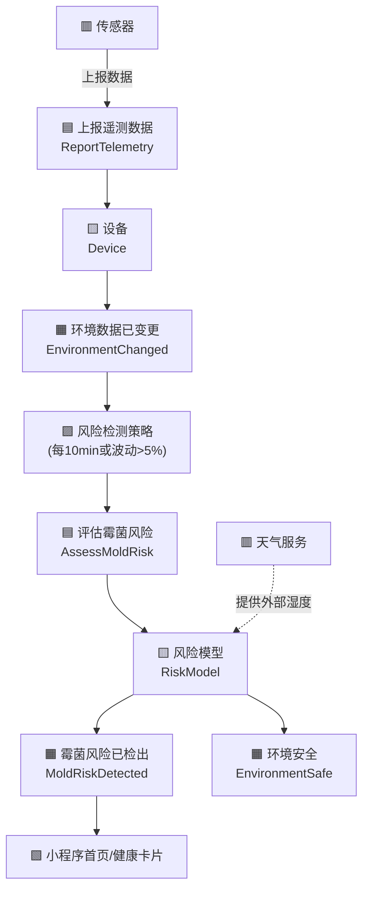
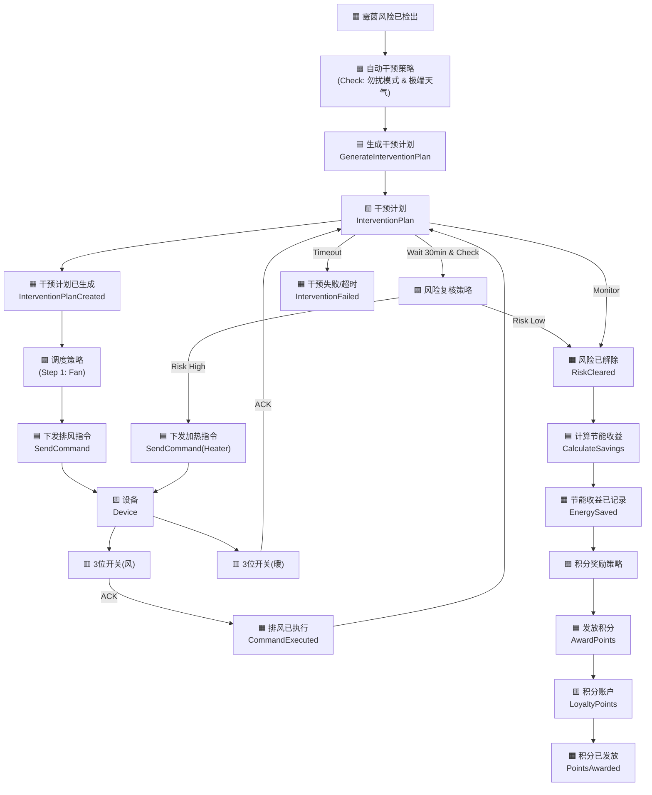
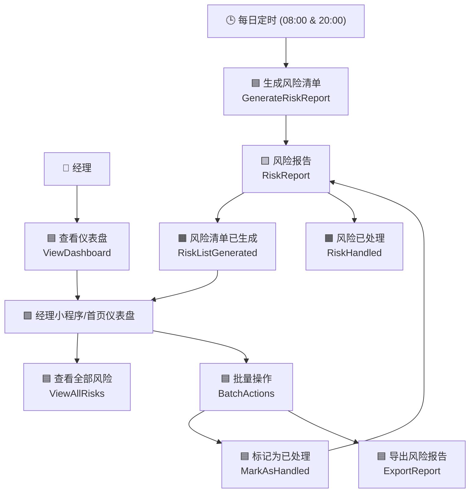
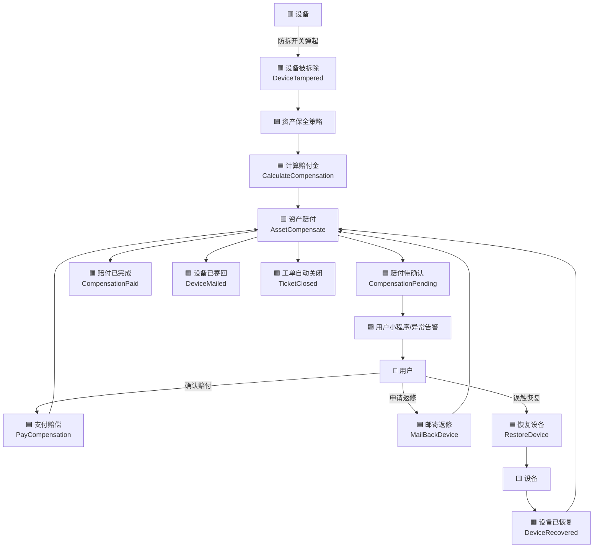
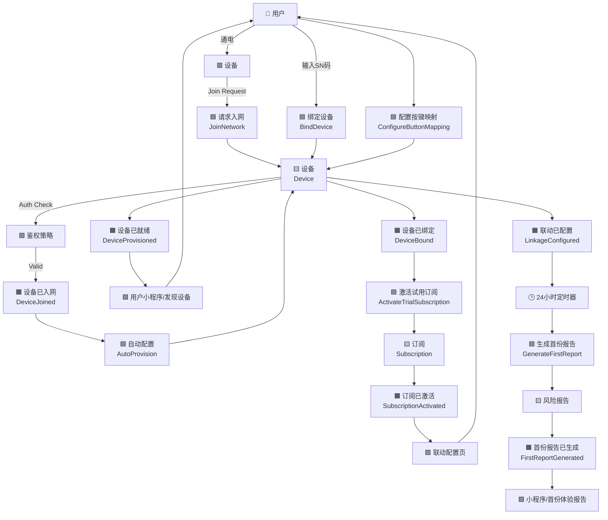
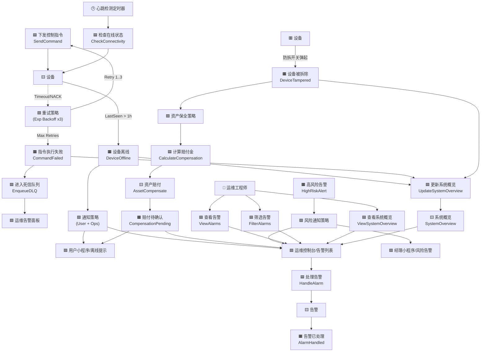

# 防霉管控MVP —— 事件风暴规划 (Event Storming Planning)

> 编号：DDD-TAC-SmartMoldGuard-20251209-v2.0
> 状态：Final
> 版本说明：深化版，基于D2战略设计v2.0的事件风暴
> 版本：v2.0 (2025-12-09)
> 依据：D1/产品设计和用户故事 & D2/实现战略设计
> 目标：将战略意图转化为战术设计蓝图，识别领域事件、命令与聚合根
> **术语引用**: 本文档使用《SmartMoldGuard-统一术语表》（v1.0）定义的标准术语

## 1. 风暴图例 (Legend)

在阅读本文档时，请对应以下颜色/符号理解：

*   **🟧 领域事件 (Domain Event)**: 过去发生的、对业务有价值的事实（动词过去式）。*例：RiskDetected*
*   **🟦 命令 (Command)**: 触发事件的动作/意图。*例：DetectRisk*
*   **🟨 聚合/实体 (Aggregate)**: 执行命令、产生事件的业务对象。*例：RiskModel*
*   **🟩 读模型 (Read Model)**: 用于展示的数据视图。*例：RiskDashboard*
*   **🟪 策略/规则 (Policy)**: "当...时，就..."的自动化业务规则。*例：If risk > 0.8 then start fan*
*   **🟥 外部系统 (External System)**: 第三方服务或硬件。*例：LoRaWAN Network*
*   **👤 角色 (Actor)**: 触发命令的人。*例：User*

---

## 2. 核心流程风暴 (Process Modeling)

### 流程一：环境感知与风险预测 (Sensing & Prediction)
> **业务价值**：将原本无意义的温湿度数据转化为具备业务含义的“霉菌风险”。

流程描述：智能家居环境健康监测系统的核心流程。
1、外部传感器上报数据，触发一个上报遥测数据的命令。
2、该命令更新设备聚合的状态，并产生一个环境数据已变更的领域事件。
3、该事件触发一个风险检测策略（定时10分钟或数据波动大于5%时执行）。
4、策略执行评估霉菌风险的命令。
5、该命令由风险模型聚合处理，它结合外部天气服务提供的湿度数据，进行综合风险评估。
6、风险模型根据计算结果，发布霉菌风险已检出或环境安全的领域事件。
7、最后，霉菌风险已检出事件会更新小程序前端的视图（如首页的健康状态卡片），通知用户。

### 流程二：智能控制闭环 (Smart Control Loop)
> **业务价值**：基于风险和用户偏好，实现“无感”且“节能”的自动干预（先排风，后加热）。

流程描述：**智能家居自动干预系统**的流程图，展示了从风险检测到自动干预的完整闭环。

- **触发阶段**：由`霉菌风险已检出`事件触发整个流程。
- **决策阶段**：
  - `自动干预策略`会检查条件（如勿扰模式、极端天气），决定是否执行自动干预。
  - 策略通过后，系统`生成干预计划`，创建`干预计划`聚合。
  - 计划生成后触发`干预计划已生成`事件，由`调度策略`决定如何执行。
- **执行阶段 (分步执行)**：
  - **Step 1**: 系统优先下发指令开启`排风扇`。
  - **Step 2**: 30分钟后复核风险，若仍未解除，则下发指令开启`加热器`进行烘干。
- **反馈循环**：
  - 执行结果反馈给`干预计划`聚合进行监控。
  - 最终产生`节能收益已记录`事件，并触发`积分奖励策略`，为用户发放防霉积分。

### 流程三：酒店轻量化风险监测 (Lightweight Risk Monitoring)

> **业务价值**：帮助民宿/酒店业主通过"风险清单"精准维护，替代盲目巡检。

流程描述：**酒店轻量化风险监测**流程，服务于 Story 3。
- **触发**：每日固定时间（**早8点 & 晚8点**）触发。
- **生成**：系统基于过去12小时湿度数据，生成《高风险房间清单》。
- **触达**：推送给经理端小程序，经理无需登录PC即可查看。
- **仪表盘视图**：经理可以查看风险概览、今日高风险房间列表和设备状态概览。
- **批量操作**：支持标记为已处理、导出风险报告。
- **闭环**：工作人员现场处理（通风/除湿）后标记反馈，系统记录处理结果以修正模型。

### 流程四：资产保全闭环 (Asset Protection Loop)

> **业务价值**：自动处理设备被拆除/损坏场景，实现资产零流失与零上门。

流程描述：**资产保全闭环**流程，服务于 Story 1。
- **触发**：设备防拆开关触发或长期异常离线。
- **计算**：运维上下文自动计算剩余租期价值与违约金；对于押金式租赁设备，系统需在 `CalculateCompensation` 中优先使用押金余额抵扣应付赔偿金，仅在押金不足时才生成补差支付请求。
- **触达**：直接推送给用户，告知"设备异常需赔付"。
- **分支**：
  - 用户承认损坏：系统先自动扣减押金，再引导用户支付超出押金部分，完成赔付后工单自动关闭。
  - **用户申请返修**：系统生成寄件码，用户寄回设备；设备验收正常后，系统根据结果退还部分或全部押金。
  - 用户误触：重新安装设备，设备上线后工单自动关闭，押金状态不发生变更。

### 流程五：首次配置与服务订阅 (Provisioning & Subscription)

> **业务价值**：实现设备上电即用，零技术门槛，并快速激活服务订阅，支撑"零上门"愿景。

流程描述：**首次配置与服务订阅**流程，服务于 Story 1 & 2。
- **触发**：用户给设备通电。
- **入网**：设备自动发送 LoRaWAN Join Request，平台自动鉴权并接受。
- **配置**：平台下发初始配置（上报频率、默认策略），设备进入就绪状态。
- **绑定**：用户打开小程序，**输入设备SN码**，完成绑定。
- **订阅**：绑定成功后，系统自动激活“首月免费试用订阅”。
- **配置**：用户在线配置LoRa开关面板的3个物理按键与排风扇/加热器的映射关系。
- **价值交付**：
    - 绑定后5分钟内（通过入网流程），用户可见实时温湿度。
    - 绑定24小时后，系统自动生成首份《霉菌风险评估报告》，展示服务价值。

### 流程六：异常与容错处理 (Exception Handling)

> **业务价值**：在网络或设备故障时保障系统鲁棒性，实现 CIT 定义的失败策略。

流程描述：**异常处理**流程。
- **指令失败**：控制指令下发后若无 ACK 或超时，触发指数退避重试（最多3次）。若仍失败，产生 `CommandFailed` 事件进入死信队列，人工介入。
- **心跳丢失**：系统定时检查设备 `LastSeen` 时间，若超过阈值（如1小时），产生 `DeviceOffline` 事件，通知用户检查电源或网络，并显示在运维控制台。
- **设备被拆**：设备防拆开关触发，产生 `DeviceTampered` 事件，系统自动计算赔付金额，并在用户小程序和运维控制台显示告警。
- **高风险告警**：当房间风险指数超过阈值时，产生 `HighRiskAlert` 事件，通知运维工程师和经理。
- **运维操作**：运维工程师可以查看系统概览、告警列表、筛选告警、处理告警，并更新系统状态。
- **系统概览**：实时更新用户总数、设备总数、今日告警数、活跃订阅数等关键指标。

---

## 3. 聚合根与命令映射 (Aggregate & Command Mapping)

### 3.1 核心域：防霉预测 (Mold Prediction Context)

| 聚合根 (Aggregate) | 命令 (Command) | 产生事件 (Domain Event) | 业务规则/不变量 (Invariant) |
| :--- | :--- | :--- | :--- |
| **RiskModel** (风险模型) | `AssessMoldRisk` (评估风险) | `MoldRiskDetected` `EnvironmentSafe` | 1. 必须结合最近24h历史趋势计算 2. 必须加载该设备所在气候带参数 |
| **Microclimate** (微气候档案) | `UpdateProfile` (更新档案) | `ProfileOptimized` | 1. 档案数据至少每月更新一次 |
| **RiskReport** (风险报告) | `GenerateRiskReport` (生成报告) | `RiskListGenerated` | 1. 报告必须包含过去12小时的最高湿度和平均湿度 |

### 3.2 核心域：智能控制 (Smart Control Context)

| 聚合根 (Aggregate) | 命令 (Command) | 产生事件 (Domain Event) | 业务规则/不变量 (Invariant) |
| :--- | :--- | :--- | :--- |
| **InterventionPlan** (干预计划) | `GeneratePlan` `CompletePlan` `CalculateEnergy` | `PlanCreated` `RiskCleared` `EnergySaved` | 1. 同一设备不能同时存在两个活跃计划 2. 勿扰时段禁止生成高噪音计划 |
| **UserPreference** (用户偏好) | `UpdatePreference` | `PreferenceChanged` | 1. 舒适度阈值不能低于 40% (防过干) |

### 3.3 支撑域：设备连接 (Connectivity Context)

| 聚合根 (Aggregate) | 命令 (Command) | 产生事件 (Domain Event) | 业务规则/不变量 (Invariant) |
| :--- | :--- | :--- | :--- |
| **Device** (设备) | `RegisterDevice` `ReportTelemetry` `ReportEvent` `JoinNetwork` `AutoProvision` `BindDevice` `ConfigureButtonMapping` | `DeviceRegistered` `EnvironmentChanged` `DeviceTampered` `DeviceRecovered` `DeviceJoined` `DeviceBound` `LinkageConfigured` `CommandFailed` `DeviceOffline` | 1. 设备ID全局唯一 2. 遥测数据不可篡改 3. 入网必须经过 DevEUI+AppKey 强校验 |

### 3.4 支撑域：交付运维 (Delivery & Ops Context)

| 聚合根 (Aggregate) | 命令 (Command) | 产生事件 (Domain Event) | 业务规则/不变量 (Invariant) |
| :--- | :--- | :--- | :--- |
| **WorkOrder** (工单) | `CreateTicket` `ResolveTicket` | `TicketCreated` `HazardResolved` | 1. 只有"进行中"的工单才能被关闭 2. 必须关联有效的设备ID或房间号 |
| **DiagnosticReport** (诊断报告) | `AutoDiagnose` `ReportHealth` | `DiagnosticCompleted` | 1. 报告必须包含最近24小时的信号强度数据 |
| **AssetCompensate** (资产赔付) | `CalculateCompensation` `PayCompensation` | `CompensationPending` `CompensationPaid` | 1. 赔付金额必须基于剩余租期或设备残值计算 2. 押金租赁场景下，赔付时必须优先扣减押金余额，并记录押金抵扣金额 3. 若押金不足以覆盖应付金额，必须生成补差支付请求，超出部分由用户支付 4. 只有 Pending 状态可支付 |

### 3.5 通用域：客户与订阅 (Customer & Subscription Context)

| 聚合根 (Aggregate) | 命令 (Command) | 产生事件 (Domain Event) | 业务规则/不变量 (Invariant) |
| :--- | :--- | :--- | :--- |
| **Subscription** (订阅) | `Subscribe` `PaySubscription` | `SubscriptionCreated` `PaymentSuccess` | 1. 支付必须通过第三方支付网关回调确认 |
