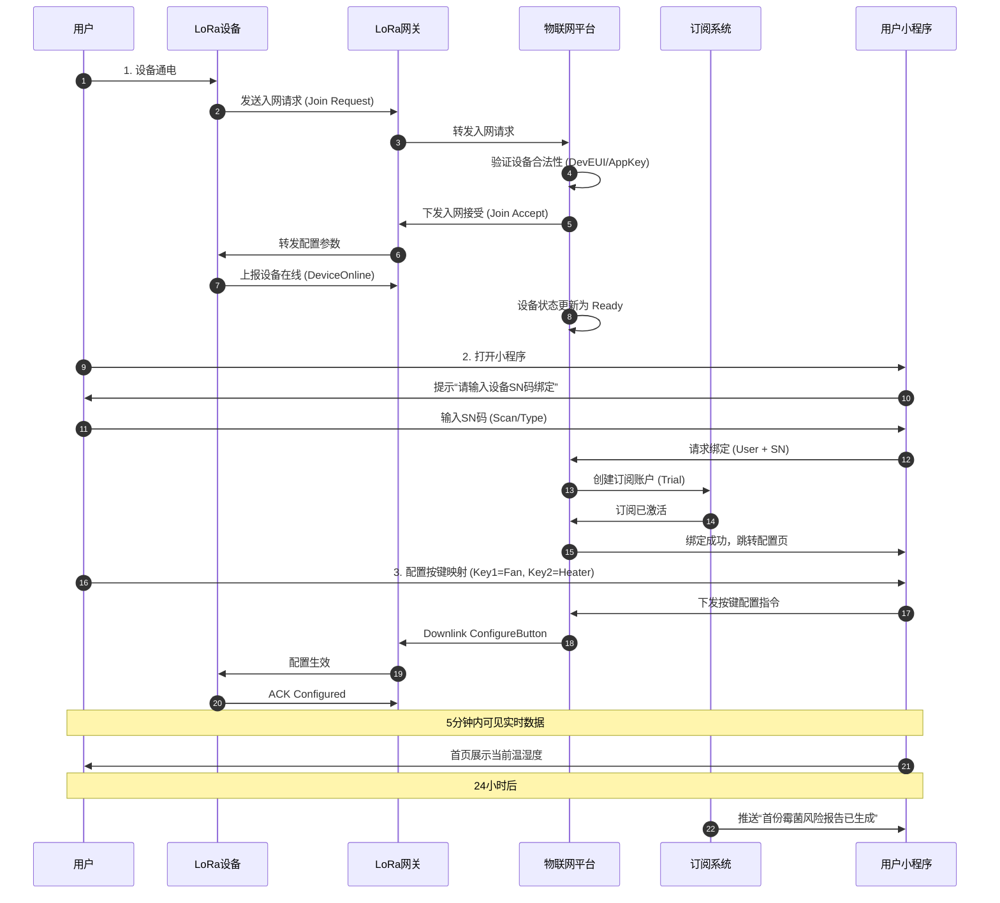
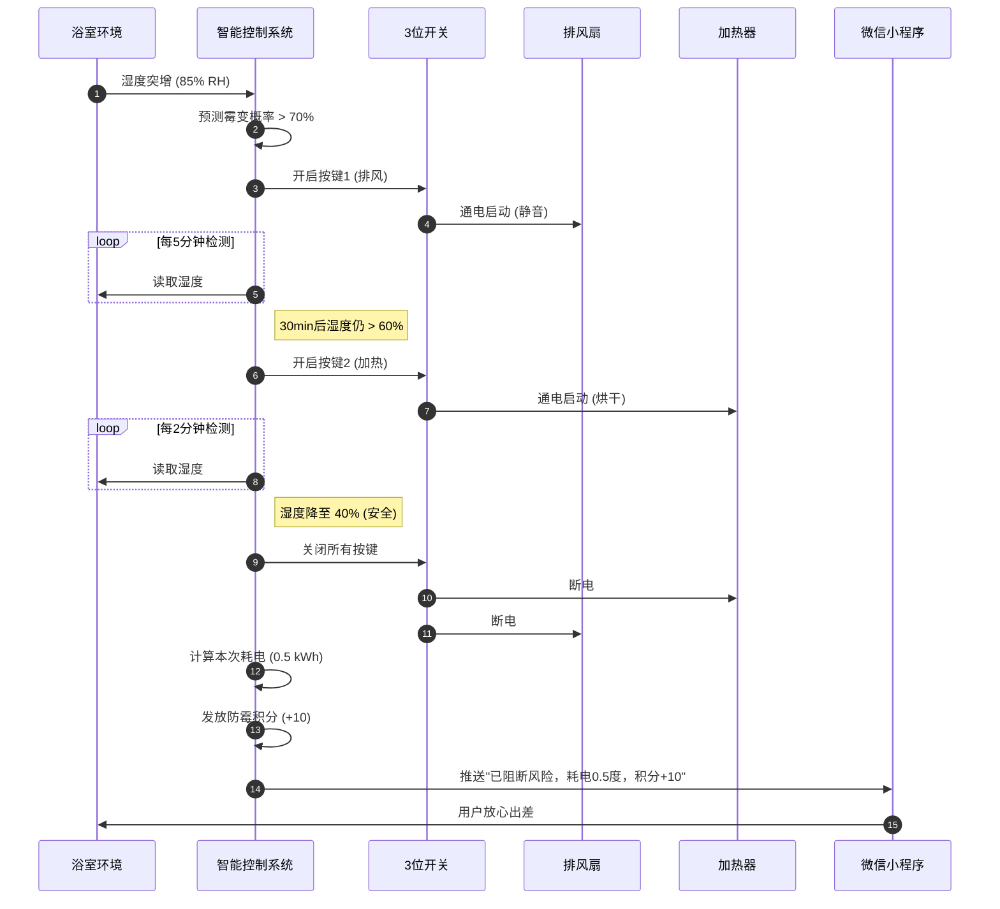
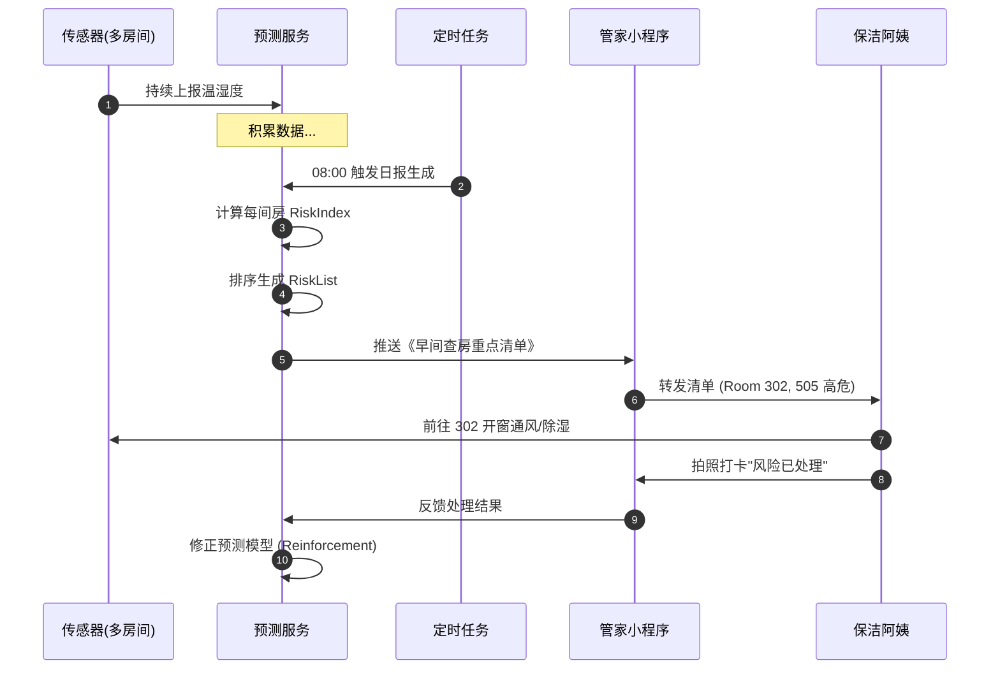
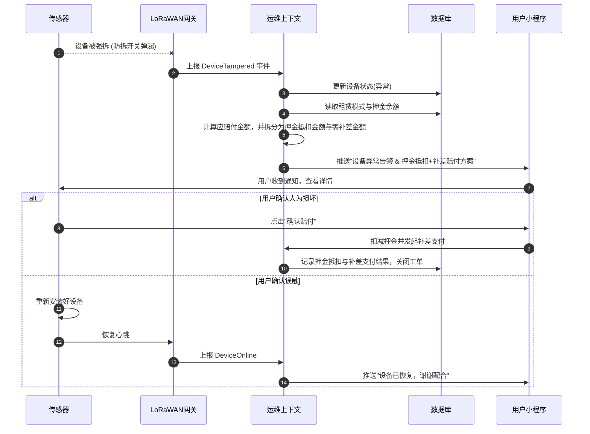

# 防霉管控MVP —— 「用户故事 & 用户旅程」

> **编号**: USER-STORIES-SmartMoldGuard-20251212-v2.0
> **状态**: Final
> **版本说明**: 基于产品愿景v2.0深化，包含完整用户旅程时序图
> **依据**: PROD-VISION-SmartMoldGuard-20251212-v2.0
> **术语引用**: 本文档使用《SmartMoldGuard-统一术语表》（v1.0）定义的标准术语

## 一、核心用户故事 (Core User Stories)

### Story 1: 首次配置自动配网 (设备连接)
```markdown
作为【首次使用防霉系统的家庭住户（最终用户）】，
当【我把LoRa开关盒或温湿度传感器通电时】，
我希望【LoRa开关盒或温湿度传感器可以自动连接到最近的LoRa网关，并自动完成NS服务器的接入注册】，
从而【在 5 分钟内自己完成配网与绑定，无需等待运维工程师上门或电话指导，首次配置成功率 ≥ 99.99 %】，
以支撑我【实现零最终用户侧上门运维，无上门安装和调测服务，所有使用问题在云端解决】。

验收标准：
1. Given 设备上电初始化
   When 自动发起入网请求 (Join Request)
   Then 云端自动下发配置，设备上线成功
2. 北极星指标：首次配网成功率 ≥ 99.99% & 配网耗时 < 5min

对应子域：设备连接上下文 (Support), 交付运维上下文 (Support)
```

### Story 2: 极简绑定与服务订阅 (用户体验)
```markdown
作为【首次使用防霉系统的家庭住户（最终用户）】，
当【我打开微信搜索"防霉管控"微信小程序时】，
我希望【通过输入温湿度传感器和LoRa开关面板设备SN码即可完成设备与最终用户绑定；能在线配置LoRa开关面板的3个物理按键中按键与排风扇、取暖器的开关对应关系；并在5分钟内看到我家实时湿度监测数据】，
从而【在24小时内获得首次霉菌风险评估报告和个性化预防建议】，
以支撑我【提前预警霉菌风险，保护家人呼吸道健康，避免每年¥3,000-8,000的墙面翻新损失】。

验收标准：
1. Given 用户已打开小程序
   When 输入设备SN码并确认
   Then 系统自动绑定设备并激活“首月免费”订阅
   And 跳转至按键配置页，用户完成排风扇/取暖器映射
   And 首页立即展示实时温湿度
2. Given 绑定满24小时
   When 系统定时任务触发
   Then 推送首份《霉菌风险评估报告》至用户微信
3. 北极星指标：绑定流程完成率 > 95% & 首份报告点击率 > 80%

对应子域：客户与订阅上下文 (Generic), 智能控制上下文 (Core)
```

### Story 3: 轻量化风险监测 (B端核心)

```markdown
作为【经营 30 间民宿的法人用户（设备使用方）】，
当【房内配置了温湿度传感器时】，
我希望【在微信小程序实时查看风险概览、今日高风险房间列表、设备状态概览，支持批量操作（指派保洁、标记已处理、导出风险报告），并每天8:00与20:00收到每间房的‘霉变风险指数’准实时推送】，
从而【把高风险房提前插入我的保洁与通风计划，降低人工巡检频次50%，单房每月节省0.8次应急保洁（约￥120），同时确保零霉变投诉】，
以支撑我【合理安排房间保洁工作，为客人提供舒适的居住空间，并体验到人工智能带来的管理效率提升与友好体验感】。

验收标准：
1. Given 每日 08:00 / 20:00 定时触发
   When 获取所有房间过去12小时湿度数据并计算风险
   Then 生成《今日高风险房间清单》推送至管家微信
2. Given 用户打开商户版小程序
   When 进入首页
   Then 显示风险概览卡片、今日高风险房间列表、设备状态概览
3. Given 用户选择多个高风险房间
   When 点击批量操作按钮
   Then 支持批量指派保洁、标记为已处理、导出风险报告
4. 北极星指标：人工巡检成本降低 ≥ 50%

对应子域：防霉预测上下文 (Core), 防霉报告上下文 (Support)
```

### Story 4: 智能联动与能耗感知 (C端核心)
```markdown
作为【年轻白领（设备使用方）】，
当【黄梅季夜间湿度突增至 85 %RH 且模型预测 3 h 后霉变概率＞70 % 时】，
我希望【系统先自动控制3位开关开启排风扇，30 min后若风险仍未降至30 %以下则联动加热器，并把单次能耗≤0.8 kWh的明细实时推送到微信小程序】，
从而【在零打扰的情况下保住衣柜内价值2万元的西装与包包免受霉菌侵袭，同时每月电费增幅＜5元，比传统防潮剂节省￥150/季】，
以支撑我【放心出差7天无需找人看房，时刻保持居住空间舒适，并享受人工智能带来的友好体验感，主动续订3年尊享云订阅+为同层邻居转介绍获取1个月免费服务】。

验收标准：
1. Given 预测霉变概率 > 70%
   When 触发智能干预策略
   Then 开启排风扇(静音) -> 30min后检测 -> 开启加热器(烘干)
   And 推送消息：“本次为您阻断霉菌风险，耗电 0.5 度，获得 10 防霉积分”
2. 北极星指标：霉变阻断成功率 100% & 用户NPS > 50%

对应子域：智能控制上下文 (Core), 防霉预测上下文 (Core), 订阅上下文 (Support)
```

### Story 6: 积分与忠诚度管理 (C端激励)
```markdown
作为【使用防霉系统的家庭住户（最终用户）】，
当【系统成功阻断霉菌风险或我完成系统推荐的防霉任务时】，
我希望【获得相应的防霉积分，并可以在小程序中查看积分余额、兑换规则和兑换记录】，
从而【用积分抵扣订阅费用或兑换清洁券等福利，降低使用成本，增加使用黏性】，
以支撑我【持续使用防霉系统，享受系统带来的价值，并愿意推荐给亲朋好友】。

验收标准：
1. Given 系统成功阻断霉菌风险
   When 干预完成
   Then 自动发放10防霉积分，并推送积分到账通知
2. Given 用户打开积分页面
   When 进入积分管理
   Then 显示当前积分余额、积分获取记录和兑换规则
3. Given 用户选择积分兑换
   When 确认兑换
   Then 积分成功抵扣或兑换成功，余额相应减少
4. 北极星指标：积分核销率 > 30%

对应子域：订阅上下文 (Support)
```

### Story 7: 试用到期与权限降级 (C端体验)
```markdown
作为【使用防霉系统试用版的家庭住户（最终用户）】，
当【我的首月免费试用到期时】，
我希望【系统提前3天通知我试用即将到期，并在到期后自动降级为预警模式，保留风险预警功能但停止自动干预】，
从而【在保护安全的前提下，清晰了解不同模式的功能差异，自主选择是否续费】，
以支撑我【根据自身需求选择合适的订阅方案，避免不必要的费用支出】。

验收标准：
1. Given 试用到期前3天
   When 系统定时任务触发
   Then 推送试用即将到期通知
2. Given 试用到期当天
   When 系统状态更新
   Then 自动降级为预警模式，保留风险预警但停止自动干预
3. Given 用户在预警模式下
   When 检测到高风险
   Then 推送风险预警通知，建议手动干预
4. 北极星指标：试用到期后30天内续费率 > 60%

对应子域：订阅上下文 (Support), 智能控制上下文 (Core)
```

### Story 5: 资产保全与零运维 (运维核心)
```markdown
作为【设备提供方的运维工程师】，
当【系统检测到设备被非法拆除、长期离线或其他异常情况时】，
我希望【在运维控制台的告警与工单面板中查看所有告警，支持按类型和状态筛选，快速处理告警，并通过微信小程序同步将告警推送给设备使用方，自动生成包含传感器SN、剩余租期、押金余额、预计押金抵扣金额与需补差金额的赔付方案说明】，
从而【让 99.99 % 的异常在 10 分钟内由用户自助确认赔付或邮寄返修，无需派单上门】，
以支撑我【实现零最终用户侧上门运维，无上门安装和调测服务，所有使用问题在云端解决】。

验收标准：
1. Given 设备心跳丢失 > 3次 或 防拆开关触发，且设备租赁模式为押金式
   When 判定为异常离线并计算应赔付金额
   Then 推送告警至用户小程序，文案中需同时展示押金余额、预计押金抵扣金额与需补差金额，并引导用户完成在线自助处理（赔付或返修）
2. Given 运维工程师登录运维控制台
   When 进入告警与工单面板
   Then 显示系统概览、告警列表，支持按类型和状态筛选告警
3. Given 运维工程师选择一个告警
   When 点击处理按钮
   Then 可以一键处理告警，更新告警状态
4. 北极星指标：异常自助处理率 > 99%

对应子域：交付运维上下文 (Support), 设备连接上下文 (Support)
```

### Story 8: 设备远程诊断 (运维效率)
```markdown
作为【设备提供方的运维工程师】，
当【系统检测到设备异常时】，
我希望【通过运维控制台远程查看设备的信号强度、电池电压、丢包率等底层数据，进行远程诊断】，
从而【快速定位设备问题，无需上门即可解决90%以上的设备故障，降低运维成本】，
以支撑我【实现零最终用户侧上门运维，提高运维效率，降低运维成本】。

验收标准：
1. Given 设备状态异常
   When 进入远程诊断
   Then 显示设备信号强度、电池电压、丢包率等数据
2. Given 运维工程师进行远程诊断
   When 诊断完成
   Then 自动生成诊断结论和建议操作
3. Given 运维工程师执行建议操作
   When 操作完成
   Then 设备状态恢复正常或问题得到解决
4. 北极星指标：远程诊断解决率 > 90%

对应子域：交付运维上下文 (Support), 设备连接上下文 (Support)
```

### Story 9: 设备健康管理 (运维预防)
```markdown
作为【设备提供方的运维工程师】，
当【我需要监控设备健康状态时】，
我希望【通过运维控制台查看设备的健康数据和健康指纹，建立设备正常运行的基线】，
从而【提前发现设备异常，进行预防性维护，减少设备故障发生】，
以支撑我【提高设备可靠性，降低设备故障率，提升用户满意度】。

验收标准：
1. Given 进入设备健康管理
   When 查看设备健康
   Then 显示设备健康数据和健康指纹
2. Given 设备健康数据偏离基线
   When 检测到异常
   Then 自动生成设备异常预警
3. Given 运维工程师查看预警
   When 确认预警
   Then 可以进行预防性维护操作
4. 北极星指标：设备故障发生率 < 1%

对应子域：交付运维上下文 (Support), 设备连接上下文 (Support)
```


## 二、用户旅程泳道图 (User Journey Map)

### 旅程 A: 首次配置与服务订阅 (Provisioning & Subscription)
*适用场景：新设备上电，首次使用，激活服务*



### 旅程 B: 智能联动与能耗感知 (Smart Intervention & Energy Insight)
*适用场景：家庭用户，全套设备，自动闭环*



### 旅程 C: 轻量化风险监测 (Lightweight Monitoring)
*适用场景：民宿/酒店，仅传感器，人工干预*



### 旅程 D: 资产保全闭环 (Asset Protection Loop)
*适用场景：设备被拆除/离线，运维侧*


