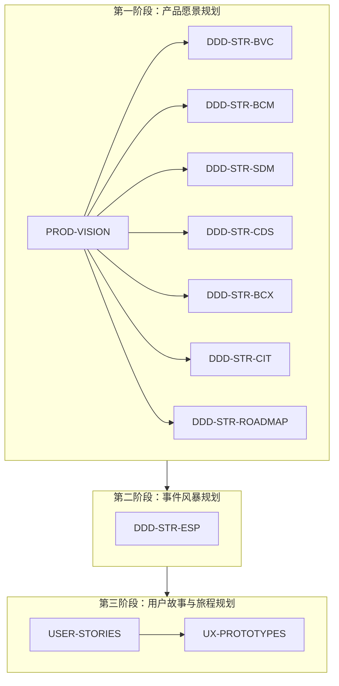

# 战略规划阅读指南

## 一、战略规划文档清单
| 序号 | 文档类型| 文档名称 | 文档描述 |
| --- | --- | --- | --- | 
| 0 | PROD-VISION | PROD-VISION-SmartMoldGuard-{{文档发布日期}}-{{文档版本号}}.md | 产品愿景 |
| 1 | DDD-STR-BVC | DDD-STR-SmartMoldGuard-{{文档发布日期}}-{{文档版本号}}-01-BVC.md | 业务价值画布 (Business Value Canvas) |
| 2 | DDD-STR-BCM | DDD-STR-SmartMoldGuard-{{文档发布日期}}-{{文档版本号}}-02-BCM.md | 业务能力地图 (Business Capability Map) |
| 3 | DDD-STR-SDM | DDD-STR-SmartMoldGuard-{{文档发布日期}}-{{文档版本号}}-03-SDM.md | 子域优先级矩阵 (Subdomain Priority Matrix) |
| 4 | DDD-STR-CDS | DDD-STR-SmartMoldGuard-{{文档发布日期}}-{{文档版本号}}-04-CDS.md | 核心域场景说明书 (Core Domain Scenario) |
| 5 | DDD-STR-BCX | DDD-STR-SmartMoldGuard-{{文档发布日期}}-{{文档版本号}}-05-BCX.md | 限界上下文地图 (Bounded Context Map) |
| 6 | DDD-STR-CIT | DDD-STR-SmartMoldGuard-{{文档发布日期}}-{{文档版本号}}-06-CIT.md | 上下文集成表 (Context Integration Table) |
| 7 | DDD-STR-ROADMAP | DDD-STR-SmartMoldGuard-{{文档发布日期}}-{{文档版本号}}-07-Roadmap.md | Roadmap 演进路线 & 里程碑 |
| 8 | DDD-STR-ESP | DDD-STR-SmartMoldGuard-{{文档发布日期}}-{{文档版本号}}-08-ESP.md | 事件风暴规划 (Event Storming Planning) |
| 9 | USER-STORIES | USER-STORIES-SmartMoldGuard-{{文档发布日期}}-{{文档版本号}}.md | 用户故事与旅程 |
| 10 | UX-PROTOTYPES | UX-PROTOTYPES-SmartMoldGuard-{{文档发布日期}}-{{文档版本号}}.md | 低保真界面原型 & 故事板 |
## 二、战略规划文档间相关性说明
- 自上而下的战略分解：整个流程体现了从宏观战略到微观设计的分解过程。PROD-VISION 是顶层设计，其下的七个战略文档（如BVC-业务价值链、BCM-业务能力模型等）是对愿景在不同维度的具体展开。
- 承上启下的关键环节：DDD-STR-ESP（事件风暴）是连接战略与具体产品设计的桥梁。它将战略文档中定义的业务概念和关系，转化为领域模型，为编写具体的用户故事 (USER-STORIES) 提供了清晰的业务上下文和规则。
- 最终交付导向：所有前期工作的价值最终体现在 USER-STORIES 和 UX-PROTOTYPES 上，它们是开发团队和设计团队可直接执行的工作依据。

战略规划阶段文档相关性说明：
- 产品愿景规划阶段：这是战略规划的起点，定义了产品的核心方向和目标。此阶段产生一个总领性文档 PROD-VISION，并衍生出七个具体的战略领域文档。
- 事件风暴规划阶段：在明确产品愿景和战略后，进入领域建模阶段，通过 DDD-STR-ESP 文档来识别领域事件、聚合和界限上下文，将战略落地到业务领域。
- 用户故事与旅程规划阶段：这是最接近具体设计和开发的阶段，基于之前的战略和领域分析，产出 USER-STORIES 和 UX-PROTOTYPES，指导产品功能实现和用户体验设计。