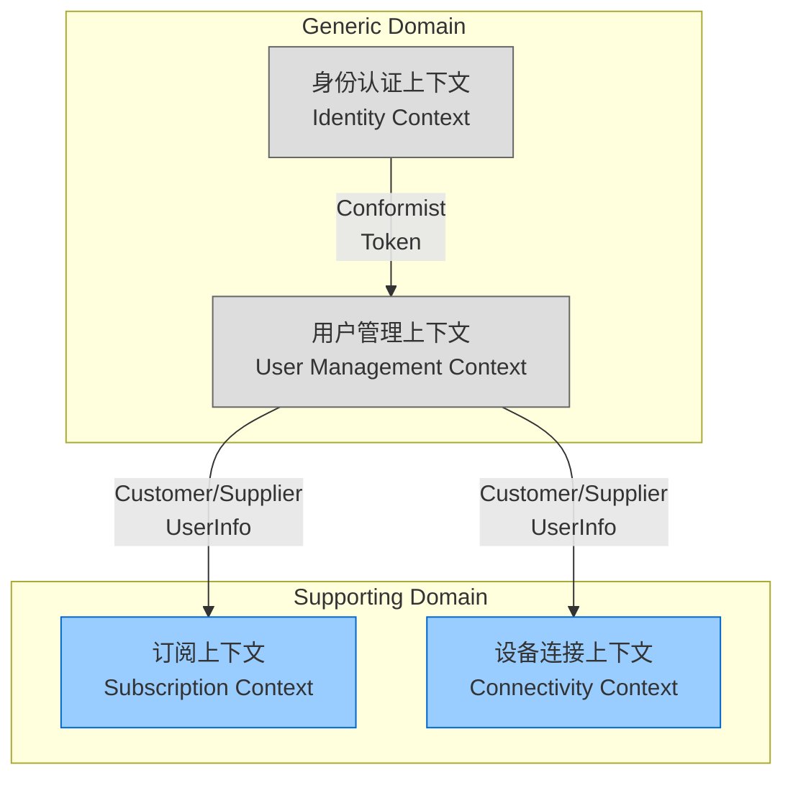
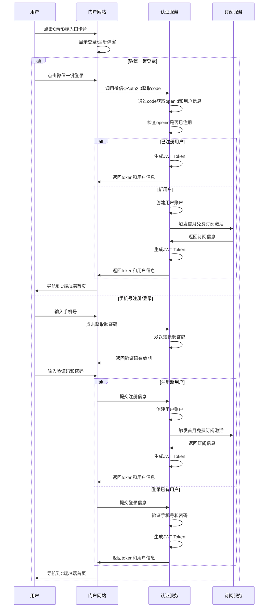

- [x] **7.2 代码质量修复**
  - [x] 修复 `device-service` 和 `gateway-service` POM 中缺失的 `spring-cloud-alibaba.version` 问题.
  - [x] 修复 `DeviceHealthService` 中的潜在空指针风险 (NPE) 及未使用导入.
  - [x] 清理测试代码 (`Phase1FeaturesE2ETest`, `ReportE2ETest`, `SubscriptionE2ETest`) 及实现类 (`AlarmServiceImpl`) 中的未使用导入.
- [x] **7.3 数据库初始化脚本修复**
  - [x] 完善 `backend/infra/postgres/init.sql`，补充缺失的表结构 (`alarms`, `climate_configurations`, `subscriptions`, `loyalty_points`, `points_transactions`, `daily_risk_reports`, `risk_event_logs`).

---

## 8. C端和B端用户管理功能规划设计

### 8.1 设计依据

- **DDD战略设计规范**：BCM (业务能力地图)、SDM (子域优先级矩阵)、BCX (限界上下文地图)
- **现有用户故事**：USER-STORIES-SmartMoldGuard-20251212-v2.0
- **现有UX原型**：UX-PROTOTYPES-SmartMoldGuard-20251212-v2.0
- **现有代码实现**：UserManagementView.vue (运维端)、ProfileView.vue (C端)

### 8.2 业务能力分析 (BCM)

根据业务能力地图 (BCM)，用户管理属于**通用域**，但在本项目中需要与防霉预测、智能控制、订阅管理深度耦合。

| L1 能力 | L2 子能力 | 描述 | 衡量指标 (KPI) | 资源策略 |
| :--- | :--- | :--- | :--- | :--- |
| **GEN-02**<br>**用户管理** | **GEN-02-01 用户注册与认证** | 支持微信一键登录、手机号注册、密码认证 | 注册成功率 > 99% | 自研+微信SDK |
| | **GEN-02-02 用户信息管理** | 用户基本信息维护、头像、昵称、联系方式 | 信息完整率 > 95% | 自研 |
| | **GEN-02-03 用户权限管理** | C端/B端/运维端权限隔离、角色管理 | 权限准确率 100% | 自研 |
| | **GEN-02-04 用户状态管理** | 用户启用/禁用、冻结、注销 | 状态同步延迟 < 1s | 自研 |
| | **GEN-02-05 用户统计与分析** | 用户增长、活跃度、留存率分析 | 统计准确率 > 98% | 自研 |

### 8.3 子域优先级分析 (SDM)

| 子域名称 | 类型 | 业务差异化 | 技术复杂度 | 评分理由 | 竞争优势 |
| :--- | :--- | :---: | :---: | :--- | :--- |
| **用户管理**<br>(User Management) | **Generic** | **1** | **2** | **无差异化**：标准用户管理功能。**低复杂度**：CRUD操作、权限控制。 | 通过与防霉场景深度绑定，提升用户体验和黏性。 |

**建设策略**：快速自研，重点在于与防霉场景的深度耦合。

### 8.4 限界上下文设计 (BCX)

#### 8.4.1 用户管理上下文

**职责**：管理用户身份、认证、权限、状态，为其他上下文提供用户信息。

**核心聚合**：
- `User` (用户): 聚合根。包含用户基本信息、状态、权限。
- `UserProfile` (用户档案): 实体。用户扩展信息（头像、昵称、偏好设置）。
- `UserPermission` (用户权限): 值对象。用户权限集合。

**领域服务**：
- `UserRegistrationService`: 用户注册服务
- `UserAuthenticationService`: 用户认证服务
- `UserAuthorizationService`: 用户授权服务

**领域事件**：
- `UserRegistered`: 用户注册事件
- `UserActivated`: 用户激活事件
- `UserDeactivated`: 用户禁用事件
- `UserUpdated`: 用户信息更新事件

**集成模式**：
- 与**身份认证上下文**：Conformist（顺从者），使用微信OAuth2/JWT
- 与**订阅上下文**：Customer/Supplier（客户/供应商），订阅状态影响用户权限
- 与**设备连接上下文**：Customer/Supplier（客户/供应商），用户绑定设备

#### 8.4.2 上下文映射关系



### 8.5 用户故事设计

#### Story 1: 门户网站登录与注册 (C端/B端通用)

```markdown
作为【首次访问门户网站的用户】，
当【我打开门户网站时】，
我希望【通过微信一键登录或手机号+验证码完成注册/登录，并选择进入C端或B端系统】，
从而【在1分钟内完成注册登录并开始使用防霉服务】，
以支撑我【快速体验防霉系统的核心功能】。

验收标准：
1. Given 用户打开门户网站
   When 点击C端/B端入口卡片
   Then 弹出登录/注册对话框
2. Given 用户选择微信一键登录
   When 授权微信登录
   Then 系统自动获取微信用户信息并完成注册/登录
   And 自动激活首月免费订阅
   And 导航到对应的C端/B端首页
3. Given 用户选择手机号注册
   When 输入手机号和验证码
   Then 系统完成注册并设置初始密码
   And 导航到对应的C端/B端首页
4. Given 已注册用户选择手机号登录
   When 输入手机号和密码
   Then 登录成功并导航到对应的C端/B端首页
5. 北极星指标：注册成功率 > 99% & 登录成功率 > 99% & 注册耗时 < 1min

对应子域：用户管理上下文 (Generic), 订阅上下文 (Generic)
```

#### Story 2: 用户信息管理 (C端/B端通用)

```markdown
作为【已注册用户】，
当【我需要更新个人信息时】，
我希望【在小程序中编辑头像、昵称、手机号、邮箱等基本信息】，
从而【保持个人信息的准确性和完整性】，
以支撑我【接收重要通知和享受个性化服务】。

验收标准：
1. Given 用户进入个人中心
   When 点击编辑资料
   Then 可以修改头像、昵称、手机号、邮箱
2. Given 用户修改手机号
   When 输入新手机号并验证
   Then 手机号更新成功
3. 北极星指标：信息完整率 > 95%

对应子域：用户管理上下文 (Generic)
```

#### Story 3: 用户权限管理 (运维端)

```markdown
作为【系统运维人员】，
当【我需要管理系统用户时】，
我希望【在运维端查看所有用户列表，支持按用户类型、状态、注册时间筛选，支持启用/禁用用户、编辑用户信息、查看用户详情】，
从而【有效管理系统用户，确保系统安全和稳定运行】，
以支撑我【快速定位和处理用户问题】。

验收标准：
1. Given 运维人员进入用户管理页面
   When 查看用户列表
   Then 显示所有用户信息（ID、姓名、类型、状态、注册时间、订阅状态）
2. Given 运维人员选择用户
   When 点击启用/禁用
   Then 用户状态更新成功
3. 北极星指标：权限准确率 100%

对应子域：用户管理上下文 (Generic)
```

#### Story 4: 用户状态管理 (运维端)

```markdown
作为【系统运维人员】，
当【检测到异常用户行为或用户违规时】，
我希望【能够禁用用户账户、冻结用户权限、注销用户】，
从而【维护系统安全和秩序】，
以支撑我【及时处理违规用户，保护其他用户权益】。

验收标准：
1. Given 运维人员选择违规用户
   When 点击禁用用户
   Then 用户立即无法登录系统
2. Given 用户被禁用
   When 用户尝试登录
   Then 提示账户已被禁用
3. 北极星指标：状态同步延迟 < 1s

对应子域：用户管理上下文 (Generic)
```

#### Story 5: 用户统计与分析 (运维端)

```markdown
作为【系统运维人员】，
当【我需要了解用户增长和活跃情况时】，
我希望【查看用户总数、C端/B端用户数、活跃用户数、新增用户趋势、用户留存率等统计数据】，
从而【评估系统运营效果和优化策略】，
以支撑我【制定用户增长和留存策略】。

验收标准：
1. Given 运维人员进入用户管理页面
   When 查看用户统计
   Then 显示用户总数、C端/B端用户数、活跃用户数
2. Given 运维人员查看趋势
   When 选择时间范围
   Then 显示用户增长趋势图
3. 北极星指标：统计准确率 > 98%

对应子域：用户管理上下文 (Generic)
```

### 8.6 UX原型设计

#### 8.6.1 门户网站登录/注册弹窗

```text
 ═══════════════════════════════════════════════════════════════
                        🛡️ 防霉守护系统
 ═══════════════════════════════════════════════════════════════

   登录/注册
 ───────────────────────────────────────────────────────

   [🟢 微信一键登录]
   使用微信账号快速登录/注册

   ───────────────────────────────────────────────────────

   手机号登录/注册
   ───────────────────────────────────────────────────────
   [📱 手机号] [13800138001          ]

   [🔒 验证码] [123456              ]  [🔄 获取验证码]

   [📝 设置密码] [••••••••           ]  (首次注册时显示)

   [✅ 我已阅读并同意《用户协议》和《隐私政策》]

   ───────────────────────────────────────────────────────

   [🔑 登录]  [📝 注册]

   ───────────────────────────────────────────────────────

   提示：
   • 首次使用手机号注册将自动激活首月免费订阅
   • 微信一键登录将自动创建账户并激活订阅

   [❌ 关闭]

 ═══════════════════════════════════════════════════════════════
```

#### 8.6.2 C端个人中心页面

```text
 ═══════════════════════════════════════════════════════════════
   👤 个人中心                                      [🔙 返回]
 ═══════════════════════════════════════════════════════════════

 📱 用户信息
 ───────────────────────────────────────────────────────
 [👤 头像]   张三
            用户ID: SMG-C-20251201-001
            [✏️ 编辑资料]

 💎 订阅状态
 ───────────────────────────────────────────────────────
 ✅ 试用中 (有效期至: 2026-01-30)

 🪙 防霉积分
 ───────────────────────────────────────────────────────
 180 分 (可兑换 ¥18 订阅抵扣)

 📊 防霉报告
 ───────────────────────────────────────────────────────
 12 份 (查看历史报告)

 功能菜单
 ───────────────────────────────────────────────────────
 🏠 房间管理              >
 ➕ 设备配网              >
 ⚙️  设置                >
 ❓  帮助中心              >
 💬  意见反馈              >
 ℹ️  关于我们              >

 ═══════════════════════════════════════════════════════════════
 [🚪 退出登录]
 ═══════════════════════════════════════════════════════════════
```

#### 8.6.3 用户信息编辑页面

```text
 ═══════════════════════════════════════════════════════════════
   ✏️ 编辑资料                                      [🔙 返回]
 ═══════════════════════════════════════════════════════════════

 头像
 ───────────────────────────────────────────────────────
 [👤 当前头像]  [📷 更换头像]

 昵称
 ───────────────────────────────────────────────────────
 [张三                    ]

 手机号
 ───────────────────────────────────────────────────────
 [13800138001          ]  [🔄 修改手机号]

 邮箱
 ───────────────────────────────────────────────────────
 [zhangsan@example.com]

 性别
 ───────────────────────────────────────────────────────
 [🔘 男  🔘 女  🔘 保密]

 生日
 ───────────────────────────────────────────────────────
 [1990-01-01             ]

 ═══════════════════════════════════════════════════════════════
 [💾 保存]  [❌ 取消]
 ═══════════════════════════════════════════════════════════════
```

#### 8.6.4 运维端用户管理页面

```text
 ═══════════════════════════════════════════════════════════════
   👥 用户管理                                      [➕ 添加用户]
 ═══════════════════════════════════════════════════════════════

 📊 用户统计
 ───────────────────────────────────────────────────────
 用户总数: 1,234    C端用户: 890    B端用户: 344    活跃用户: 1,100

 用户列表
 ───────────────────────────────────────────────────────
 [🔍 搜索用户名、ID或手机号]

 用户ID       用户名    类型    手机号        状态    注册时间    订阅状态    操作
 ───────────────────────────────────────────────────────
 SMG-C-...    张三      🏠C端   13800138001   ✅活跃   2025-12-01  ✅已订阅    [查看][编辑][禁用]
 SMG-B-...    李四      🏢B端   13900139002   ✅活跃   2025-12-02  ✅已订阅    [查看][编辑][禁用]
 SMG-C-...    王五      🏠C端   13700137003   ❌禁用   2025-12-03  ❌未订阅    [查看][编辑][启用]

 ═══════════════════════════════════════════════════════════════
 [上一页]  1 / 10  [下一页]
 ═══════════════════════════════════════════════════════════════
```

#### 8.6.5 用户详情页面

```text
 ═══════════════════════════════════════════════════════════════
   👤 用户详情                                      [🔙 返回]
 ═══════════════════════════════════════════════════════════════

 基本信息
 ───────────────────────────────────────────────────────
 用户ID:       SMG-C-20251201-001
 用户名:       张三
 用户类型:     🏠 C端用户
 手机号:       13800138001
 邮箱:         zhangsan@example.com
 注册时间:     2025-12-01 10:30:00
 状态:         ✅ 活跃

 订阅信息
 ───────────────────────────────────────────────────────
 订阅状态:     ✅ 已订阅
 套餐类型:     Premium
 有效期至:     2026-12-01
 防霉积分:     180 分

 设备信息
 ───────────────────────────────────────────────────────
 绑定设备数:   2 台
 设备列表:
   • 主卧浴室 (在线)
   • 次卧浴室 (在线)

 活跃度统计
 ───────────────────────────────────────────────────────
 最后登录:     2025-12-29 15:30:00
 本月登录次数: 28 次
 本月活跃天数: 25 天

 ═══════════════════════════════════════════════════════════════
 [✏️ 编辑]  [🚫 禁用]  [📊 查看详细统计]
 ═══════════════════════════════════════════════════════════════
```

### 8.7 数据库设计

#### 8.7.1 用户表 (users)

```sql
CREATE TABLE IF NOT EXISTS users (
    id BIGSERIAL PRIMARY KEY,
    user_id VARCHAR(50) UNIQUE NOT NULL,
    user_type VARCHAR(20) NOT NULL,
    username VARCHAR(100) NOT NULL,
    phone VARCHAR(20) UNIQUE,
    email VARCHAR(100),
    avatar VARCHAR(255),
    gender VARCHAR(10),
    birthday DATE,
    password_hash VARCHAR(255),
    wechat_openid VARCHAR(100) UNIQUE,
    status VARCHAR(20) NOT NULL DEFAULT 'active',
    last_login_time TIMESTAMP,
    created_at TIMESTAMP DEFAULT CURRENT_TIMESTAMP,
    updated_at TIMESTAMP DEFAULT CURRENT_TIMESTAMP
);

CREATE INDEX idx_users_user_id ON users(user_id);
CREATE INDEX idx_users_phone ON users(phone);
CREATE INDEX idx_users_wechat_openid ON users(wechat_openid);
CREATE INDEX idx_users_status ON users(status);
CREATE INDEX idx_users_type ON users(user_type);
```

#### 8.7.2 用户权限表 (user_permissions)

```sql
CREATE TABLE IF NOT EXISTS user_permissions (
    id BIGSERIAL PRIMARY KEY,
    user_id BIGINT REFERENCES users(id),
    role VARCHAR(50) NOT NULL,
    permissions JSONB,
    created_at TIMESTAMP DEFAULT CURRENT_TIMESTAMP,
    updated_at TIMESTAMP DEFAULT CURRENT_TIMESTAMP
);

CREATE INDEX idx_user_permissions_user_id ON user_permissions(user_id);
```

#### 8.7.3 用户统计表 (user_statistics)

```sql
CREATE TABLE IF NOT EXISTS user_statistics (
    id BIGSERIAL PRIMARY KEY,
    user_id BIGINT REFERENCES users(id),
    login_count INTEGER DEFAULT 0,
    active_days INTEGER DEFAULT 0,
    last_active_date DATE,
    month_login_count INTEGER DEFAULT 0,
    month_active_days INTEGER DEFAULT 0,
    created_at TIMESTAMP DEFAULT CURRENT_TIMESTAMP,
    updated_at TIMESTAMP DEFAULT CURRENT_TIMESTAMP
);

CREATE INDEX idx_user_statistics_user_id ON user_statistics(user_id);
```

### 8.8 API接口设计

#### 8.8.1 门户网站登录与注册

```
POST /api/v1/auth/wechat-login
Request: { wechat_code, user_type }
Response: { user_id, token, user_info, is_new_user }

POST /api/v1/auth/send-sms-code
Request: { phone }
Response: { success: true, expires_in: 300 }

POST /api/v1/auth/register
Request: { phone, sms_code, password, username, user_type }
Response: { user_id, token, user_info }

POST /api/v1/auth/login
Request: { phone, password, user_type }
Response: { user_id, token, user_info }

POST /api/v1/auth/logout
Request: { token }
Response: { success: true }

GET /api/v1/auth/current-user
Request: { token }
Response: { user_info }
```

#### 8.8.2 用户信息管理

```
GET /api/v1/users/{user_id}
Response: { user_info }

PUT /api/v1/users/{user_id}
Request: { username, email, avatar, gender, birthday }
Response: { success: true }

PUT /api/v1/users/{user_id}/phone
Request: { new_phone, verification_code }
Response: { success: true }
```

#### 8.8.3 用户权限管理 (运维端)

```
GET /api/v1/admin/users
Query: { page, size, type, status, keyword }
Response: { users, total, page, size }

PUT /api/v1/admin/users/{user_id}/status
Request: { status }
Response: { success: true }

DELETE /api/v1/admin/users/{user_id}
Response: { success: true }
```

#### 8.8.4 用户统计与分析

```
GET /api/v1/admin/users/statistics
Response: { total_users, c_end_users, b_end_users, active_users, growth_trend }

GET /api/v1/admin/users/{user_id}/statistics
Response: { login_count, active_days, last_active_date, ... }
```

### 8.9 门户网站登录/注册流程设计

#### 8.9.1 门户网站登录/注册交互流程



#### 8.9.2 门户网站登录/注册状态管理

```javascript
// 登录/注册弹窗状态
const authModal = ref({
  visible: false,
  user_type: null, // 'c' 或 'b'
  loginType: 'wechat', // 'wechat' 或 'phone'
  step: 'login', // 'login' 或 'register'
  phone: '',
  smsCode: '',
  password: '',
  countdown: 0,
  loading: false
})

// 用户认证状态
const authState = ref({
  isAuthenticated: false,
  token: localStorage.getItem('token'),
  userInfo: JSON.parse(localStorage.getItem('userInfo') || '{}')
})
```

#### 8.9.3 门户网站登录/注册实现要点

**前端实现要点**：
1. 在PortalView.vue中添加登录/注册弹窗组件
2. 点击C端/B端入口卡片时显示弹窗并设置user_type
3. 实现微信OAuth2.0登录流程
4. 实现短信验证码发送和倒计时功能
5. 实现手机号注册/登录表单验证
6. 登录成功后保存token和用户信息到localStorage
7. 登录成功后导航到对应的C端/B端首页

**后端实现要点**：
1. 实现微信OAuth2.0认证服务
2. 实现短信验证码发送服务
3. 实现用户注册服务（自动激活首月免费订阅）
4. 实现用户登录服务（生成JWT Token）
5. 实现Token刷新和验证机制
6. 实现用户信息查询服务

**安全要点**：
1. 密码使用BCrypt加密存储
2. JWT Token设置过期时间（建议24小时）
3. 短信验证码有效期5分钟，限制发送频率（60秒一次）
4. 防止暴力破解（登录失败次数限制）
5. HTTPS传输加密
6. 敏感信息脱敏处理

### 8.10 实现优先级

#### 第一阶段（核心功能）
- 用户注册与认证（微信一键登录、手机号注册）
- 用户信息管理（基本信息维护）
- 用户权限管理（运维端用户列表、启用/禁用）

#### 第二阶段（增强功能）
- 用户状态管理（冻结、注销）
- 用户统计与分析（用户增长趋势、活跃度分析）

#### 第三阶段（优化功能）
- 用户行为分析
- 用户画像与推荐

### 8.11 技术栈建议

**后端**：
- Spring Boot 3.2.0
- Spring Security + JWT
- MyBatis Plus
- PostgreSQL

**前端**：
- Vue 3 + Vite
- Pinia (状态管理)
- Axios (HTTP客户端)

**认证**：
- 微信OAuth2.0
- JWT Token

### 8.12 风险提示

- 用户信息安全：密码加密存储、敏感信息脱敏
- 认证安全：Token过期机制、刷新Token机制
- 权限控制：严格的权限校验，防止越权操作
- 数据一致性：用户状态变更需要同步到订阅、设备等上下文

### 8.13 验收标准

- 所有功能需符合UX-PROTOTYPES设计
- 所有功能需满足USER-STORIES用户故事
- 所有功能需通过测试用例验证
- 所有功能需符合安全合规要求
- 用户注册成功率 > 99%
- 用户信息完整率 > 95%
- 权限准确率 100%
- 状态同步延迟 < 1s
- 统计准确率 > 98%

---

**创建日期**：2025-12-30
**更新日期**：2025-12-30
**更新人**：AI助手
**版本**：v1.0
- [x] **7.4 K8s 部署脚本修复**
  - [x] 补充缺失的 `k8s/00-namespace.yaml` 文件.
  - [x] 移除 `k8s/01-postgres.yaml` 中冗余的 Namespace 定义.
  - [x] 验证 `k8s/deploy.sh` 引用的所有 YAML 文件存在性及 namespace 配置正确性.
- [x] **7.5 Nacos 集成实施**
  - [x] 修改 `docker-compose.yml` 和 `.env` 添加 Nacos.
  - [x] 启动 Nacos 并录入初步配置.
  - [x] 改造 `gateway-service` 验证连通性.
  - [x] 批量改造其他后端服务.
  - [x] 移除 Eureka 服务.
  - [x] 全面回归测试.
- [x] **7.6 前端门户入口显示修复**
  - [x] 排查 JS 资源加载 404 问题 (版本哈希不一致).
  - [x] 优化 Nginx 配置禁用 index.html 缓存.
  - [x] 重新构建前端容器并验证服务状态.
