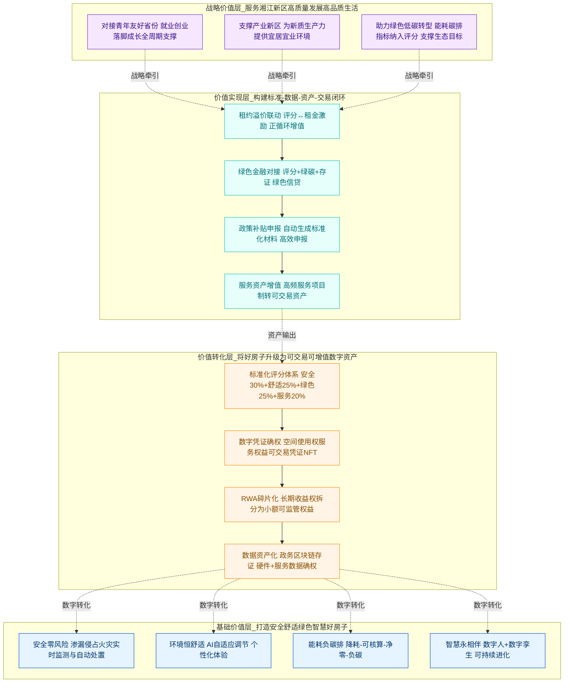
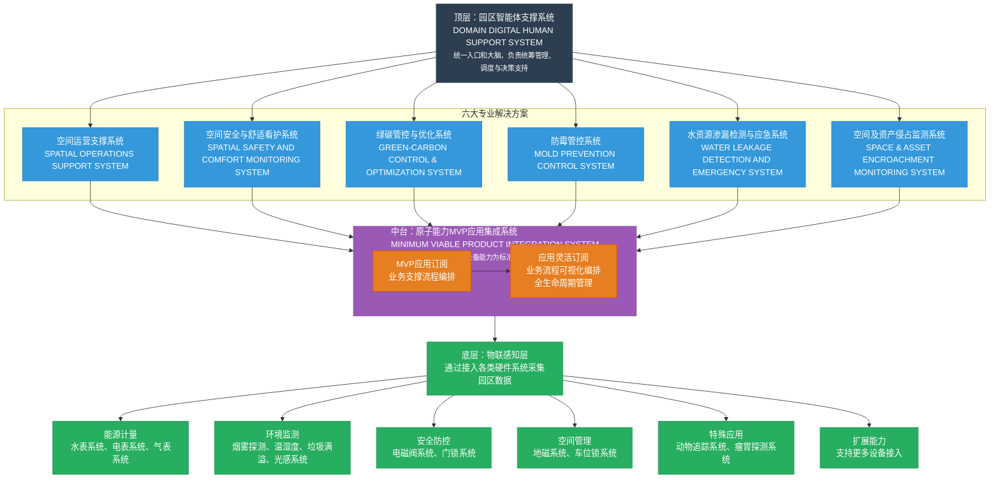

# 华宽通园区智能体 —— 「产品愿景」

> **编号**: DDD-STR-VISION-HKT-LivingCampusAgentic-v1.0
> **状态**: Draft
> **版本说明**: 系统性修订（对齐《领域数字人规划-愿景》《园区建设规划-对外宣传》，并适配华宽通园区智能体交付边界）
> **术语引用**: 本文档使用“好房子数字资产 / 好房子评分 / 园区智能体 / 建筑数字孪生 / 领域数字人 / 数字凭证”等统一口径

产品名称：华宽通园区智能体（好房子 + 数字资产）
版本：v1.0
修改日期：2025-12-17 18:06:39

---

## 1. 产品定位

**一句话愿景：**

**“建造安全、舒适、绿色、智慧的‘好房子’，让园区成为可交易、可增值的‘数字资产’！”**

**核心价值：**
围绕"好房子"与"数字资产"双轮驱动，构建"空间+数字"融合的价值闭环。通过"先建好房子，再升级为数字资产"的递进路径，实现从物理空间品质到数字资产价值的全面跃升。让建筑"会成长的好房子"都成为可计量、可比较、可交易的智慧资产体，持续进化增值，为湘江新区"十五五"蓝图增加确定性。

### 1.1 基础价值层：打造"安全、舒适、绿色、智慧"的好房子
- 安全零风险 ：构建全空间安全预警系统，实现渗漏、侵占、火灾等风险的实时监测与自动处置
- 环境恒舒适 ：通过AI驱动的环境自适应调节，为居住、办公、活动空间提供个性化舒适体验
- 能耗负碳排 ：遵循"降耗—可核算—净零—负碳排"路径，实现绿色低碳运营
- 智慧永相伴 ：部署领域数字人、建筑数字孪生等智能系统，赋予建筑可持续进化的智慧生命
### 1.2 价值转化层：将好房子升级为可交易、可增值的数字资产
- 标准化评分体系 ：建立"好房子评分"（安全30%+舒适25%+绿色25%+服务20%），为资产定价提供标尺
- 数字凭证确权 ：将空间使用权、服务权益转化为可交易的数字凭证（可扩展为NFT等形式）
- RWA碎片化 ：将长期稳定的空间收益权拆分为可管理、可监管的小额权益
- 数据资产化 ：通过政务区块链存证，实现楼宇硬件与服务数据的标准化确权
### 1.3 价值实现层：构建"标准—数据—资产—交易"的完整闭环
- 租约溢价联动 ：评分与租金水平、运营激励直接挂钩，形成价值增值正循环
- 绿色金融对接 ：通过评分+绿碳指标+存证材料的组合数据包，支撑绿色信贷申请
- 政策补贴申报 ：自动生成标准化申报材料，高效对接政府补贴政策
- 服务资产增值 ：将高频服务从"项目制"转化为"可交易资产"，提升服务收入占比
### 1.4 战略价值：服务湘江新区"高质量发展"与"高品质生活"目标
- 对接青年友好省份建设 ：通过"好房子评分"和数字资产实践，承载"就业有门、创业有路、落脚有房、成长有伴"的政策目标
- 支撑产业新区发展 ：为智能制造、数字经济等新质生产力提供宜居宜业的综合环境
- 助力绿色低碳转型 ：将能耗、碳排等绿色指标作为评分重要维度，支撑新区生态目标实现

以“空间运营者 + 科技服务者”的双重角色为出发点，将园区从“可出租的物理空间”，升级为“可衡量、可比较、可交易的好房子数字资产单元”。以统一指标口径把安全、舒适、绿色、智慧与服务履约全面数字化、指标化，形成可对比、可归因的“好房子评分”，并通过园区智能体、建筑数字孪生与领域数字人联动，跑通“告警—处置—复盘”的专业闭环与“服务供给—预约—核验—履约—评价—复购”的运营闭环。

进一步将屋顶时段、课程活动、工位会议、健身停车等空间与服务权益凭证化，并以“履约记录 + 指标快照”为最小单元完成存证确权，形成可审计的履约报告与对账结算清单，为租约溢价、服务复购、政策评估与绿色金融对接提供可核验的“刻度”，最终支撑园区资产增值与跨园区复制。

**技术实现策略（领域数字人 / 建筑数字孪生 / 存证确权）：**

- **建筑数字孪生**：以“资产—空间—服务—事件”为主线构建最小可用孪生体，覆盖园区关键空间（屋顶/裙楼/大堂与广场）与关键资产（门锁、地磁、能耗/水表、环境检测等），用于态势可视、告警定位、履约复盘与评分归因。
- **领域数字人**：以“运营助理 + 用户助理”双角色落地，提供统一入口的意图理解、业务引导、可解释答复与自动化操作编排，覆盖预约、核验、履约、工单与指标查询等高频动作。
- **存证确权**：以“服务履约记录 + 关键指标快照”为最小可信单元进行存证，支撑审计与对外证明材料；与“好房子评分”口径统一，为政策评估与金融工具对接提供可核验底座。

**MVP边界与规划方向：**

- **MVP必做**：好房子评分（核心维度与口径落地）、数字凭证（预约/核验/履约/评价/对账）、建筑数字孪生（最小可用范围）、领域数字人（高频流程助理）、关键数据存证（可审计）、运营抓手（社群触达/榜单/积分/内容投放最小能力）、多终端触达（大屏/酒店电视/数字标牌的内容播放与审计最小能力）、专业能力订阅与编排（最小产品机制）、租赁全流程对接边界（与空间出租运营支撑系统的关键接口最小集）。
- **规划方向（不作为MVP交付承诺）**：空间收益权的合规拆分与资产化（RWA）、场景与单次服务的确权与流转（NFT/数字凭证扩展）、用户激励机制升级（积分向代币化激励演进）、与不动产登记链等跨链协同。

**社会价值主张：**

围绕新区“高质量发展”和“高品质生活”主线，并对齐“十五五”与《行动方案（2025—2027）》“好房子”共识，本产品以“好房子 + 数字资产”为承载单元，采用“AI + 硬件 + 软件”融合方案，推动青年友好社区建设、产业升级与绿色低碳目标协同落地，并通过指标体系与存证机制形成可验证、可迭代的长期运营路径。
- **青年友好与社区发展**：让“住得好”可被体验与验证，把“温度与归属感”从口号变成可持续运营的社区能力。
- **就业与产业促进**：用园区服务与产业数据链接“人—房—业”，提升企业与人才的双向匹配效率，支撑产业升级的可持续循环。
- **绿色低碳与环境可持续**：以能耗、水耗、碳排等指标纳入“好房子评分”，驱动持续降耗与绿碳优化，以“降耗—可核算—净零—负碳排”为路径逐步验证“能耗负碳排”运营目标。
- **治理与金融可承接**：以数据存证与标准化指标支撑政策评估与金融工具对接，让投入被看见、价值可兑现。

---

## 2. 用户定义

凡满足以下任一条件的自然人/法人，均被系统认定为“园区运营体系用户”，并按角色授予权限：

- **居住用户（保租房/长租住户）**：与园区签订有效租赁合同并完成实名认证者；享有居住空间服务使用、预约、评价、权益凭证、个人舒适与健康相关服务等权限。
- **企业用户（园区入驻企业）**：与园区签订有效入驻/服务合同者；享有办公空间服务、工位/会议/活动预约、企业级账务结算与数据报表等权限。
- **访客用户（活动参与者/短时使用者）**：通过小程序完成活动报名或服务购买并核验入园者；享有对应时段/场景服务权益与履约凭证。
- **运营用户（园区运营/物业/服务商）**：经园区授权并签署责任与合规协议的工作人员与合作服务商；享有工单、履约、资产管理、告警处置、经营分析等权限。
- **监管/合作方用户（政府/金融/合作机构）**：在合规授权边界内获取脱敏指标与存证材料，用于政策评估、金融对接、审计与治理协同。

用户身份判定的唯一依据为：合同关系（租赁/入驻/服务）、订单关系（活动/服务）、以及组织授权关系（运营/监管）。

### 2.1 与“空间出租运营支撑系统”的对接边界（报名—退租全流程）

本产品以“运营闭环与可核验履约”为目标，与既有“空间出租运营支撑系统”保持职责分离：租赁合同与房态为主数据源，本产品负责在授权边界内完成身份识别、权益发放、服务履约与数据复盘。

| 对接主题 | 主数据归属 | 本产品最小对接能力（MVP） |
| :--- | :--- | :--- |
| 报名/签约/退租状态 | 空间出租运营支撑系统 | 同步合同状态与生效时间，用于用户身份与权限自动生效/失效 |
| 房态与空间归属 | 空间出租运营支撑系统 | 同步空间单元与租户归属，用于“按空间授权”的预约、核验与报表 |
| 押金/账单/结算口径 | 空间出租运营支撑系统 | 同步关键账务摘要，用于对账核验与异常提示，不替代主系统记账 |
| 入住/退租节点事件 | 空间出租运营支撑系统 | 订阅事件用于触发权益发放/回收、工单联动与服务引导 |
| 用户与组织信息 | 空间出租运营支撑系统/统一认证 | 以统一身份体系对齐企业组织与成员，支撑企业报表与权限分级 |

---

## 3. 功能愿景

**客户价值主张：**

让园区成为“有体面发展的机会、有住得舒心的空间、有温度和归属感的社区”的可验证承载单元：屋顶做可溢价的高端社交权益，裙楼做可追踪的成长与办公服务资产，大堂与广场做高频刚需的生活服务入口；同时以“AI + 硬件 + 软件”形成持续进化的安全、节能、舒适看护能力。

围绕“业态分层 + 人群匹配 + 专业能力守护”的总体运营构思，提供两大价值流：

- **服务型价值流**：交友、健身、学习、创业等主题运营服务（高频、可预约、可评价、可溢价）。
- **专业型价值流**：安全、节能、舒适等专业看护（可计量、可预警、可联动、可降低运维成本）。

### 3.1 居住用户（生活服务入口）

作为「园区居住用户」，

当「我打开园区微信小程序」时，

我希望「能在一个入口完成活动/课程/场地预约、权益核验、支付结算、到场签到、服务评价，并在大堂/广场/裙楼/屋顶等区域获得一致体验」，

从而「把园区当作日常生活的高频目的地，而不只是睡觉的地方」，

支撑我「获得归属感与成长机会，形成稳定居住与口碑推荐」。

### 3.2 访客用户（活动与凭证化履约）

作为「活动访客」，

当「我报名主题沙龙/发布会/雅集」时，

我希望「系统生成可核验的入场凭证，并在活动结束后自动汇总服务履约报告（安全记录、环境数据、服务评价等）」，

从而「降低入场与管理摩擦，提升活动品质可信度」，

支撑园区「实现活动可复制、可溢价、可追踪」。

### 3.3 企业用户（办公加速与服务资产）

作为「园区入驻企业」，

当「我需要工位、会议室、培训活动与配套服务」时，

我希望「能够按套餐预约并获得标准化服务记录与结算清单，形成企业侧可追踪的服务资产与经营报表」，

从而「让办公加速与技能进阶变得可量化、可持续」，

支撑园区「提升企业续约率与服务收入占比」。

### 3.3.1 心理疗愈/健康类服务（合规与履约标准）

面向心理疗愈、健康评估等可能涉及敏感信息与资质约束的服务，平台以“合规先行、最小采集、可审计”为底线，确保可运营且可规模复制。

- **准入与资质**：服务供给方需完成资质校验与备案；服务上架需绑定责任主体与可追溯的资质材料。
- **知情同意**：在预约与履约关键节点完成明确授权与告知，用户可随时撤回非必要授权。
- **最小化采集**：仅采集完成履约所必需的信息；不采集与服务无关的敏感个人信息；对敏感字段做分级保护与脱敏展示。
- **隐私与审计**：敏感数据最小可见原则；全链路访问留痕；对外仅输出指标与摘要，不输出原始敏感内容。
- **履约与纠纷处理**：明确预约取消、缺席、退款、投诉与升级路径；对关键节点形成可核验履约记录。
- **未成年人保护**：涉及未成年人时执行监护人同意与陪同规则，限制敏感服务的开放范围。

### 3.4 运营用户（全域运营闭环）

作为「园区运营人员」，

当「我需要组织主题运营并保障现场与履约」时，

我希望「从供给上架、定价、预约、核验、现场协同、履约记录、评价回收、复购触达到经营分析一体化闭环」，

从而「减少人工协调成本，提升服务产能与利润率」，

支撑园区「将服务从‘项目制’升级为‘产品化’」。

### 3.5 专业看护（安全/节能/舒适）

作为「园区运营与物业」，

当「出现安全风险、能耗异常或舒适度偏离」时，

我希望「系统能够提前预警、自动诊断并联动处置（策略下发/设备控制/工单派发），并沉淀为可审计的处置链路与指标变化」，

从而「实现安全零风险、能耗持续优化、环境恒舒适」，

支撑园区「降低单位运维成本并形成‘好房子评分’的可验证提升」。

### 3.6 数字资产化（评分—权益—交易）

作为「园区资产经营者」，

当「空间质量与服务履约数据持续积累」时，

我希望「形成标准化的好房子评分与存证材料，并将部分空间收益权与场景服务权益进行合规拆分与确权（数字凭证/权益凭证），与租约价格、激励与金融工具联动」，

从而「让投入可衡量、价值可兑现、经营可融资」，

支撑园区「长期可持续运营盈利与规模扩张」。

### 3.7 运营用户（领域数字人助理）

作为「园区运营人员」，

当「我需要快速了解某个空间的经营表现、服务履约与异常处置情况」时，

我希望「领域数字人能基于建筑数字孪生与履约存证，直接回答‘这个月屋顶时段利用率、投诉原因、能耗变化、评分变化的归因’，并一键生成对外可用的证明材料摘要」，

从而「把分析与汇报时间从小时级压缩到分钟级」，

支撑园区「让运营变成可复盘、可复制的体系能力」。

### 3.8 业态分区能力映射（对齐《园区运营业态规划》）

| 业态分区（空间） | 价值主题与典型场景 | 主要目标客群 | 关键运营抓手（最小集） | 必备产品能力（MVP） | 关键数据与设备侧支撑 |
| :--- | :--- | :--- | :--- | :--- | :--- |
| 屋顶（26–27层）「高端社交聚会圈」 | 高空私享社交：主题沙龙/创业发布会/艺术雅集/星空营地 | 社会成功人士、高知识人群、品牌合作方 | 社群定向邀约、主题排期、电子凭证核验、活动大屏/酒店电视播报、到场榜单与口碑传播 | 供给上架与定价、预约与名额管理、入场核验、履约记录与证据链、满意度回收、对外可核验材料导出 | 空间门禁/门锁、客流/环境检测（按既有体系接入）、活动期间事件记录与快照存证 |
| 裙楼4层「创意手作/数字创作/心理疗愈圈」 | 创作成长与心理疗愈：数字创作营/心理疗愈课/文创市集 | 创作者、创业者、内容生产者、需要身心疗愈人群 | 社群报名与候补、课程打卡、积分激励、排行榜（打卡/作品/出勤）、内容投放（活动预告/作品展陈） | 课程/活动编排、签到核销、材料/设备资源管理（最小）、履约评价、积分与榜单规则引擎（最小）、合规校验与隐私保护（见3.3.1） | 设备/物料台账（可从资产系统同步）、环境/噪声等舒适数据（可选）、事件与评价存证 |
| 裙楼2–3层「智慧办公服务圈」 | 职场加速与技能进阶：24小时办公区/职场PK赛/技能提升日 | 职业人群、再创业者、园区企业与员工 | 顾问群运营、企业服务包、排行榜（学习/出勤/协作）、企业报表与对账清单 | 工位/会议资源预约、企业账号与组织权限、服务套餐与结算清单、履约报表、与租赁/合同身份对齐（见8.5） | 合同/组织/权限同步、门禁/门锁核验、打印/设备使用（可选）、服务履约存证 |
| 裙楼1层/负1层/广场/大堂「健康动休与便捷生活」 | 智慧健身/停车充电/快递/共享厨房/代际食堂/便民服务 | 家庭、休闲运动人群、高频生活服务用户、访客 | 体验官群、积分任务、服务广告墙、现场大屏、线上预约与在线支付 | 高并发预约与核验、支付与对账、到场与评价、广告墙内容投放与审计（最小）、积分任务（最小） | 停车/充电/快递等第三方系统对接（可分期）、地磁/车位锁、门禁、能耗与环境检测 |

---

### 3.9 架构支撑下的创新场景（可验收）

1) **订阅包驱动的“安全/节能/舒适”联动处置**

- 场景描述：运营人员按空间与时段订阅“安全包/节能包/舒适包”，当触发条件满足时自动下发联动动作，并沉淀“触发—处置—复盘”证据链。
- MVP验收要点：订阅生效范围（空间/时段）可配置；联动动作可回溯；复盘指标可导出。
- 架构关联出处：《系统支撑架构设想.md》原子能力MVP应用集成系统与流程编排（29-34、118-127）；控制流向（169-176）。

2) **领域数字人问答式经营复盘与对外可核验材料生成**

- 场景描述：领域数字人以“统一入口”承接运营提问，基于建筑数字孪生的资产—空间—事件链路与存证材料，生成“本月利用率/投诉归因/能耗变化/评分变化”的可解释摘要，并一键导出对外材料。
- MVP验收要点：问题可追溯到指标口径与数据来源；导出材料脱敏可审计。
- 架构关联出处：《系统支撑架构设想.md》顶层作为统一入口和大脑（15-16、89-95）；数据流向（160-167）。

3) **跨专业方案的“异常聚合”与统一工单闭环**

- 场景描述：将渗漏、侵占、霉变风险、能耗异常等跨专业问题聚合为统一异常视图，自动分派到对应专业解决方案处理，并以统一工单闭环沉淀处置证据。
- MVP验收要点：至少覆盖两类专业方案的异常聚合；工单闭环可查询、可审计。
- 架构关联出处：《系统支撑架构设想.md》六大专业解决方案（18-27、97-116）；数据流与控制流（160-176）。

4) **绿碳“可核算台账”到“策略联动”的分阶段验证**

- 场景描述：先完成能耗/水耗/碳排的核算口径与台账，再基于策略编排联动设备控制与运营动作，形成可验证的净零路径试点。
- MVP验收要点：台账口径可追溯；试点策略执行可回溯；效果指标与证据链可导出。
- 架构关联出处：《系统支撑架构设想.md》绿碳管控与优化系统（23、106-107）；智能闭环与持续优化（195-198）。

## 4. 技术实现路径

### 4.1 四层递进式架构对齐（出处：《系统支撑架构设想》）

| 架构层级 | 核心定位 | 在本产品中的落点（能力与应用形态） |
| :--- | :--- | :--- |
| **顶层：园区智能体支撑系统** | 统一入口和大脑，负责统筹管理、调度与决策支持 | 领域数字人作为统一入口与交互层；跨系统协同编排；经营分析与决策看板；全局策略下发与审计查询 |
| **第二层：六大专业解决方案** | 面向垂直问题域的专业系统 | 空间运营支撑 / 空间安全与舒适看护 / 绿碳管控与优化 / 防霉管控 / 水资源渗漏检测与应急 / 空间及资产侵占监测；以“告警—处置—复盘”与“订阅包（安全/节能/舒适）”作为可复制的交付单元 |
| **第三层：原子能力MVP应用集成系统（中台）** | 封装设备能力为标准服务，提供可复用原子能力并支撑快速集成 | 统一事件模型与工单流转；指标口径与好房子评分计算；存证与对外可核验材料导出；业务流程可视化编排；专业能力订阅与全生命周期管理；为微信小程序（C端）、后台（B端）、数字标牌/大屏/酒店电视（多终端触达）提供能力支撑 |
| **底层：物联感知层** | 接入各类硬件系统采集园区数据 | 能源计量（电/水/气）、环境监测（烟感/温湿度/垃圾满溢/光感等）、安全防控（电磁阀/门锁等）、空间管理（地磁/车位锁等）及扩展设备；边缘汇聚与统一接入为中台提供稳定数据源 |



### 4.2. 顶层：园区智能体支撑系统（DOMAIN DIGITAL HUMAN SUPPORT SYSTEM）

- **定位**：系统的"统一入口和大脑"
- **核心功能**：
  - 统筹管理与调度
  - 智能决策支持
  - 全局资源协调
- **特点**：作为整个系统的指挥中心，负责跨系统协同和战略级决策

### 4.3. 第二层：六大专业解决方案

这一层包含六个垂直领域的专业系统，每个系统解决特定的园区管理问题：

#### （1）空间运营支撑系统

- 专注于园区空间资源的优化配置和高效利用

#### （2）空间安全与舒适看护系统

- 保障园区环境安全，提升人员舒适度体验

#### （3）绿碳管控与优化系统

- 实现碳排放监测、分析和优化，支持绿色园区建设

#### （4）防霉管控系统

- 针对特定环境（如仓储、实验室）的霉菌预防和控制

#### （5）水资源渗漏检测与应急系统

- 实时监测水资源使用，快速响应渗漏事件

#### （6）空间及资产侵占监测系统

- 防止未授权使用空间和资产，保障资源安全

### 4.4. 第三层：原子能力MVP应用集成系统（中台层）

- **定位**："承上启下的核心平台"
- **核心价值**：
  - 封装底层设备能力为标准服务
  - 提供可复用的原子能力组件
  - 支持快速应用开发和集成

#### 横向流程支撑：

- **MVP应用订阅**：业务支撑流程编排
- **应用灵活订阅**：业务流程可视化编排和全生命周期管理

### 4.5. 底层：物联感知层

- **基础功能**：通过接入各类硬件系统采集园区实时数据
- **子系统分类**：

#### （1）能源计量系统

- 水表、电表、气表等计量设备
- 实现能源消耗的精确监测

#### （2）环境监测系统

- 烟雾探测、温湿度传感器
- 垃圾满溢监测、光感系统
- 保障环境质量和安全

#### （3）安全防控系统

- 电磁阀系统、门锁系统
- 物理安全防护和控制

#### （4）空间管理系统

- 地磁系统、车位锁系统
- 空间使用状态监测和管控

#### （5）特殊应用系统

- 动物追踪系统、瘤胃探测系统
- 满足特定行业或场景需求

#### （6）扩展能力

- 支持更多类型设备的接入
- 保证系统的可扩展性和兼容性

## 三、数据流与业务逻辑

### 1. 数据流向（自下而上）

```
物联感知层 → 中台层 → 专业解决方案 → 顶层智能体
```

- **数据采集**：各类传感器和设备实时采集数据
- **能力封装**：中台层将原始数据转化为标准服务
- **专业处理**：各解决方案基于业务需求处理数据
- **智能决策**：顶层系统综合分析，做出优化决策

### 2. 控制流向（自上而下）

```
顶层智能体 → 专业解决方案 → 中台层 → 物联感知层
```

- **策略制定**：顶层根据分析结果制定优化策略
- **方案执行**：专业解决方案转化为具体操作指令
- **指令下发**：中台层将指令转化为设备可执行命令
- **设备控制**：物联层设备执行具体操作

### 4.2 数据流与控制流（出处：《系统支撑架构设想》）

- **数据流向（自下而上）**：物联感知层 → 中台层 → 专业解决方案 → 顶层智能体
- **控制流向（自上而下）**：顶层智能体 → 专业解决方案 → 中台层 → 物联感知层

---

## 5. 商业与服务模型

### 5.1 商业模式：空间收益 + 服务收入 + 数据价值

- **空间收益（基本盘）**：保租房/办公空间出租与续约，形成稳定现金流。
- **服务收入（增长盘）**：主题运营服务（课程/活动/场地/配套服务）产品化售卖，提升客单价与复购。
- **数据价值（放大器）**：以好房子评分与存证为抓手，承接政策评估、绿色金融、资产管理与治理协同价值（在合规前提下）。

### 5.2 闭环服务策略：高频服务带动长期留存

- **服务型（交友/健身/学习/创业）**：以预约、评价、复购为核心循环，沉淀“可溢价的服务供给”。
- **专业型（安全/节能/舒适）**：以预警、联动、处置、复盘为核心循环，沉淀“可验证的品质提升”。
- **权益化（数字凭证）**：将屋顶时段、课程名额、工位/会议资源等形成可核验凭证，提升履约效率与供给管理能力。
- **结算与对账**：以标准化套餐与履约记录驱动自动结算，降低运营摩擦成本。

### 5.5 运营抓手最小闭环（社群 / 榜单 / 积分 / 内容投放）

- **社群触达**：支持按“业态分区/活动/企业组织/用户标签”进行定向触达，形成报名、候补、到场提醒与复盘回收的标准化运营动作。
- **榜单机制（最小）**：围绕“到场/打卡/作品/学习”等可核验行为沉淀榜单，榜单规则与数据口径可审计，可按业态分区、活动、时间范围切片。
- **积分机制（最小）**：以“可核验行为”为计分依据（报名到场、打卡、评价、内容共创等），积分仅用于园区内权益兑换与运营激励，避免与金融属性混淆。
- **内容投放（最小）**：支持“服务广告墙/活动大屏/酒店电视/数字标牌”的播放清单管理、素材审核与留痕，投放记录可回溯，形成对外合作的可审计凭据。

### 5.3 财务模型与LTV方向

- **CAC**：以园区空间天然流量为基础，降低获客成本；以“高频服务入口”提升转化。
- **LTV**：通过持续服务复购、企业续约、口碑传播与会员体系提升生命周期价值。
- **品质—定价联动**：好房子评分与服务履约指标提升，支撑租金溢价与续约率提升。

### 5.4 结算口径（对齐总体规划方向）

- **MVP口径**：支持微信/支付宝等常用支付方式，确保预约与履约的对账闭环。
- **规划方向**：具备数字人民币自动结算的可扩展能力，支持按数字凭证履约后自动结算与对账。

---

## 6. 成功指标（OKRs）

### O1：验证园区“高频服务入口”的运营有效性

- **KR1**：居住用户月活跃率（MAU/入住人数）≥ 40%。
- **KR2**：服务预约履约率（到场/已预约）≥ 85%。
- **KR3**：核心服务（课程/活动/场地）复购率 ≥ 25%。

### O1-2：验证“社区温度与归属感”的可运营性

- **KR1**：园区居住/企业用户综合满意度（季度）≥ 4.5/5。
- **KR2**：园区 NPS（季度）≥ 50。
- **KR3**：社区活动参与覆盖率（参与过至少 1 次/月）≥ 35%。

### O1-3：验证运营抓手（社群/榜单/积分/内容投放）的有效性

- **KR1**：社群触达覆盖率（活动报名用户中被有效触达）≥ 70%。
- **KR2**：积分参与率（参与过至少 1 次可核验行为）≥ 40%。
- **KR3**：内容投放到转化的闭环覆盖率（有投放记录且可回溯到预约/到场/支付任一行为）≥ 60%。

### O2-1：验证专业能力订阅与编排的可复制性

- **KR1**：完成至少 3 类专业能力订阅包并上线（安全/节能/舒适）。
- **KR2**：订阅包覆盖率（关键空间单元中已启用）≥ 80%。
- **KR3**：订阅包联动闭环率（触发—处置—复盘完成）≥ 90%。

### O2：验证“专业看护”对成本与品质的贡献

- **KR1**：重大安全事件 0 起（以制度口径定义）。
- **KR2**：能耗优化：单位面积综合能耗同比下降 ≥ 10%（阶段一：先降耗）。
- **KR3**：告警到闭环平均时长下降 ≥ 30%（对比基线）。

### O2-2：以“降耗—可核算—净零—负碳排”路径承接“能耗负碳排”的长期目标（方案B）

- **KR1**：完成园区能耗/水耗/碳排的核算口径与台账体系（阶段二：可核算）。
- **KR2**：完成公共区域与核心业态的绿电/节能策略联动试点，形成“净零”路径验证（阶段三：可达成）。
- **KR3**：在“十五五”周期内形成可审计的“负碳排”运营方法论与示范点（阶段四：可复制）。

### O3：跑通“评分—资产—经营”闭环的可行性

- **KR1**：好房子评分体系完成并稳定产出（月度），覆盖率 ≥ 90% 的关键资产单元。
- **KR2**：形成可审计的履约存证链路，关键服务存证覆盖率 ≥ 95%。
- **KR3**：完成至少 1 个与绿色金融/政策工具的对接试点（以签署或落地为准）。

### 6.1 阶段路线（与对外口径一致）

- **阶段一：MVP闭环**：跑通“服务供给—预约—核验—履约—评价—复购”与“告警—处置—复盘”两条最小闭环。
- **阶段二：规模复制**：形成标准化套餐、指标口径与运营中台能力，支持多园区复制。
- **阶段三：价值承接**：以好房子评分与存证材料对接政策评估与绿色金融，形成可持续投入与增值机制。

### 6.2 专业能力订阅与编排（产品机制）

专业能力以“可订阅包”形态交付，支持按空间与业态分区做差异化启用，并将策略编排落到可验收的交付物。

| 机制要素 | 定义 | MVP实现要点 |
| :--- | :--- | :--- |
| 订阅对象 | 空间单元（楼层/区域/房间）、资产单元（门禁/能耗/环境等） | 与建筑数字孪生的资产—空间模型绑定 |
| 订阅包 | 安全包/节能包/舒适包等“能力套餐” | 每个订阅包包含：触发条件、联动动作、工单流程、复盘指标 |
| 生效范围 | 分区/时段/人群 | 支持按“屋顶活动时段”“办公24小时”等场景启用 |
| 权限与审计 | 谁能开通/调整/停用 | 分级授权；配置变更与执行结果全留痕 |
| 计费与对账（可选） | 订阅包费用与结算口径 | MVP先做到“启用记录与成本归集”，计费规则可后置 |
| 复盘输出 | 订阅包的效果证明材料 | 自动生成“触发—处置—指标变化”摘要并支持导出 |

### 6.3 功能路线图（按架构分层演进）

| 阶段 | 顶层（园区智能体支撑系统） | 第二层（六大专业解决方案） | 第三层（原子能力MVP应用集成系统） | 底层（物联感知层） |
| :--- | :--- | :--- | :--- | :--- |
| **阶段一：MVP闭环** | 统一入口与“领域数字人”高频流程助理；跨系统协同看板（最小） | 优先落地“空间运营支撑 + 安全与舒适看护”两条主线闭环；打通告警—处置—复盘 | 预约/凭证/核验/履约/评价/对账；事件模型 + 工单；好房子评分（最小口径）与存证导出；订阅包机制（最小） | 门锁/门磁、地磁、能耗计量、水表/流量计、烟感/温湿度等关键数据接入与边缘汇聚 |
| **阶段二：规模复制** | 多园区多租户统一调度；经营分析与策略编排增强 | 将绿碳、防霉、渗漏应急、资产侵占等纳入标准化“订阅包”交付；形成可复用场景模板 | 流程编排可视化与全生命周期管理；指标口径台账化（阶段二：可核算）；多终端触达与内容审计能力固化 | 扩展计量与环境监测覆盖面；补齐特殊子系统接入规范，提升可扩展性 |
| **阶段三：价值承接** | “评分—资产—经营”闭环的决策支持；对外可核验材料标准化输出 | 各专业方案与政策评估/绿色金融工具对接的指标与证据链固化 | 存证与审计查询体系完善；指标与证据链标准沉淀；能力复用支撑新业态快速上线 | 支持更多类型设备接入与治理；形成持续优化的感知数据基线 |

---

## 7. 风险与对策

| 风险类别 | 风险描述 | 应对策略 |
| :--- | :--- | :--- |
| **业务风险** | 主题运营服务供给不足或同质化，导致低复购 | 建立供给上架标准与淘汰机制；以数据驱动选品与排期；引入共营服务商 |
| **运营风险** | 现场履约复杂导致人工成本上升 | 预约-核验-履约-评价全链路产品化；以凭证化与标准套餐降低变异性 |
| **技术风险** | 多系统/多设备数据割裂，难形成闭环 | 统一事件模型与指标口径；以中台层与顶层能力做汇聚编排；先打通最小闭环再扩展 |
| **合规风险** | 数据确权、存证、隐私与监管边界不清 | 最小化采集、脱敏与分级授权；全链路审计；对外共享仅输出指标与存证材料 |
| **内容合规风险** | 广告墙/大屏/酒店电视等内容投放出现违规或不可追溯 | 上线素材审批与留痕；建立投放清单与播放日志；分级权限与定期抽检 |
| **运营风控风险** | 积分与榜单被刷量或引发争议，损害口碑 | 积分仅绑定可核验行为；引入反作弊策略与申诉机制；对外公示口径与规则 |
| **疗愈服务合规风险** | 心理疗愈类服务触及资质、隐私与敏感数据边界 | 资质准入与实名备案；知情同意与最小化采集；敏感数据分级授权与审计 |
| **财务风险** | 前期投入大、回收周期长 | 以“空间收益基本盘”托底；服务收入分阶段爬坡；试点验证后复制扩张 |

---

## 8. 一致性验收报告（最终版）

### 8.1 验收范围

本次验收覆盖以下文档之间的一致性对齐：

- 《华宽通园区智能体-产品愿景》（本文档）
- 《领域数字人规划-愿景》
- 《园区建设规划-对外宣传》
- 《园区运营业态规划》
- 《系统支撑架构设想》

验收维度：社会价值主张、客户价值定位、关键指标（OKRs/KR）、愿景与术语口径一致性、MVP边界与规划方向拆分清晰度。

### 8.2 验收结论

- 愿景一致性：已形成统一的一句话愿景与价值叙事路径，均指向“好房子 + 数字资产”的可验证、可运营、可增值目标。
- 价值定位一致性：已将园区定位从“物理空间出租”统一升级为“可衡量、可比较、可交易的好房子数字资产单元”，并以“服务型价值流 + 专业型价值流”承接。
- 指标一致性：已采用同一条绿碳路径（“降耗—可核算—净零—负碳排”）表达长期目标，并将其以阶段化OKR形式固化到MVP愿景中。
- 术语一致性：关键术语口径已统一为“建筑数字孪生 / 领域数字人 / 数字凭证确权（可扩展为NFT等形式）/ 好房子评分 / 存证确权”，且已完成残留表述的交叉验证。
- 交付边界清晰：已明确“MVP必做”与“规划方向（不作为MVP交付承诺）”的拆分，避免对外口径与交付承诺互相挤压。
- 业态支撑性：已补齐“四大业态分区能力映射”、运营抓手（社群/榜单/积分/内容投放）最小闭环、专业能力订阅与编排机制、以及与租赁全流程系统的对接边界，能够覆盖《园区运营业态规划》中明确的运营抓手与落地场景。

### 8.3 关键对齐项（统一口径）

| 主题 | 统一口径 | 在本MVP愿景中的落点 |
| :--- | :--- | :--- |
| 总体愿景 | 好房子 + 数字资产：让园区成为可交易、可增值的好房子数字资产单元 | 1. 产品定位（愿景与核心价值） |
| 技术底座 | 园区智能体 + 建筑数字孪生 + 领域数字人 | 1. 产品定位（技术实现策略）、4. 技术实现路径 |
| 架构分层 | 四层递进式架构：统一大脑、专业应用、能力中台、物联感知 | 4. 技术实现路径（4.1、4.2）、6.3 功能路线图 |
| 履约与可信 | 数字凭证贯通预约/核验/履约/对账，关键指标快照与履约链路存证 | 1. 产品定位（存证确权）、5. 商业与服务模型、4. 技术实现路径 |
| 绿碳表达 | 以“降耗—可核算—净零—负碳排”路径逐步验证长期目标 | 1. 社会价值主张、6. 成功指标（O2-2） |
| 对外证明材料 | 以存证与指标为边界输出“可核验材料”，不越权输出原始敏感数据 | 4. 技术实现路径（4.1、4.2）、7. 风险与对策（合规风险） |
| 业态落地能力 | 四大业态分区以“供给—预约—核验—履约—复盘”产品化承接 | 3. 功能愿景（业态分区能力映射） |
| 运营抓手 | 社群/榜单/积分/内容投放的最小闭环与审计 | 5. 商业与服务模型（运营抓手最小闭环）、4. 技术实现路径（4.1） |
| 专业订阅编排 | 专业能力以订阅包交付，可按空间/时段启用并可复盘 | 6. 成功指标（专业订阅OKR）、6.2 专业能力订阅与编排 |
| 租赁对接边界 | 租赁合同与房态为主数据源，权益与履约由本产品承接 | 2. 用户定义（租赁对接边界） |

### 8.4 修订点摘要（面向验收复核）

- 统一核心术语口径：将涉及孪生能力的表达统一为“建筑数字孪生”，并将确权表达统一为“数字凭证确权（可扩展为NFT等形式）”。
- 强化技术一致性：在MVP愿景中补足“领域数字人 / 建筑数字孪生 / 存证确权”的最小实现策略，使其与总体规划表达可映射。
- 明确MVP边界：将运营抓手、多终端触达、专业订阅编排、租赁对接边界纳入MVP最小交付口径，并保留RWA/NFT等为规划方向，降低对外宣传与交付承诺混淆风险。
- 固化绿碳路径：以同一条四阶段路径统一承接“能耗负碳排”长期目标，并将阶段二、三、四的验证口径写入OKR。
- 补齐合规与风控：新增内容投放留痕、积分/榜单风控、疗愈服务合规要求，确保“可运营”与“可复制”。

### 8.5 风险与后续建议（不影响本轮验收通过）

- 建议建立“统一词表（v0.1）”：固化“园区智能体/领域数字人/建筑数字孪生/数字凭证/存证”的边界定义与示例用法，作为后续需求与对外材料的唯一引用源。
- 建议补齐“核算口径基线”：尽快确定能耗/水耗/碳排的口径与基线采集方法（阶段二），否则O2-2的KR难以客观验收。
- 建议补齐“存证最小单元模板”：统一每类服务/事件的“履约记录 + 指标快照”字段清单与导出格式，降低跨团队理解偏差。
- 建议明确“对外输出边界”：对外宣传与合作材料中仅输出指标与存证摘要，建立脱敏分级与审批流程，避免合规风险外溢。

---

## 9. 修订说明（对齐《系统支撑架构设想》）

### 9.1 修订目标

将“华宽通园区智能体”的产品分层表述、路线图与创新场景，映射到《系统支撑架构设想》提出的“四层递进式架构”（统一大脑、专业应用、能力中台、物联感知），使产品承诺具备可实现、可演进与可验收的技术支撑路径。

### 9.2 主要修订点（含出处）

- **补齐架构对齐表达**：在“技术实现路径”中以四层递进式架构重写分层口径，并给出数据流/控制流闭环。
  - 关联出处：《系统支撑架构设想.md》整体架构概述与四层模型（3-5、15-37、87-156）；数据流与控制流（158-176）。
- **明确“能力中台”承载范围**：将“事件/工单/指标/存证/编排/订阅”等复用能力明确归入“原子能力MVP应用集成系统”，并作为C端/B端/多终端触达的统一能力底座。
  - 关联出处：《系统支撑架构设想.md》中台定位与流程支撑（29-34、118-127）。
- **按分层能力重构路线图**：新增“按架构分层演进”的功能路线图，将阶段目标落实到顶层/专业方案/中台/物联四层的可交付项。
  - 关联出处：《系统支撑架构设想.md》分层解耦、能力复用、灵活扩展、智能闭环（178-198）。
- **补充架构支撑的创新场景**：新增订阅包联动、数字人复盘材料生成、跨专业异常聚合、绿碳台账与策略联动等可验收场景，并标注对应架构支撑点。
  - 关联出处：《系统支撑架构设想.md》六大专业解决方案（18-27、97-116）；中台流程支撑（118-127）；智能闭环（195-198）。

### 9.3 关联引用索引（快速检索）

| 本文内容 | 对应架构要点 | 架构出处 |
| :--- | :--- | :--- |
| 4.1 四层递进式架构对齐 | 四层递进式架构、分层职责 | 《系统支撑架构设想.md》3-5、87-156 |
| 4.2 数据流与控制流 | 自下而上数据流、自上而下控制流 | 《系统支撑架构设想.md》158-176 |
| 6.2 专业能力订阅与编排 | MVP应用订阅、流程编排、全生命周期管理 | 《系统支撑架构设想.md》29-34、125-127 |
| 6.3 功能路线图（按架构分层演进） | 分层解耦、能力复用、灵活扩展、智能闭环 | 《系统支撑架构设想.md》178-198 |
| 3.9 架构支撑下的创新场景 | 六大专业方案 + 中台编排 + 顶层统一入口 | 《系统支撑架构设想.md》15-37、97-127 |

