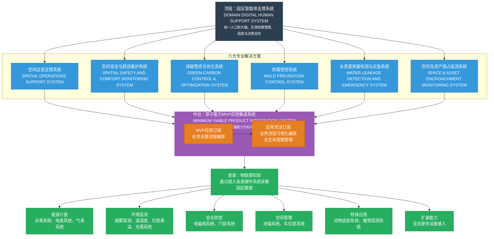

# 园区智能体支撑系统架构描述

## 一、整体架构概述

本系统采用**四层递进式架构**，从顶层智能决策到底层物联感知，形成完整的园区智能化管理体系。架构遵循"统一大脑、专业应用、能力中台、物联感知"的设计理念，实现数据从采集到决策的闭环流转。



## 二、各层级详细说明

### 1. 顶层：园区智能体支撑系统（DOMAIN DIGITAL HUMAN SUPPORT SYSTEM）
- **定位**：系统的"统一入口和大脑"
- **核心功能**：
  - 统筹管理与调度
  - 智能决策支持
  - 全局资源协调
- **特点**：作为整个系统的指挥中心，负责跨系统协同和战略级决策

### 2. 第二层：六大专业解决方案
这一层包含六个垂直领域的专业系统，每个系统解决特定的园区管理问题：

#### （1）空间运营支撑系统
- 专注于园区空间资源的优化配置和高效利用

#### （2）空间安全与舒适看护系统
- 保障园区环境安全，提升人员舒适度体验

#### （3）绿碳管控与优化系统
- 实现碳排放监测、分析和优化，支持绿色园区建设

#### （4）防霉管控系统
- 针对特定环境（如仓储、实验室）的霉菌预防和控制

#### （5）水资源渗漏检测与应急系统
- 实时监测水资源使用，快速响应渗漏事件

#### （6）空间及资产侵占监测系统
- 防止未授权使用空间和资产，保障资源安全

### 3. 第三层：原子能力MVP应用集成系统（中台层）
- **定位**："承上启下的核心平台"
- **核心价值**：
  - 封装底层设备能力为标准服务
  - 提供可复用的原子能力组件
  - 支持快速应用开发和集成

#### 横向流程支撑：
- **MVP应用订阅**：业务支撑流程编排
- **应用灵活订阅**：业务流程可视化编排和全生命周期管理

### 4. 底层：物联感知层
- **基础功能**：通过接入各类硬件系统采集园区实时数据
- **子系统分类**：

#### （1）能源计量系统
- 水表、电表、气表等计量设备
- 实现能源消耗的精确监测

#### （2）环境监测系统
- 烟雾探测、温湿度传感器
- 垃圾满溢监测、光感系统
- 保障环境质量和安全

#### （3）安全防控系统
- 电磁阀系统、门锁系统
- 物理安全防护和控制

#### （4）空间管理系统
- 地磁系统、车位锁系统
- 空间使用状态监测和管控

#### （5）特殊应用系统
- 动物追踪系统、瘤胃探测系统
- 满足特定行业或场景需求

#### （6）扩展能力
- 支持更多类型设备的接入
- 保证系统的可扩展性和兼容性

## 三、数据流与业务逻辑

### 1. 数据流向（自下而上）
```
物联感知层 → 中台层 → 专业解决方案 → 顶层智能体
```
- **数据采集**：各类传感器和设备实时采集数据
- **能力封装**：中台层将原始数据转化为标准服务
- **专业处理**：各解决方案基于业务需求处理数据
- **智能决策**：顶层系统综合分析，做出优化决策

### 2. 控制流向（自上而下）
```
顶层智能体 → 专业解决方案 → 中台层 → 物联感知层
```
- **策略制定**：顶层根据分析结果制定优化策略
- **方案执行**：专业解决方案转化为具体操作指令
- **指令下发**：中台层将指令转化为设备可执行命令
- **设备控制**：物联层设备执行具体操作

## 四、架构特点与优势

### 1. 分层解耦
- 各层级职责清晰，接口标准化
- 便于独立升级和维护
- 降低系统复杂度

### 2. 能力复用
- 中台层提供标准化原子能力
- 避免重复开发，提高开发效率
- 支持快速构建新应用

### 3. 灵活扩展
- 物联层支持多种设备接入
- 解决方案层可根据需求增加新系统
- 架构具有良好的可扩展性

### 4. 智能闭环
- 实现"感知-分析-决策-执行"的完整闭环
- 数据驱动决策，持续优化园区运营
- 提升管理效率和资源利用率

## 五、应用价值

1. **运营效率提升**：通过智能化管理减少人工干预
2. **资源优化配置**：基于数据分析实现资源精准调配
3. **安全保障增强**：实时监控和预警，降低安全风险
4. **绿色可持续发展**：支持碳减排和资源节约目标
5. **投资回报优化**：通过预防性维护降低运维成本

这个架构设计体现了现代智慧园区系统的典型特征：**数据驱动、平台化、模块化、智能化**，能够满足复杂园区环境下的多样化管理需求。