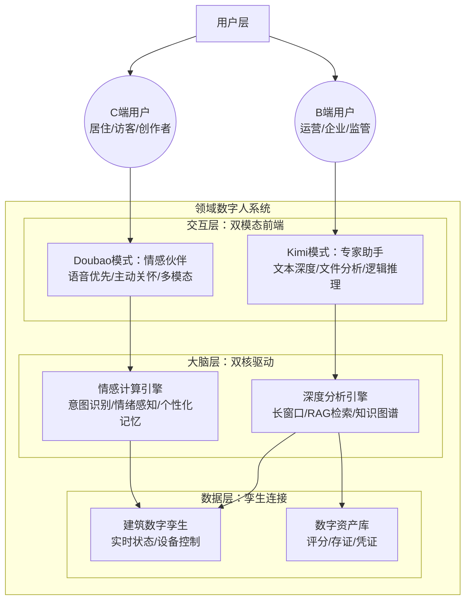

# 领域数字人综合产品规划框架：融合情感交互与深度分析的资产化路径

> **文档版本**: v1.0
> **生成日期**: 2025-12-18
> **核心目标**: 整合豆包（Doubao）的情感交互优势与Kimi的深度分析能力，赋能“好房子+数字资产”空间运营战略，构建分层分角色的领域数字人产品体系。

---

## 一、 竞品对标与启示（Doubao vs Kimi）

基于对《产品愿景规划参考（DouBao）》与《产品愿景规划参考（Kimi）》的深度分析，两者代表了当前AI应用的两个极端方向：**大众情感化**与**专业工具化**。

### 1.1 核心要素对比分析

| 维度 | **Doubao（豆包）** | **Kimi（月之暗面）** | **领域数字人（融合启示）** |
| :--- | :--- | :--- | :--- |
| **愿景定位** | **AI Companion for Everyone** 每个人的人工智能伙伴 | **Professional Long-Context Assistant** 专业长文本分析助手 | **Dual-Mode Domain Agent** C端做伙伴，B端做专家 |
| **核心价值** | **情感与陪伴** 拟人化、高情商、随时随地 | **效率与深度** 处理海量信息、逻辑推理、精准输出 | **体验与资产** C端提升空间温度，B端提升资产效能 |
| **目标用户** | 大众用户（C端）、生活场景用户 | 知识工作者（B/C端）、研究人员、企业 | **全域角色** C端：居住/访客/创作者 B端：运营/企业/监管 |
| **交互范式** | **语音优先（Voice First）** 多模态、自然对话、主动关怀 | **文本/文件驱动** 上传文件、超长上下文对话、结构化输出 | **场景自适应** 生活圈：语音/大屏交互 工作圈：PC/报表交互 |
| **技术护城河** | 语音合成（TTS）、情感计算、个性化推荐 | 超长上下文（200万+ tokens）、无损记忆、复杂逻辑链 | **领域知识库 + 孪生体连接** 既懂情感，又懂建筑数据 |
| **典型场景** | 聊天解闷、英语陪练、生活助手 | 研报分析、代码辅助、长文总结 | **空间伴随 vs 资产运营** 伴随：活动指引、疗愈陪伴 运营：评分归因、合规审计 |

### 1.2 创新点借鉴与应用

#### 借鉴 Doubao（面向C端生活/疗愈场景）：
1.  **拟人化语音交互**：在**裙楼1层生活圈**与**4层疗愈圈**，引入类似Doubao的高表现力TTS，让数字人能以“邻家管家”或“心理咨询师”的口吻交流，而非机械指令。
2.  **主动关怀（Proactive）**：结合物联感知数据（如检测到长时间未出门或深夜滞留），数字人主动发起问候（“今天天气不错，要不要去屋顶晒晒太阳？”），提升**社区归属感**。

#### 借鉴 Kimi（面向B端办公/运营场景）：
1.  **超长上下文（Long Context）**：在**运营复盘**与**监管审计**中，支持一次性输入全年的维修日志、投诉记录与能耗表，让数字人进行跨周期分析，输出《年度资产价值报告》。
2.  **文件深度解析**：在**裙楼2-3层办公圈**，为入驻企业提供合同审查、政策文件匹配服务，直接回答“根据这份200页的政策文档，我公司能申请多少补贴？”。

---

## 二、 空间运营核心策略解析：“好房子”与“数字资产”

基于《空间运营产品规划：打造‘好房子’与‘数字资产’》，我们的核心策略是**双轨并行，虚实共生**。

### 2.1 双轨战略图谱

*   **实轨（好房子）：体验底座**
    *   **目标**：安全、舒适、绿色、智慧。
    *   **支撑**：物联感知层（IoT）+ 专业解决方案（六大系统）。
    *   **交付物**：零事故的安全空间、恒温恒湿的舒适环境、负碳排的绿色建筑。

*   **虚轨（数字资产）：价值顶层**
    *   **目标**：可衡量、可比较、可交易、可增值。
    *   **支撑**：能力中台（存证/评分/编排）+ 顶层智能体（大脑）。
    *   **交付物**：好房子评分报告、服务履约数字凭证、碳资产账本。

### 2.2 价值实现路径

1.  **数据化（Datafication）**：将物理空间的每一次交互（开门、用水、上课、维修）转化为数据。
2.  **指标化（Indexation）**：通过算法将散乱数据计算为核心指标（如“安全履约率”、“舒适度指数”），形成**“好房子评分”**。
3.  **资产化（Assetization）**：将高分指标与优质服务通过区块链确权，形成**数字凭证**（如“VIP时段权益”、“绿色信用”）。
4.  **金融化/交易化（Financialization）**：基于可信资产，对接租金溢价、绿色金融与政策补贴，实现**资产增值**。

---

## 三、 融合型产品规划方案：双脑驱动的领域数字人

为了支撑上述双轨战略，我们提出**“分层分角色的双模态数字人”**架构，将 Doubao 的“情”与 Kimi 的“智”有机结合。

### 3.1 产品架构图谱

### 3.2 场景化功能定义

#### A. C端交互层（Doubao模式）：有温度的社区伙伴
**核心定位**：生活服务入口、心理疗愈伴侣、活动社交助理。
**适用空间**：裙楼1层（生活）、裙楼4层（疗愈）、屋顶（社交）。

| 场景 | 用户痛点 | 数字人功能（Doubao模式） | 价值落点 |
| :--- | :--- | :--- | :--- |
| **生活服务** | 操作繁琐，找不到入口 | **语音一键办**：“帮我订个明晚7点的羽毛球场，要人少的。”（自动查询热力图并预约） | 便捷性、高频入口 |
| **心理疗愈** | 孤独感，需要倾诉 | **情感陪伴**：“听起来你今天很累，要不要试试‘雨声冥想’模式？”（联动灯光音响调节） | 心理健康、空间温度 |
| **社区社交** | 邻里陌生，活动参与低 | **主动破冰**：“王先生，这周末屋顶有创业沙龙，很多您的同行参加，要帮您报名吗？” | 社区归属感、社群活跃 |

#### B. B端分析层（Kimi模式）：有深度的资产专家
**核心定位**：运营决策参谋、企业政策顾问、合规审计专家。
**适用空间**：运营中心、裙楼2-3层（办公）、监管接口。

| 场景 | 用户痛点 | 数字人功能（Kimi模式） | 价值落点 |
| :--- | :--- | :--- | :--- |
| **运营复盘** | 数据分散，归因困难 | **长文档归因**：上传整月维保记录与投诉工单，提问“上个月好房子评分下降的主要原因是什么？”（输出结构化归因报告） | 运营效率、精准优化 |
| **企业办公** | 政策晦涩，申报难 | **政策解读**：上传《湘江新区创业补贴细则》，提问“我们要招5个应届生，能拿多少补贴？”（精准匹配条款） | 企业服务增值、营商环境 |
| **合规审计** | 证据链长，核验繁琐 | **跨周期审计**：检索全年的安全巡检记录与门禁日志，生成《年度安全履约合规报告》。 | 资产确权、金融对接 |

---

## 四、 综合落地路线图

### 阶段一：连接与温度（Month 1-6）
*   **目标**：跑通 C 端高频场景，建立用户粘性。
*   **动作**：
    *   上线“生活圈”数字人（Doubao模式），支持语音预约健身、停车。
    *   在裙楼4层落地“疗愈助手”，打通环境控制（灯光/音乐）。
    *   **核心指标**：C端用户日活（DAU）、语音交互渗透率。

### 阶段二：分析与效能（Month 7-12）
*   **目标**：赋能 B 端运营，实现降本增效。
*   **动作**：
    *   上线“运营驾驶舱”数字人（Kimi模式），支持长文本日志分析与自然语言查询报表。
    *   落地“好房子评分”自动化生成与归因分析。
    *   **核心指标**：运营工单闭环时间降低30%、企业服务满意度。

### 阶段三：资产与生态（Month 13-24）
*   **目标**：打通双脑数据，实现资产增值。
*   **动作**：
    *   **双脑联动**：C端的情感交互数据（如满意度、活跃度）成为B端分析引擎的输入，直接影响资产评分。
    *   **对外输出**：面向监管与金融机构，开放基于长窗口审计的“资产可信报告”，支撑绿色信贷与RWA。
    *   **核心指标**：空间资产溢价率、非租金收入占比。

---

## 五、 总结

本规划框架并未简单堆砌功能，而是**精准地将 AI 的两种核心能力（情感交互与深度推理）分别映射到了空间运营的两个核心端点（C端体验与B端资产）**。

*   用 **Doubao** 的方式，让“好房子”**更有温度**，解决“住得好”的问题。
*   用 **Kimi** 的方式，让“数字资产”**更可度量**，解决“增值”的问题。

通过这种**“双脑驱动”**的架构，我们不仅实现了技术上的先进性，更在业务逻辑上完美闭环了“人-空间-资产”的价值链条。
