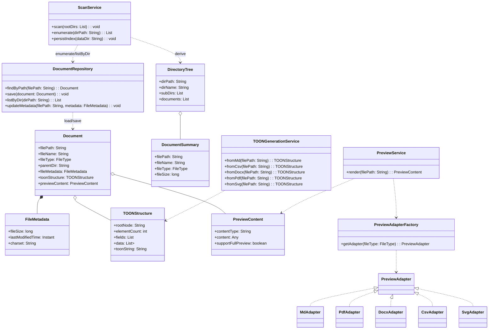

# 文档TOON结构生成与Web预览系统 - 统一产品设计文档（DDD + Spring Cloud + React）

作者：伍志勇
日期（北京时间）：2025-11-24 16:34:42
版本：v1.0

## 1. 产品概述

- 目标：展示指定目录（示例 `/home/agentic/hkt-knowledge`）的全部子目录与文档清单；生成并持久化索引TOON数据到本地 `data/` 目录（不使用PostgreSQL）；左侧树展示结构，右侧预览文档内容。
- 范围：完整枚举目录与文件（支持中文名与Linux路径）；文件预览支持 `.md/.docx/.pdf/.csv/.svg`。
- 核心特性：索引TOON（`files` 块）生成与读取、树状展示、类型识别与预览、缓存与治理。
- 场景：内部/公开文档库的轻量化展示与快速检索。

## 2. 统一语言与术语（Ubiquitous Language）

- 目录（Directory/Folder）：以`dirPath/dirName`表示的层级节点
- 文档（Document/File）：以`filePath/fileName/fileType`表示的文件实体
- TOON（面向词元的对象表示法）：结构化块表示，含`fields/data/toonString`
- 预览（Preview）：以`PreviewContent`呈现的可视内容（HTML/PDF/SVG）

## 3. 领域驱动设计（DDD）

### 3.1 用户旅程工作坊（User Journey Mapping）

- 输出：用户旅程图、痛点/机会点、角色与场景列表

#### 3.1.1 角色（Persona）

- 访客：浏览与预览文档，不进行上传/下载。
- 管理员：触发重扫、查看状态、清理缓存，保障索引与预览稳定。

#### 3.1.2 旅程阶段（Stages）

- 进入应用 → 加载索引（`index.toon/json`） → 浏览树（展开/折叠） → 筛选与定位（关键字/类型过滤） → 点击文档 → 预览渲染（md/docx/pdf/csv/svg） → 错误与降级提示 → 管理操作（重扫/状态/清缓存）。

#### 3.1.3 痛点与机会点（Pain & Opportunities）

- 痛点：
  - 大目录加载与渲染性能瓶颈（滚动卡顿、一次性渲染过多节点）。
  - 多语言路径与中文字符的兼容性问题（编码与规范化）。
  - 部分格式解析失败或不支持（例如复杂DOCX或超大PDF）。
  - 索引刷新后前端状态一致性（缓存失效与ETag协同）。
- 机会：
  - 采用TOON高效索引与分页分块，减少传输体积与渲染压力。
  - 树懒加载与虚拟滚动、按需加载预览器，显著提升体验。
  - 统一错误与降级策略，保证“可视化回退”与操作指引。
  - 管理接口支持重扫与状态观察，形成闭环运维能力。

#### 3.1.4 场景清单（Scenarios）

- 场景1：首次进入应用 → 自动加载`index.toon` → 左侧树显示根目录与首层节点。
- 场景2：展开目录节点 → 按需请求下一层数据 → 渲染子目录与文档列表。
- 场景3：关键字筛选 → 过滤`name/path`，高亮命中项 → 清空筛选恢复。
- 场景4：点击`.md`文档 → 前端`marked`渲染 → 支持标题目录与代码高亮。
- 场景5：点击`.pdf`文档 → 后端流式返回 → 前端`pdfjs`分页渲染与缩放。
- 场景6：点击`.docx`文档 → 根据决策矩阵选择前端`mammoth`或后端POI → 输出HTML预览。
- 场景7：点击`.csv`文档 → `papaparse`解析 → 表格排序与列宽调整。
- 场景8：点击`.svg`文档 → 直接嵌入`<svg>` → 安全过滤可疑脚本。
- 场景9：预览失败（解析或资源限制） → 显示降级内容或错误页 → 提供“查看原始TOON”。
- 场景10：管理员在状态页触发重扫 → `data/index.toon`更新时间刷新 → 前端树自动刷新或提示手动刷新。

### 3.2 事件风暴（Event Storming）摘要

- 业务目标：从指定根目录快速构建可浏览的索引TOON，并按需预览文档。
- 关键事件（Domain Events）：
  - `IndexRequested`（用户/系统发起索引请求）
  - `DirectoryScanned`（目录被遍历完成，发现条目）
  - `ItemEnumerated`（发现目录/文件条目）
  - `IndexPersisted`（索引TOON写入 `data/index.toon` 完成）
  - `IndexLoaded`（前端/API读取索引TOON或JSON派生）
  - `PreviewRequested`（预览请求到达）
  - `PreviewRendered`（预览成功生成）
  - `PreviewFailed`（预览失败，触发降级与错误事件）
  - `RescanTriggered`（运维或配置变更触发重扫）
  - `CacheInvalidated`（扫描变更导致缓存失效）
- 命令（Commands）：`TriggerScan`、`PersistIndex`、`LoadIndex`、`RenderPreview`、`InvalidateCache`、`TriggerRescan`。
- 聚合与读模型：
  - 聚合：`DocumentRepository`（统一维护文件与目录条目、元数据）
  - 读模型：`FilesIndex`（TOON/JSON）、`DirectoryTree`（派生树）、`PreviewContent`
- 策略/规则（Policies）：
  - 配置变更 → 触发 `TriggerRescan`
  - 扫描完成 → `PersistIndex` → 通知前端刷新
  - 预览失败 → 生成降级TOON块或错误响应
- 外部系统：文件系统（Linux）、Redis（缓存）、Config Server（配置）、Nginx（入口）、Prometheus/Grafana（监控）。
- 端到端路径（示例）：
  - 用户打开页面 → `IndexRequested` → 后端`TriggerScan`（或直接`IndexLoaded`）→ 生成并`PersistIndex` → 前端树加载 → 用户点击文件 → `PreviewRequested` → `RenderPreview` → 展示或降级。

#### 3.2.1 DDD 完整链路图（Mermaid）

- 迁移说明：该图已移至“附录 E. DDD 完整链路图（Mermaid）”。

### 3.3 划分限界上下文（Context Slicing）

- 规则：语言边界、业务一致性、团队边界
- 输出：限界上下文图（Context Map）

#### 3.3.1 上下文清单（Bounded Contexts）

- 文档（Document）：负责文档实体、目录树读模型与TOON结构的对外暴露。
- 扫描（Scan）：负责遍历与索引生成、持久化`data/index.toon/index.json`。
- 预览（Preview）：负责类型适配与内容生成（HTML/PDF/SVG）。
- 网关（Gateway）：统一入口、CORS、限流、错误映射与内容协商。

#### 3.3.2 边界描述（Boundary）

- Document：
  - 输入：来自Scan的索引、来自Preview的渲染请求。
  - 输出：`DirectoryTree`、`FilesIndex`、`TOONStructure`。
  - 自有模型：`Document`、`FileMetadata`、`TOONStructure`、`DirectoryTree`。
  - 非功能：读取`data`目录只读；缓存命中直接返回；统一错误结构。
- Scan：
  - 输入：配置根目录（Config Server）、重扫命令（Admin）。
  - 输出：`index.toon`与`index.json`、`metadata`更新时间。
  - 自有模型：扫描任务、黑白名单、符号链接校验策略。
  - 非功能：文件系统I/O与并发控制、去重与原子写入、指标监控。
- Preview：
  - 输入：`filePath`与类型参数。
  - 输出：`PreviewContent`（HTML/PDF/SVG）。
  - 自有模型：解析适配器、降级策略、资源限制（线程/内存/超时）。
  - 非功能：安全过滤、内容类型协商、HTTP Range支持。
- Gateway：
  - 输入：前端请求。
  - 输出：路由到各BC、统一错误映射、`ETag/Last-Modified`处理。
  - 自有模型：CORS白名单、限流令牌桶、受支持`Accept`集合。
  - 非功能：日志与审计、告警与熔断策略（可选）。

#### 3.3.3 防腐层与契约（ACL & Contract）

- Preview对复杂库（PDFBox/POI）设置适配接口，隔离库细节，返回统一`PreviewContent`。
- Gateway对外统一MIME与错误结构；`Accept: application/x-toon`直通TOON契约；`application/json`返回结构化对象。
- Document与Scan之间采用`index.toon/json`文件契约；更新时间通过`metadata.last_updated`传递。

#### 3.3.4 团队边界

- Scan与Preview可由后端团队维护；Document由后端与前端共同维护读模型；Gateway由平台/架构组维护。

### 3.4 上下文映射（Context Mapping）

- 模式：合作关系、共享内核、客户-供应商、防腐层ACL、开放主机服务
- 输出：上下文映射图

#### 3.4.1 关系矩阵（Relationship Matrix）

- Document ↔ Scan：客户-供应商（Customer–Supplier）。Document消费Scan产出的索引；Scan遵循约定的TOON契约与更新时间规则。
- Document ↔ Preview：开放主机服务（Open Host Service）。Document发起`RenderPreview`调用，Preview暴露统一接口与MIME；失败时返回统一错误结构。
- Gateway ↔ 各BC：开放主机服务 + 防腐层（ACL）。Gateway只曝光稳定契约与错误映射；对内部对象进行DTO转换。

#### 3.4.2 协作模式说明

- Published Language：跨上下文统一采用`TOONStructure/PreviewContent/DirectoryTree/FilesIndex`术语与字段命名，避免翻译歧义。
- Anti-Corruption Layer：Preview内部适配第三方解析库；Gateway对外统一MIME与错误；Document保持读模型纯净。
- Shared Kernel（谨慎）：仅在通用工具层共享TOON校验器与时间/路径规范工具，业务模型不共享。

#### 3.4.3 故障与降级路径

- Scan失败：保留最近一次`index.toon`并标注`metadata`为旧时间；前端提示“索引可能不是最新”。
- Preview失败：返回降级TOON或错误；前端提供“查看原始TOON”与“稍后重试”。
- Gateway限流：返回429与`Retry-After`，避免雪崩；记录`traceId`与指标。

#### 3.4.4 一致性与刷新

- 索引刷新：`IndexPersisted`事件广播（可选）或前端轮询`last_updated`；命中ETag返回304。
- 读写分离：Scan写`data/*`，Document读`data/*`；通过文件锁或原子替换保证一致性。

### 3.5 建立通用语言（Ubiquitous Language）

- 指引：术语统一见第2章；代码词汇表见第27章

#### 3.5.1 角色词汇表

- 访客（Visitor）：浏览索引、查看预览、不进行写操作。
- 管理员（Admin）：触发重扫、查看运行状态、清理缓存。

#### 3.5.2 场景词汇表

- 浏览索引：加载`index.toon/json`并渲染树。
- 展开节点：获取指定目录的子项并渲染。
- 筛选搜索：按`name/path`过滤并高亮命中。
- 预览渲染：根据`fileType`选择适配器生成`PreviewContent`。
- 错误降级：当解析失败时渲染降级内容或错误页。
- 管理重扫：管理员触发重新扫描根目录或子树。

#### 3.5.3 示例用语（Examples）

- 作为访客，我希望能快速加载文档树并展开我关心的目录。
- 作为访客，当我点击文档时，系统应返回对应的预览内容或清晰的错误提示。
- 作为管理员，我希望在索引过期或结构变化时，能够一键触发重扫并查看最新更新时间。

#### 3.5.4 代码词汇一致性

- 接口与模型统一使用：`filePath/fileName/fileType`、`TOONStructure`、`PreviewContent`、`DirectoryTree`、`FilesIndex`。
- 错误统一：`ErrorResponse{code,message,traceId,details}`；日志包含`traceId`便于定位。

### 3.6 战术设计（Tactical Modeling）

- 实体/聚合根/值对象/领域服务/仓储/工厂
- 待补充：战术模型图与类图（ToDo）

#### 3.6.1 核心领域与聚合

- 聚合根：`DocumentRepository`，负责文档实体生命周期管理（创建、查询、更新、删除）。
- 上下文划分：
  - 文档领域（核心）：文档实体、TOON结构、文件元数据。
  - 扫描领域：扫描任务与结果，目录遍历与目标格式识别。
  - 预览领域：预览内容生成与格式适配。

#### 3.6.2 实体与值对象

- 实体 `Document`（唯一标识 `filePath`）：
  - 属性：`filePath`、`fileName`、`fileType`、`parentDir`、`fileMetadata`、`toonStructure`（懒加载）、`previewContent`（懒加载）。
- 值对象：
  - `FileMetadata`：`fileSize`、`lastModifiedTime`、`charset`（默认UTF-8）。
  - `TOONStructure`：`rootNode`、`elementCount`、`fields`（List<String>）、`data`（List<Map<String,Object>>）、`toonString`（标准TOON字符串）。
  - `PreviewContent`：`contentType`（text/html、application/pdf、image/svg+xml 等）、`content`（HTML字符串/二进制流/SVG文本）、`supportFullPreview`（boolean）。
  - `DirectoryTree`：`dirPath`、`dirName`、`subDirs`（List<DirectoryTree>）、`documents`（List<DocumentSummary>）。
  - `DocumentSummary`：`filePath`、`fileName`、`fileType`、`fileSize`。

#### 3.6.3 领域服务

- `ScanService`：遍历根目录与子目录，识别目标格式、生成 `FileMetadata`，更新仓库。
- `TOONGenerationService`：按文档格式提取结构化数据并生成 `TOONStructure`。
- `PreviewService`：将文档转换为Web可展示的 `PreviewContent`（HTML/PDF/SVG）。

#### 3.6.4 领域事件

- 事件（可选）：`DocumentScannedEvent`（扫描完成）、`PreviewRequestedEvent`（预览请求）。
- 实体/聚合根/值对象/领域服务/仓储/工厂
- 参考：3.2 实体与值对象；3.3 领域服务

#### 3.6.5 战术模型图与类图（文本草案）

- 实体与值对象：
  - `Document`（Entity）：`filePath`、`fileName`、`fileType`、`parentDir`、`fileMetadata`、`toonStructure?`、`previewContent?`
  - `FileMetadata`（ValueObject）：`fileSize`、`lastModifiedTime`、`charset`
  - `TOONStructure`（ValueObject）：`rootNode`、`elementCount`、`fields: List<String>`、`data: List<Map<String,Object>>`、`toonString`
  - `PreviewContent`（ValueObject）：`contentType`、`content`、`supportFullPreview`
  - `DirectoryTree`（ValueObject）：`dirPath`、`dirName`、`subDirs: List<DirectoryTree>`、`documents: List<DocumentSummary>`
- 仓储（Repository）：
  - `DocumentRepository`：`findByPath(filePath)`、`save(document)`、`listByDir(dirPath)`、`updateMetadata(filePath, metadata)`
- 领域服务（Domain Service）：
  - `ScanService`：`scan(rootDirs)`、`enumerate(dirPath)`、`persistIndex(dataDir)`
  - `TOONGenerationService`：`fromMd(filePath)`、`fromCsv(filePath)`、`fromDocx(filePath)`、`fromPdf(filePath)`、`fromSvg(filePath)`
  - `PreviewService`：`render(filePath)`（返回`PreviewContent`）
- 工厂与规约（Factory & Specification）：
  - `PreviewAdapterFactory`：按`fileType`返回适配器。
  - `IndexSpecification`：黑白名单、符号链接、编码规范校验。
- 交互关系：
  - 应用层调用`ScanService`生成索引，持久化到`data/index.*`；
  - 应用层调用`PreviewService`产出`PreviewContent`；
  - Document聚合通过`DocumentRepository`装载与更新实体，保持读模型与索引文件一致。

（Mermaid 可视化）



### 3.2.2 命令-事件-聚合表（草案）


| 业务动作   | 命令              | 触发条件           | 领域事件                                              | 聚合/读模型            | 备注                                                  |
| ---------- | ----------------- | ------------------ | ----------------------------------------------------- | ---------------------- | ----------------------------------------------------- |
| 索引扫描   | `TriggerScan`     | 用户/定时/配置变更 | `DirectoryScanned`、`ItemEnumerated`                  | `DocumentRepository`   | 生成`FilesIndex`候选；跳过隐藏/黑名单                 |
| 持久化索引 | `PersistIndex`    | 扫描完成           | `IndexPersisted`                                      | `DocumentRepository`   | 写入`data/index.toon`与`metadata`；可派生`index.json` |
| 加载索引   | `LoadIndex`       | 前端或API请求      | `IndexLoaded`                                         | `FilesIndex`（读模型） | 返回TOON或JSON，支持内容协商                          |
| 请求预览   | `RenderPreview`   | 用户点击文件       | `PreviewRequested`、`PreviewRendered`/`PreviewFailed` | `PreviewService`       | 支持md/docx/pdf/csv/svg；失败降级                     |
| 清缓存     | `InvalidateCache` | 管理操作/变更检测  | `CacheInvalidated`                                    | Cache层                | 失效`toon:`/`preview:`键；ETag刷新                    |
| 触发重扫   | `TriggerRescan`   | Admin接口调用      | `RescanTriggered`                                     | `ScanService`          | 全量或增量；更新`last_updated`                        |

### 3.3.1 限界上下文图（草案表格）


| 上下文（BC）     | 职责                        | 上游             | 下游             | 关系模式                 | 防腐层                 | UL关键词                                     |
| ---------------- | --------------------------- | ---------------- | ---------------- | ------------------------ | ---------------------- | -------------------------------------------- |
| 文档（Document） | 文档实体/TOON/目录树读模型  | 扫描（Scan）     | 预览（Preview）  | 客户-供应商（对Scan）    | 路径/编码规范；DTO映射 | `filePath`、`TOONStructure`、`DirectoryTree` |
| 扫描（Scan）     | 遍历与索引生成、持久化index | Config Server    | 文档（Document） | 开放主机服务（暴露索引） | 黑白名单/符号链接校验  | `files[count]{path,type,name}`、`metadata`   |
| 预览（Preview）  | 各类型预览内容生成          | 文档（Document） | 网关/前端        | 防腐层（对复杂格式库）   | 解析库接口封装         | `PreviewContent`、降级策略                   |
| 网关（Gateway）  | 统一入口/CORS/限流          | 前端             | 各BC API         | 开放主机服务             | 统一错误映射           | `Accept`、`ETag`                             |

### 3.7 实现（Code & UT）

- 结构：模块-聚合-分层；接口层/应用层/领域层/基础设施层
- 规约：业务规则单元测试、EBNF语法校验测试

#### 3.7.1 关键模块清单（Backend）

- `gateway`：路由、CORS、限流、错误映射、ETag处理。
- `document-service`
  - Controller：`DocumentController`（tree/toon/preview/scan/index接口）。
  - Application：用例编排与事务控制（按目录粒度）。
  - Domain：`ScanService`、`TOONGenerationService`、`PreviewService`、`DocumentRepository`。
  - Infra：文件遍历器、TOON校验器、预览适配器（PDFBox/POI/OpenCSV等）。
- `preview-worker`（可选）：队列消费者，异步执行重解析任务。

#### 3.7.2 关键模块清单（Frontend）

- 页面：`TreePage`（索引树与筛选）、`PreviewPage`（文档预览）、`AdminPage`（重扫与状态）。
- 组件：`DirectoryTree`、`PreviewPane(md/pdf/docx/csv/svg)`、`SearchBar`、`StatusBadge`。
- 状态：React Query 请求层、缓存策略与错误提示。

#### 3.7.3 UT用例索引（Backend）

- `ScanServiceTest`：
  - 枚举跳过隐藏/黑名单；符号链接白名单校验；大目录性能阈值。
  - `index.toon`生成与`metadata`时间格式（北京时区）。
- `TOONGenerationServiceTest`：
  - CSV/MD/DOCX/PDF/SVG五类解析一致性与转义校验；降级块生成。
- `PreviewServiceTest`：
  - 各类型适配与MIME；PDF Range分页；超时与内存限制保护。
- `GatewayErrorMappingTest`：
  - 错误码与HTTP映射；`traceId`传递；CORS预检缓存。

#### 3.7.4 UT用例索引（Frontend）

- `TreeRender.spec.tsx`：懒加载/虚拟滚动/分页段落；筛选与高亮。
- `PreviewMd.spec.tsx`、`PreviewPdf.spec.tsx`、`PreviewDocx.spec.tsx`、`PreviewCsv.spec.tsx`、`PreviewSvg.spec.tsx`：渲染与错误降级。
- `AdminRescan.spec.tsx`：重扫后更新时间刷新与提示。

### 3.8 持续演进（Evolution）

- 活动：领域事件回放、模型重构、定期事件风暴
- 参考：12 运行保障；12 扩展性与演进

#### 3.8.1 演进周期

- 每周：事件风暴复盘（针对新增/变化的领域事件与命令），更新命令-事件-聚合表。
- 每两周：Story Map梳理与迭代计划评审；MVP/V1/V2增量验收。
- 每月：非功能指标回顾（`latency p95/p99`、`cache_hit_ratio`、`parse_success_rate`）与容量策略调整。

#### 3.8.2 触发机制

- 配置刷新（Config Server）：根目录或限流/缓存参数变更 → 增量/全量重扫（5分钟窗口）。
- 文件系统事件（inotify）：新增/修改/删除 → 局部重扫与缓存失效。
- 指标阈值：当`parse_success_rate`连续低于阈值或`api_latency_p99`升高 → 降级策略启用与资源上限调整。

#### 3.8.3 版本演进

- MVP → V1 → V2：对应“用户故事地图”的版本切片；优先保证索引浏览与`.md`预览，逐步引入其他格式与后台能力。

#### 3.8.4 领域事件回放

- 支持将扫描与预览关键步骤记录为事件流水，便于定位问题与重现；必要时对比两版索引差异（`diff index.toon`）。

#### 3.8.5 风险与回退

- 索引文件损坏或不可读：回退到最近一次可用索引并提示“索引可能过期”。
- 预览解析崩溃：触发熔断与降级，限制并发与内存，记录失败样本用于事后分析。

## 4. 架构设计（Spring Cloud + React）

- 服务组件：
  - `gateway`（统一入口、CORS策略、限流可选）。
  - `eureka`（服务发现）。
  - `config-server`（集中配置，含根目录数组与定时参数）。
  - `document-service`（领域服务：扫描、TOON、预览API）。
  - 可选 `preview-worker`（重解析任务异步化：PDF/DOCX转HTML）。
- 技术选型：
  - 后端：Java 17、Spring Boot 3、Lombok（简化）、POI（docx）、PDFBox（pdf）、OpenCSV（csv）、Tika（类型识别）、Redis（缓存）。
  - 前端：React 18、TypeScript、Ant Design 5、Vite；预览库：`marked`（md）、`pdfjs-dist`（pdf）、`mammoth`（docx）、`papaparse`（csv）、原生`<svg>`（svg）。
  - 部署：Docker、Nginx（负载均衡）、Jenkins + GitLab（CI/CD）、Kubernetes（可选）；监控：Prometheus + Grafana；日志：ELK。
- 依赖关系：接口层（Web/网关）→ 应用层（用例编排）→ 领域层（模型与服务）→ 基础设施层（文件系统与解析库）。

## 5. TOON语法规范

- 语法范式：`blockName[count]{field1,field2,...}: record1; record2; ...`
- 记录表达：每条记录为逗号分隔的字段值；记录间以分号或换行分隔；允许空值（空字符串）。
- 转义规则：值中包含逗号/分号/换行时使用 `\,` `\;` `\n`；反斜杠使用 `\\`；统一UTF-8编码。
- 多块输出：响应可包含多个块，按语义顺序组织，例如：
  - `directories[2]{path}: /docs; /images`
  - `documents[3]{id,name,path,type}: 1,readme.md,/docs/readme.md,md; 2,report.docx,/docs/report.docx,docx; 3,data.csv,/data/data.csv,csv`
- 元数据块：`metadata{total,last_updated,page,size}: 3,2025-11-24T11:27:16+08:00,1,100`（时间统一为北京时间，ISO-8601）。
- 令牌优化：字段顺序固定；避免冗余键；尽量合并表头/重复值；非必要标点禁止；大集合按分页块分段返回。
- 兼容性：中文目录/文档名与中文字段值允许；统一UTF-8；建议使用NFC规范化。
- EBNF描述：
  - `block ::= name '[' count ']' '{' fields '}' ':' records`
  - `fields ::= field { ',' field }`
  - `records ::= record { (';' | NEWLINE) record }`
  - `record ::= value { ',' value }`
  - `value ::= TEXT | ESCAPED`
- `ESCAPED ::= '\\,' | '\\;' | '\\n' | '\\\\'`
- `name, field, TEXT 采用 UTF-8；推荐NFC规范化`

### 5.1 索引TOON（files块）规范

- 目的：持久化指定根目录的目录与文件枚举，供Web应用加载展示。
- 语义：`files[count]{path,type,name}:` 后接按行/分号分隔的记录；`type` 取 `directory|file`；`path` 为相对根的Linux风格路径；`name` 为条目名。
- 元数据：附加 `metadata{total,last_updated,root}: count,2025-11-24T16:34:42+08:00,/home/agentic/hkt-knowledge`
- 示例：
  - `files[12]{path,type,name}:`
  - `hkt-knowledge/,directory,hkt-knowledge`
  - `hkt-knowledge/hkt-product/,directory,hkt-product`
  - `hkt-knowledge/hkt-product/hkt-agentic/,directory,hkt-agentic`
  - `hkt-knowledge/hkt-product/industrial-brain/,directory,industrial-brain`
  - `hkt-knowledge/hkt-project/,directory,hkt-project`
  - `hkt-knowledge/hkt-project/docs/,directory,docs`
  - `hkt-knowledge/hkt-project/docs/gitlab流水线触发指南.md,file,gitlab流水线触发指南.md`
  - `hkt-knowledge/hkt-project/docs/会议纪要模版.md,file,会议纪要模版.md`
  - `hkt-knowledge/hkt-project/docs/孚盟学习网址.md,file,孚盟学习网址.md`
  - `hkt-knowledge/hkt-project/docs/客户地理位置分布.md,file,客户地理位置分布.md`
  - `hkt-knowledge/hkt-project/docs/客户地理位置分布.xlsx,file,客户地理位置分布.xlsx`
  - `hkt-knowledge/hkt-project/docs/广告推广国家.md,file,广告推广国家.md`
  - `hkt-knowledge/test-document.md,file,test-document.md`
  - `metadata{total,last_updated,root}: 12,2025-11-24T16:34:42+08:00,/home/agentic/hkt-knowledge`

## 6. 功能模块设计

### 6.1 扫描模块

- 配置根目录（单/多），在 `config-server` 配置，如 `app.scan.root-dirs=["/home/agentic/hkt-knowledge"]`；默认取第一个根进行索引持久化。
- 支持手动触发与定时扫描（默认每1小时，可配置）；跳过隐藏文件/目录（如 `.git/`）。
- 扫描遍历目录与文件，生成 `files[count]{path,type,name}` 索引TOON；写入本地 `data/index.toon`（附 `metadata` 块）。
- 可选生成派生 `data/index.json`（仅供前端树快速加载）。

### 6.2 TOON生成模块

- 首次访问懒加载生成，生成后按 `filePath` 缓存（Redis）默认1小时。
- 无法提取结构化数据时生成默认TOON（例如PDF纯文本）。
- 标准TOON输出包含对象字段与 `toonString` 字符串。

### 6.3 Web展示模块

- 左侧 Tree 展示 `DirectoryTree`，支持展开/折叠、类型图标区分。
- 右侧预览按类型加载对应预览器：
  - `.md` → `marked` 转 HTML；
  - `.pdf` → `pdfjs-dist` 渲染二进制流，支持滚动/缩放；
  - `.docx` → 后端 POI 转 HTML 或前端 `mammoth`；
  - `.csv` → `papaparse` → `Antd Table`，支持排序；
  - `.svg` → 原始文本嵌入 `<svg>`。
- 交互限制：不提供下载按钮，禁用右键保存（前端限制）。

## 7. API设计（REST）

- `GET /api/v1/document/tree`
  - 描述：获取目录树结构。
  - 返回：`DirectoryTree`。
- `GET /api/v1/document/toon?filePath=...`
  - 描述：获取文档TOON结构。
  - 返回：`TOONStructure`。
- `GET /api/v1/document/preview?filePath=...`
  - 描述：获取文档预览内容。
  - 返回：`PreviewContent`（HTML字符串/PDF流/SVG文本）。
- `POST /api/v1/document/scan`
  - 描述：触发手动扫描。
  - 返回：`ScanResult`（新增/更新/删除数量等）。

### 7.1 索引加载接口

- `GET /api/v1/index/toon`
  - 描述：返回持久化的索引TOON（`data/index.toon`）。
  - 返回：MIME `application/x-toon` 或 `text/plain; charset=UTF-8`。
- `GET /api/v1/index/json`
  - 描述：返回索引的JSON派生结构（`data/index.json`）。
  - 返回：`FilesIndex`（数组）。

### 7.2 请求参数

- 获取目录树 `GET /api/v1/document/tree`
  - 可选：`rootDir`（字符串，默认配置的全部根目录）、`path`（仅返回指定路径子树）、`depth`（整数，默认2）、`page`、`size`（分段加载）。
- 获取文档TOON `GET /api/v1/document/toon`
  - 必填：`filePath`；可选：`format=both|toon|json`（默认both）、`page`、`size`（大集合分页）。
- 获取文档预览 `GET /api/v1/document/preview`
  - 必填：`filePath`；可选（PDF）：`startPage`、`endPage`。
- 触发手动扫描 `POST /api/v1/document/scan`
  - 可选：`dirPath`（仅扫描指定目录）、`force`（布尔，是否跳过缓存直接重扫）。

### 7.3 响应示例（节选）

- 目录树（JSON）：
  - `{ "dirPath": "/opt/docs", "dirName": "docs", "subDirs": [{"dirPath":"/opt/docs/api","dirName":"api","subDirs":[],"documents":[]}], "documents": [{"filePath":"/opt/docs/readme.md","fileName":"readme.md","fileType":"MD","fileSize":1024}] }`
- 文档TOON（both）：
  - `{ "rootNode":"users", "elementCount":2, "fields":["id","name","role"], "data":[{"id":1,"name":"张三","role":"admin"},{"id":2,"name":"李四","role":"user"}], "toonString":"users[2]{id,name,role}: 1,张三,admin; 2,李四,user\nmetadata{total,last_updated,page,size}: 2,2025-11-24T11:27:16+08:00,1,100" }`
- 文档预览（PDF片段）：
  - 头：`Content-Type: application/pdf`，支持 Range；体为二进制流；JSON模式示例：`{ "contentType":"application/pdf", "content":"<base64>", "supportFullPreview": false }`

### 7.4 接口参数表（摘要）

- `GET /api/v1/document/tree`
  - 必填：无
  - 可选：`rootDir`、`path`、`depth`、`page`、`size`
- `GET /api/v1/document/toon`
  - 必填：`filePath`
  - 可选：`format=both|toon|json`、`page`、`size`
- `GET /api/v1/document/preview`
  - 必填：`filePath`
  - 可选：`startPage`、`endPage`（PDF）
- `POST /api/v1/document/scan`
  - 必填：无
  - 可选：`dirPath`、`force`

### 7.5 OpenAPI草案（节选）

```yaml
openapi: 3.0.0
info:
  title: 文档TOON结构生成与Web预览系统 API
  version: 1.0.0
paths:
  /api/v1/document/tree:
    get:
      summary: 获取目录树结构
      parameters:
        - in: query
          name: rootDir
          schema: { type: string }
        - in: query
          name: path
          schema: { type: string }
        - in: query
          name: depth
          schema: { type: integer, minimum: 0, default: 2 }
        - in: query
          name: page
          schema: { type: integer, minimum: 1, default: 1 }
        - in: query
          name: size
          schema: { type: integer, minimum: 1, default: 200 }
      responses:
        '200': { description: OK, content: { application/json: { schema: { $ref: '#/components/schemas/DirectoryTree' } } } }
        '400': { $ref: '#/components/responses/Error400' }
  /api/v1/document/toon:
    get:
      summary: 获取文档TOON结构
      parameters:
        - in: query
          name: filePath
          required: true
          schema: { type: string }
        - in: query
          name: format
          schema: { type: string, enum: [both, toon, json], default: both }
        - in: query
          name: page
          schema: { type: integer }
        - in: query
          name: size
          schema: { type: integer }
      responses:
        '200': { description: OK, content: { application/json: { schema: { $ref: '#/components/schemas/TOONStructure' } }, application/x-toon: { schema: { type: string } } } }
        '404': { $ref: '#/components/responses/Error404' }
        '422': { $ref: '#/components/responses/Error422' }
  /api/v1/document/preview:
    get:
      summary: 获取文档预览内容
      parameters:
        - in: query
          name: filePath
          required: true
          schema: { type: string }
        - in: query
          name: startPage
          schema: { type: integer }
        - in: query
          name: endPage
          schema: { type: integer }
      responses:
        '200': { description: OK, content: { application/json: { schema: { $ref: '#/components/schemas/PreviewContent' } }, application/pdf: { schema: { type: string, format: binary } } } }
        '404': { $ref: '#/components/responses/Error404' }
  /api/v1/document/scan:
    post:
      summary: 触发手动扫描
      requestBody:
        content:
          application/json:
            schema:
              type: object
              properties:
                dirPath: { type: string }
                force: { type: boolean, default: false }
      responses:
        '200': { description: OK }
components:
  schemas:
    DirectoryTree:
      type: object
      properties:
        dirPath: { type: string }
        dirName: { type: string }
        subDirs:
          type: array
          items: { $ref: '#/components/schemas/DirectoryTree' }
        documents:
          type: array
          items: { $ref: '#/components/schemas/DocumentSummary' }
    DocumentSummary:
      type: object
      properties:
        filePath: { type: string }
        fileName: { type: string }
        fileType: { type: string, enum: [MD, DOCX, PDF, CSV, SVG] }
        fileSize: { type: integer }
    TOONStructure:
      type: object
      properties:
        rootNode: { type: string }
        elementCount: { type: integer }
        fields: { type: array, items: { type: string } }
        data: { type: array, items: { type: object } }
        toonString: { type: string }
    PreviewContent:
      type: object
      properties:
        contentType: { type: string }
        content: { type: string }
        supportFullPreview: { type: boolean }
    ErrorResponse:
      type: object
      properties:
        code: { type: string }
        message: { type: string }
        traceId: { type: string }
        details: { type: object }
  responses:
    Error400:
      description: Bad Request
      content:
        application/json:
          schema: { $ref: '#/components/schemas/ErrorResponse' }
    Error404:
      description: Not Found
      content:
        application/json:
          schema: { $ref: '#/components/schemas/ErrorResponse' }
    Error422:
      description: Unprocessable Entity
      content:
        application/json:
          schema: { $ref: '#/components/schemas/ErrorResponse' }
```

### 7.6 API协商与返回模式

- `GET /api/v1/document/toon?filePath=...&format=both|toon|json&page=1&size=100`
  - `format`：返回模式；默认 `both`（结构体与 `toonString` 同时返回）。
  - 分页：对大集合型TOON可使用 `page/size`；响应中同时返回 `metadata` 块说明总数、页码与最后更新时间。
- 内容协商：支持 `Accept: application/x-toon` 强制仅返回 `toonString`（MIME：`application/x-toon`）；`application/json` 返回对象结构；无 `Accept` 或 `*/*` 返回默认 `both`。
- 预览分页：`GET /api/v1/document/preview?filePath=...&startPage=1&endPage=10`（PDF），支持HTTP Range；单次最大返回页数 `<= 20`。
- 响应示例：
  - JSON：`{ rootNode: "users", elementCount: 2, fields: ["id","name","role"], data: [{id:1,name:"张三",role:"admin"},{id:2,name:"李四",role:"user"}], toonString: "users[2]{id,name,role}: 1,张三,admin; 2,李四,user\nmetadata{total,last_updated,page,size}: 2,2025-11-24T11:27:16+08:00,1,100" }`
  - TOON：`users[2]{id,name,role}: 1,张三,admin; 2,李四,user\nmetadata{total,last_updated,page,size}: 2,2025-11-24T11:27:16+08:00,1,100`
- 兼容降级策略：若代理/浏览器不识别 `application/x-toon`，可回退使用 `text/plain; charset=UTF-8` 返回 `toonString`。
- 配置项（Config Server）：`preview.pdf.max-pages-per-request=20`、`gateway.response.supported-accepts=application/json,application/x-toon,*/*`。

## 8. 数据结构定义（概念约定）

- 枚举 `FileType`：MD/DOCX/PDF/CSV/SVG。
- 实体 `Document`：见 3.2。
- 值对象 `TOONStructure`：见 3.2。
- 前端 TypeScript 约定：
  - `DirectoryTree { dirPath: string; dirName: string; subDirs: DirectoryTree[]; documents: DocumentSummary[] }`
  - `DocumentSummary { filePath: string; fileName: string; fileType: FileType; fileSize: number }`
  - `TOONStructure { rootNode: string; elementCount: number; fields: string[]; data: Array<Record<string, any>>; toonString: string }`
  - `PreviewContent { contentType: string; content: string | ArrayBuffer; supportFullPreview: boolean }`
  - `FilesIndexItem { path: string; type: 'directory' | 'file'; name: string }`
  - `FilesIndex = FilesIndexItem[]`

## 9. TOON生成规则（按格式）

- CSV：第一行为 `fields`，其余行为 `data`；`rootNode` 为文件名；`elementCount` 为数据行数。
- MD：优先提取表格数据（列名→`fields`，行→`data`）；次选列表结构。
- DOCX：提取表格优先，其次段落标题；规则对齐MD。
- PDF：尽力提取表格/结构化；若不可行，则 `fields=["content"]`，`data` 为文本片段。
- SVG：`fields=["width","height","elementsCount"]`，`data` 为SVG元数据。

## 10. 治理与合规

### 10.1 路径与编码规范（Linux/中文）

- 运行环境：Linux；路径分隔符 `/`；大小写敏感；禁止Windows样式路径。
- 编码与规范化：文件/目录名统一UTF-8；建议NFC规范化；拒绝包含控制字符与非法路径片段（如 `..` 越权）。
- 符号链接策略：禁止跨根目录的符号链接访问；允许根目录内的符号链接但需解析到真实路径并做白名单校验；检测越权即拒绝。
- 默认黑名单：`.git/`、`.svn/`、`node_modules/`、`target/`、`.DS_Store`、临时/隐藏文件（以 `.` 开头）。
- 白名单：所有访问严格限制在配置的根目录集合内；任何跨目录或符号链接越权访问拒绝。

### 10.2 安全与访问限制

- 根目录访问严格限制在配置集合内，拒绝跨目录访问与路径遍历（规范化路径校验）。
- 网关层启用CORS白名单策略，仅允许指定来源域名。
- 前端禁用右键保存与下载入口（仅UI限制，无法完全阻止恶意抓取）。

### 10.3 错误与响应格式

- 统一错误JSON：`{ code: string, message: string, traceId: string, details?: object, locale?: string }`
- HTTP状态码：
  - 400 参数错误（非法filePath、越权路径）。
  - 404 文件不存在或不支持格式。
  - 409 并发冲突（扫描进行中）。
  - 422 解析失败（TOON/预览生成失败）。
  - 429 请求过多（限流）。
  - 500 服务器内部错误。
- 网关错误映射：统一成上述错误结构并记录 `traceId`。
- 错误码字典：`INVALID_PATH`、`UNSUPPORTED_TYPE`、`FILE_NOT_FOUND`、`PARSE_FAILED`、`CONFLICT`、`RATE_LIMITED`、`INTERNAL_ERROR`。
- CORS与预检：配置 `Access-Control-Allow-Origin`（白名单）、`Access-Control-Allow-Methods`、`Access-Control-Allow-Headers`、`Access-Control-Max-Age=600`。

#### 10.3.1 错误码与HTTP映射（示例）

- `INVALID_PATH` → 400；消息：路径非法或越权访问
- `FILE_NOT_FOUND` → 404；消息：文件不存在
- `UNSUPPORTED_TYPE` → 404；消息：格式不支持
- `CONFLICT` → 409；消息：资源冲突或扫描进行中
- `PARSE_FAILED` → 422；消息：解析失败，返回降级内容或提示
- `RATE_LIMITED` → 429；消息：请求过多，请稍后重试
- `INTERNAL_ERROR` → 500；消息：服务器内部错误

## 9. 非功能与性能

- 异步扫描与大目录优化（并发遍历、I/O分离、批量缓存更新）。
- 跳过隐藏文件与目录，避免无意义解析。
- 大文件（>100MB）预览仅加载前10页（PDF），显示分页控件与提示。
- TOON结构与预览内容缓存默认1小时，可配置；命中则直接返回。
- 兼容性：现代浏览器（Chrome/Firefox/Edge ≥ 88）。

## 10. 部署与运维

- 容器化：Docker 镜像构建；Nginx 反向代理与负载均衡；Jenkins + GitLab CI/CD。
- 微服务：Eureka 服务发现；Config Server 管理根目录与扫描周期；
- 监控：Prometheus 采集接口与调度指标；Grafana 仪表盘；
- 日志：ELK 聚合 `document-service` 扫描/预览日志与异常。

## 11. 用户故事与验收标准

- 用户故事1：查看文档树结构
  - Given 配置的根目录存在，When 应用启动，Then 自动扫描并生成TOON数据，左侧显示树状结构。
  - Given 树已显示，When 点击目录节点，Then 展开子目录与文档清单。
  - Given 树已显示，When 点击文档节点，Then 右侧预览文档内容。
- 用户故事2：预览文档内容
  - Given 用户点击文档节点，When 文档类型为 md/docx/pdf/csv/svg，Then 在右侧渲染对应预览。
  - Given 预览界面显示，When 文档格式不支持，Then 显示“预览不支持”提示。
  - Given 预览功能，Then 不提供下载或上传选项。

### 用户故事地图（Story Map）

- Backbone（活动）：浏览索引 → 查找与筛选 → 查看预览 → 管理重扫 → 运行保障
- 用户角色：访客（浏览/预览）、管理员（重扫/状态/清缓存）
- 活动拆分与步骤：
  - 浏览索引：加载`index.toon/json` → 渲染树 → 展开/折叠 → 类型图标
  - 查找与筛选：关键字筛选（按`name/path`，可选）→ 类型过滤（file/directory）→ 清空筛选
  - 查看预览：点击文件 → 加载对应预览器（md/docx/pdf/csv/svg）→ 错误降级提示
  - 管理重扫：进入管理页 → 选择目录 → 触发`admin/rescan` → 观察更新时间
  - 运行保障：限流/缓存生效 → 监控指标回报 → 故障时降级与重试
- 版本切片：
  - MVP：加载索引、树浏览、`.md`预览、错误页提示
  - V1：`.pdf/.docx/.csv/.svg`预览、`index.json`派生、限流与缓存
  - V2：异步预览worker、管理后台页面、监控与告警、筛选搜索
- 验收视角：每步具备可见输出（树渲染/预览/状态）、错误有统一文案、操作有可回退路径。

## 12. 扩展性与演进

- 新增格式时：实现 `TOONGenerationService` 与 `PreviewService` 的新适配方法，注册到策略表。
- 多根目录：`config-server` 支持数组配置与动态刷新；扫描服务按目录并发执行。
- 异步预览：将重解析任务下沉至 `preview-worker`，通过Kafka异步处理与Redis结果回填。

## 13. 参考来源与整合说明

- 参考文档：
  - e:\Doc-Tree Viewer\docs\Web服务器文件预览系统的产品设计文档（豆包）.md:193-198（技术选型）、269-317/281-307（API端点）、205-213（扫描策略）、141-149（TOON规则）、385-392（安全/CORS）、377-384（性能/缓存）、239-252（交互）、40-65/67-125（模型）、175-185（分层）、400-405（扩展性）、77-90（TOON对象）。
  - e:\Doc-Tree Viewer\docs\Web服务器文件预览系统的产品设计文档（DeepSeek）.md:53-58（前后端建议与预览库）、45-48（预览不支持提示）、58（Docker容器化）、36-49（用户故事与验收）、124-125（异步与性能）。
- 参考文章：知乎《TOON vs JSON：现代数据格式的巅峰对决》 https://zhuanlan.zhihu.com/p/1973687597361566533（TOON语法、块结构与令牌效率要点）。
- 整合原则：以“豆包”工程化规则为主干，吸收“DeepSeek”的快速实现与容器建议，并统一到 React + AntD + Vite 前端与 Spring Cloud + Java 后端的栈约束下。

## 12. 运行保障

### 12.1 缓存与失效策略

- Redis键设计：
  - TOON：`toon:{sha256(filePath)}:{version}`；预览：`preview:{sha256(filePath)}:{pageRange}`。
  - 版本计算：默认 `sha256(filePath + mtime + size)`；可选 `sha256(content)`（大文件时按区块）。
- TTL：默认1小时；大文件预览可单独设置TTL。
- 失效触发：
  - 扫描发现变更（新增/修改/删除）即失效对应键。
  - 手动触发重扫或管理接口清缓存。
- HTTP缓存：使用 `ETag` 与 `Last-Modified`；命中直接返回304。
- 容量与逐出：配置最大容量；策略LRU或LFU；指标监控命中率与逐出率。

### 12.2 监控指标与限流建议

- 监控指标：
  - `scan_duration_ms`、`parse_success_rate`、`cache_hit_ratio`、`api_latency_p95`、`api_latency_p99`、`queue_backlog`。
- 限流：
  - 基于IP或令牌的令牌桶；默认每IP每分钟 120 次，突发 30；超限返回429并提供 `Retry-After` 与统一错误页文案。

### 12.3 稳定性与运行策略

- 扫描策略：
  - 定时扫描（默认每小时）与Linux inotify文件事件监听结合；事件驱动优先，周期性补偿。
  - 多根目录并发扫描需保证仓库更新的原子性与去重。
- 并发与锁：Repository更新采用分段锁（按目录粒度）与批处理事务，避免写入冲突；去重基于 `filePath+hash`。
- 重试与退避：解析失败指数退避（初始500ms，最大4s，最多3次）；区分可重试/不可重试错误并记录失败样本。
- 资源限制：为PDFBox/POI设置并发线程上限（≤CPU核数）、单文件解析超时（≤10s）与内存上限，防止OOM。
- 配置刷新：`config-server` 变更后触发增量重扫（变更目录）或在 5 分钟窗口内全量重扫。

## 附录 A. 示例用例（各格式TOON）

- CSV：
  - `users[2]{id,name,role}: 1,张三,admin; 2,李四,user`
  - `metadata{total,last_updated,page,size}: 2,2025-11-24T11:27:16+08:00,1,100`
- MD（表格）：
  - `features[3]{name,status}: 目录树,done; 预览,doing; 缓存,pending`
- DOCX（表格优先）：
  - `requirements[2]{item,priority}: TOON语法规范,high; 错误格式统一,high`
- DOCX 适配决策矩阵：
  - 条件：文档体积 < 5MB，样式简单（纯文本/基本表格） → 选择：前端 `mammoth` → 理由：轻量、减少后端负载 → 降级：复杂样式检测失败则回退后端POI
  - 条件：包含复杂表格/图片/页眉页脚/公式 → 选择：后端 POI 转 HTML → 理由：解析更稳定、可控 → 降级：无法完整转换时输出文本TOON块
  - 条件：超大文件 ≥ 20MB → 选择：后端 POI 分段解析 → 理由：内存与性能控制 → 降级：仅抽取段落摘要或表格前N行
  - 条件：中文大段与混合编码 → 选择：后端统一UTF-8并规范化 → 理由：保证TOON一致性 → 降级：不可识别字符替换为占位符
- PDF（文本降级）：
  - `content[1]{content}: 项目概述\n支持五类文档\n缓存1小时`
- SVG（元数据）：
  - `svg_meta[1]{width,height,elementsCount}: 800,600,42`
- 复杂示例（多块顺序与关联）：
  - `directories[1]{path}: /docs`
  - `documents[2]{id,name,path,type}: 1,概述.md,/docs/概述.md,md; 2,设计.pdf,/docs/设计.pdf,pdf`
- `metadata{total,last_updated,page,size}: 2,2025-11-24T11:27:16+08:00,1,100`

## 附录 B. 前后端实现与测试建议

- 前端状态管理：采用 React Query；设定 `staleTime=30s`、`retry=2`、指数退避；缓存接口数据与错误重试。
- PDF.js配置：本地worker脚本路径 `/static/pdf.worker.min.js`；确保CORS允许；大文件按页加载与占位提示。
- 树加载：分页/懒加载/虚拟滚动结合；每层最多加载 200 节点，超出分页请求后端。
- 测试计划：
  - 后端：各格式解析与TOON生成单元/集成测试；错误与降级用例；EBNF语法校验测试。
  - 前端：预览渲染与交互回归测试；大数据性能用例；状态管理与错误提示一致性测试。
- 持久化：`DocumentRepository` 默认落地 PostgreSQL；支持内存模式用于小规模或故障降级。
- 前端错误体验与降级：损坏文件或不支持预览时显示统一错误页与操作建议；提供“查看原始TOON”回退。
- ETag/Last-Modified 协同：前端请求携带 `If-None-Match/If-Modified-Since`；React Query 根据304直接复用缓存并跳过重试。

## 附录 C. 树接口分页契约示例

- 请求：`GET /api/v1/document/tree?path=/opt/docs&depth=1&page=1&size=200`
- 返回：`DirectoryTree` 仅包含当前层 `subDirs/documents` 的分页片段，并附 `metadata{total,page,size}` TOON块或JSON元数据。
- 交互：
  - 展开节点时按需请求下一层；若节点子项超过 `size`，显示“加载更多”并继续分页。
  - 前端虚拟滚动仅渲染可视区域；移除离屏节点；缓存已加载段落。
  - 排序：默认按 `dirName/fileName` 字典序；可选 `fileType/lastModifiedTime`。

## 附录 D. TOON 示例集与单测清单

- 示例集：为 CSV/MD/DOCX/PDF/SVG 各提供至少3个复杂场景示例（中文/空值/转义/大集合分页）。
- 单测：
  - 语法校验：转义合法性、分隔符、块计数一致性、编码为UTF-8。
  - 解析一致性：`fields/data/toonString` 对齐；降级块生成规则；分页合并一致性。
  - 边界用例：损坏文件、非UTF-8、超长字段、嵌套列表/表格。

## 23. 持久化模型（data目录TOON方案）

- 索引文件：`data/index.toon`，内容为 `files[count]{path,type,name}` 块与 `metadata{total,last_updated,root}` 块。
- JSON派生：`data/index.json`（可选），内容为 `FilesIndex` 数组，便于前端树加载与缓存。
- 更新时间：`data/last_updated.txt`（可选），记录北京时间ISO-8601字符串，便于运维观察。
- 生成策略：手动/定时扫描生成，命中缓存则复用；变更检测到后重写文件并更新ETag。
- 读取策略：API优先读取 `index.toon`；前端可选择直接请求TOON或JSON派生。

## 24. 管理与运维接口

- `POST /api/v1/admin/rescan`（全量或指定目录重扫，更新 `data/index.*`）。
- `POST /api/v1/admin/cache/clear?filePath=...`（清除单文件预览缓存，与索引无关）。
- `GET /api/v1/admin/status`（查看任务队列、缓存命中率与 `index.toon` 更新时间）。
- 访问控制：默认仅本地或白名单IP允许；可后续接入令牌校验。

## 25. 本地化与时间格式

- 错误消息默认中文，支持英文回退：`locale` 字段返回当前语言。
- 时间统一使用北京时间ISO-8601，带时区偏移 `+08:00`；用于 `metadata` 与日志。

## 26. 参数默认值与配置表（节选）

- `app.scan.root-dirs`：数组，默认空，示例 `[/opt/docs,/opt/images]`
- `app.scan.cron`：扫描周期（CRON），默认每小时
- `app.data.dir`：索引持久化目录，默认 `./data`
- `preview.pdf.max-pages-per-request`：单次最大页数，默认20
- `gateway.response.supported-accepts`：`application/json,application/x-toon,*/*`
- `gateway.rate-limit.ip.per-minute`：默认120
- `gateway.rate-limit.ip.burst`：默认30
- `cache.toon.ttl`：默认3600秒
- `cache.preview.ttl`：默认600秒（大文件）

## 27. 术语对照与一致性清单

- 术语对照：
  - 目录（Directory/Folder）→ `dirPath/dirName`
  - 文档（Document/File）→ `filePath/fileName/fileType`
  - TOON结构（TOONStructure）→ `rootNode/elementCount/fields/data/toonString`
  - 预览（Preview）→ `PreviewContent`
- 一致性检查：
  - 字段命名在前后端、持久化与TOON中一致
  - 时间格式统一为北京时间ISO-8601（`+08:00`）
  - 路径为Linux风格，UTF-8编码，NFC规范化
  - 错误码与HTTP映射一致，统一错误响应结构
  - 缓存键命名、TTL与失效触发一致

## 28. 需求覆盖评估

- 覆盖项：
  - 指定目录全量枚举与中文路径：由扫描模块与`files`索引TOON规范覆盖（含Linux路径与符号链接治理）。
  - 索引持久化与加载：`data/index.toon`（必选）与`index.json`（可选）及对应API覆盖。
  - 树展示与预览适配：React前端与五类预览器（md/docx/pdf/csv/svg）覆盖；错误统一降级与提示。
  - 治理与运行保障：路径与编码、安全、错误、缓存、限流、监控、稳定性策略覆盖。
  - 运维与管理：`admin/rescan/status/cache`接口覆盖索引更新与状态可观测。
- 差距与建议：
  - `.xlsx` 仅列于索引样例，当前“预览不支持”（不在五类之内）。建议：V2引入轻量预览（只读表格前N行）或标注“仅下载不预览”。
  - 索引搜索/筛选：Story Map中为可选，当前规范未定义API参数。建议：前端本地筛选为先，必要时提供`GET /index/search?q=`。
  - 索引规模极大（>10万项）分页：目前通过JSON派生与前端虚拟滚动缓解，建议后续提供分片索引（`index.part-N.toon`）。
  - 缺失文件或`index.toon`不存在的降级：建议在API与前端加入“空索引占位”与重扫引导。
  - 无登录与权限控制：按需求刻意不覆盖；如后续公开部署需考虑只读令牌与审计。
- 结论：就“展示指定目录并持久化为TOON索引、提供预览”核心需求而言，规范已覆盖端到端路径与非功能治理；已知差距集中在`.xlsx`预览与搜索/大规模索引的增强项，可按版本切片推进。

## 附录 E. DDD 完整链路图（Mermaid）

```mermaid
%% -------------- DDD 完整链路 -------------- 
graph TB
    %% ========== 0. 前期对齐 ==========
    A0[0.组建跨职能战队<br/>对齐业务愿景] --> A1

    %% ========== 1. 用户旅程 ==========
    A1([1.用户旅程工作坊<br/>User Journey Mapping])
    A1 -->|输出| A1_OUT1[用户旅程图<br/>痛点 & 机会]
    A1_OUT1 -->|输出| A1_OUT2[角色 Persona]

    %% ========== 2. 用户故事地图 ==========
    A1 --> A2([2.用户故事地图<br/>Story Mapping])
    A2 -->|输出| A2_OUT1[故事地图墙<br/>Epic → Story → Task]
    A2 -->|输出| A2_OUT2[故事卡<br/>As-Who-Want-What]
    A2 -->|输出| A2_OUT3[验收标准 AC<br/>Given-When-Then]

    %% ========== 3. 事件风暴 ==========
    A2_OUT2 --> B0([3.事件风暴<br/>Event Storming])
    B0 -->|每张故事卡| B0_LINK[故事卡 ←→ 领域事件]
    B0 -->|贴纸墙| B0_STEP1[橙色：领域事件]
    B0_STEP1 --> B0_STEP2[蓝色：命令]
    B0_STEP2 --> B0_STEP3[黄色：聚合候选]
    B0_STEP3 --> B0_STEP4[红色：热点/矛盾]
    B0 -->|输出| B0_OUT1[事件流大图]
    B0 -->|输出| B0_OUT2[命令-事件-聚合表]

    %% ========== 4. 战略设计 ==========
    B0_OUT2 --> C1([4.划分限界上下文])
    C1 -->|输出| C1_OUT[BC图 + 上下文映射]
    C1_OUT --> C2([5.建立通用语言])
    C2 -->|输出| C2_DICT[术语词典 + 代码词汇表]

    %% ========== 5. 战术设计 ==========
    C2_DICT --> D1([6.战术建模])
    D1 --> D1_ENT[实体 Entity]
    D1 --> D1_AR[聚合根 Aggregate Root]
    D1 --> D1_VO[值对象 Value Object]
    D1 --> D1_DS[领域服务 Domain Service]
    D1 --> D1_REPO[仓储 Repository]
    D1 --> D1_SPEC[规约 Specification]
    D1 -->|输出| D1_MODEL[战术模型图 + 类图]

    %% ========== 6. 敏捷迭代：故事 → 任务 → 代码 ==========
    D1_MODEL --> E1[7.迭代 backlog]
    E1 --> E2[8.故事卡拆任务]
    E2 --> E3[9.TDD / 单元测试]
    E3 --> E4[10.持续集成]
    E4 --> E5[11.演示 & 验收]

    %% ========== 7. 需求变更闭环 ==========
    F1([12.新需求 / 变更]) --> F2[ diff 事件流 ]
    F2 --> F3[快速定位受影响的聚合]
    F3 --> F4[更新故事卡 & AC]
    F4 --> E1
    F4 --> B0

    %% -------------- 样式定义 --------------
    classDef workshop fill:#FFEAA7,stroke:#333,stroke-width:2px
    classDef output fill:#D1F2EB,stroke:#333
    classDef story fill:#FDEDEC,stroke:#333
    classDef change fill:#FADBD8,stroke:#333
    classDef role fill:#EAF2F8,stroke:#333

    class A1,A2,B0,C1,C2,D1 workshop
    class A1_OUT1,A1_OUT2,A2_OUT1,A2_OUT2,A2_OUT3,B0_OUT1,B0_OUT2,C1_OUT,C2_DICT,D1_MODEL output
    class E1,E2,E3,E4,E5 story
    class F1,F2,F3,F4 change
    class P1,P2,P3,P4,P5,P6 role